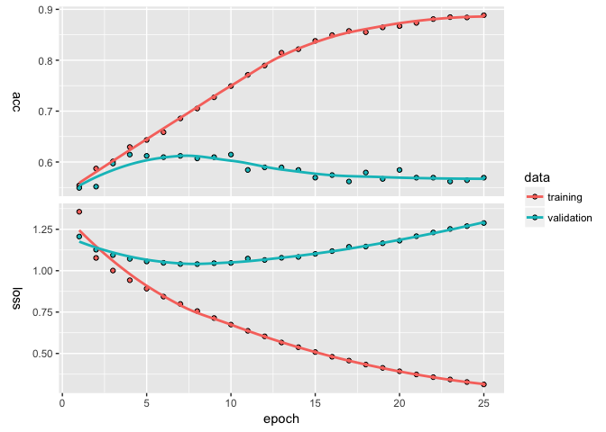

foRmula keRas
================
Pete Mohanty
December 20, 2017

The goal of this document is to introduce `lstm`, a regression style function which allows users to call `keras` with `R` `formula` objects and which splits training and test data into sparse matrices. Let's start with an example using `rtweet` from `@kearneymw`. The examples here don't provide particularly predictive models so much as show how using `formula` objects can smooth data cleaning and hyperparameter selection.

``` r
library(rtweet)
rt <- search_tweets(
  "#rstats", n = 10000, include_rts = FALSE
)
dim(rt)
```

    [1] 2580   42

``` r
summary(rt$retweet_count)
```

       Min. 1st Qu.  Median    Mean 3rd Qu.    Max. 
      0.000   0.000   0.000   3.486   2.000 327.000 

Suppose we wanted to predict how many times a tweet with `#rstat` is going to be retweeted. And suppose we wanted to bin the retweent count into five categories (none, 1-10, 11-50, 51-99, and 100 or more). Suppose we believe that the twitter handle matters as does day and time of day.

``` r
library(keras)
breaks <- c(-1, 0, 1, 10, 50, 100, 10000)
out <- lstm("cut(retweet_count, breaks) ~ screen_name + 
            grepl('gg', text) + grepl('tidy', text) + 
            grepl('rstudio', text, ignore.case = TRUE) +
            grepl('cran', text, ignore.case = TRUE) +
            grepl('trump', text, ignore.case = TRUE) +
            weekdays(rt$created_at) + 
            format(rt$created_at, '%d') + 
            format(rt$created_at, '%H')", data = rt)
plot(out$history)
```



``` r
summary(out$model)
```

    ___________________________________________________________________________
    Layer (type)                     Output Shape                  Param #     
    ===========================================================================
    dense_1 (Dense)                  (None, 128)                   142208      
    ___________________________________________________________________________
    dropout_1 (Dropout)              (None, 128)                   0           
    ___________________________________________________________________________
    dense_2 (Dense)                  (None, 6)                     774         
    ===========================================================================
    Total params: 142,982
    Trainable params: 142,982
    Non-trainable params: 0
    ___________________________________________________________________________

``` r
out$confusion
```

                 
                  (-1,0] (0,1] (1,10] (10,50] (50,100] (100,1e+04]
      (-1,0]         215    27     55       3        0           0
      (0,1]           34    16     12       2        0           0
      (1,10]          36    14     49       9        0           0
      (10,50]          9     5     18       7        0           0
      (50,100]         1     0      2       0        1           0
      (100,1e+04]      0     0      1       0        0           0

``` r
out$evaluations
```

    $loss
    [1] 1.262151

    $acc
    [1] 0.5581395

Let's say we want to add some data about how many other people are mentioned in each tweet and switch to a (discretized) log scale.

``` r
rt$Nmentions <- unlist(lapply(rt$mentions_screen_name, 
                              function(x){length(x[[1]]) - is.na(x[[1]])}))

out2 <- lstm("floor(log(retweet_count + 1)) ~ Nmentions + screen_name + 
            grepl('gg', text) + grepl('tidy', text) + 
            grepl('rstudio', text, ignore.case = TRUE) +
            grepl('cran', text, ignore.case = TRUE) +
            grepl('trump', text, ignore.case = TRUE) +
            weekdays(rt$created_at) + 
            format(rt$created_at, '%d') + 
            format(rt$created_at, '%H')", 
            data = rt, Nepochs = 10)
out2$evaluations
```

    $loss
    [1] 0.8011118

    $acc
    [1] 0.7320388

``` r
out2$confusion
```

       
          0   1   2   3
      0 345  12   3   0
      1  71  18  13   0
      2  16   8  14   1
      3   4   3   1   0
      4   3   0   2   1

Heading in the right direction. Suppose instead we wanted to add who was mentioned.

``` r
input.formula <- "floor(log(retweet_count + 1)) ~ Nmentions + screen_name + 
            grepl('gg', text) + grepl('tidy', text) + 
            grepl('rstudio', text, ignore.case = TRUE) + grepl('python', text, ignore.case = TRUE) + 
            grepl('cran', text, ignore.case = TRUE) +
            grepl('trump', text, ignore.case = TRUE) +
            weekdays(rt$created_at) + format(rt$created_at, '%d') + 
            format(rt$created_at, '%H')"

handles <- names(table(unlist(rt$mentions_screen_name)))

for(i in 1:length(handles)){
  lab <- paste0("mentions_", handles[i])
  rt[[lab]] <- grepl(handles[i], rt$mentions_screen_name)
  input.formula <- paste(input.formula, "+", lab)
}

out3 <- lstm(input.formula, data = rt, Nepochs = 10)
out3$evaluations
```

    $loss
    [1] 0.7457331

    $acc
    [1] 0.7655678

``` r
out3$confusion
```

       
          0   1   2   3
      0 390  14   3   0
      1  52  13  17   0
      2  17   4  14   0
      3  13   1   4   1
      4   2   0   1   0

Marginal improvement but the model is still clearly overpredicting the modal outcome (zero retweets) and struggling to forecast the rare, popular tweets. Maybe the model needs more layers.

``` r
out4 <- lstm(input.formula, data = rt, 
            layers = list(units = c(405, 135, 45, 15, NA), 
                         activation = c("softmax", "relu", "relu", "relu", "softmax"), 
                         dropout = c(0.7, 0.6, 0.5, 0.4, NA)),
            Nepochs = 6)
out4$evaluations
```

    $loss
    [1] 0.9184905

    $acc
    [1] 0.6960784

``` r
out4$confusion
```

       
          0
      0 355
      1  75
      2  57
      3  20
      4   2
      5   1

Suppose we wanted to see if the estimates were stable across 10 test/train splits.

``` r
est <- list()
accuracy <- c()
for(i in 1:10){
  est[[paste0("seed", i)]] <- lstm(input.formula, data = rt, seed = i,
            layers = list(units = c(405, 135, 45, 15, NA), 
                         activation = c("softmax", "relu", "relu", "relu", "softmax"), 
                         dropout = c(0.7, 0.6, 0.5, 0.4, NA)),
            Nepochs = 10)
  accuracy[i] <- est[[paste0("seed", i)]][["evaluations"]][["acc"]]
}
accuracy
```

     [1] 0.6933333 0.7186380 0.7258383 0.7242064 0.7378277 0.7093690 0.6863118
     [8] 0.7192308 0.7298387 0.7178503

Hmmm... Maybe Model 3 is the closest ... Or maybe we just need more data :)

Though `lstm` contains a number of parameters, the goal is not to replace all the vast customizability that `keras` offers. Rather, like `qplot` in the `ggplot` library, `lstm` offers convenience for common scenarios. Or, perhaps better, like `MCMCpack` or `rstan` do for Bayesian MCMC, `lstm` aims to introduce users familiar with regression in R to neural nets without steep scripting stumbling blocks. Suggestions are more than welcome!
