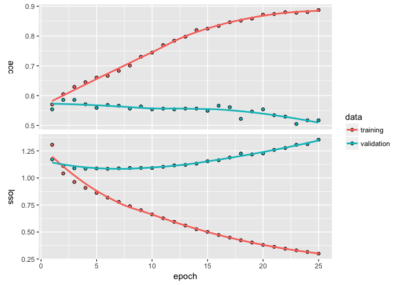

foRmula keRas
================
Pete Mohanty
December 20, 2017

The goal of this document is to introduce `kms` (as in `keras_sequential_model()`), a regression-style function which allows users to call `keras` neural nets with `R` `formula` objects. Formulas are very powerful in R; in the example below, a small tweak in the way the dependent variable is coded explains an additional 20% of out of sample variance. `kms` splits training and test data into sparse matrices and contains the major parameters found in `library(keras)` as inputs (loss function, batch size, number of epochs, etc.). To install my [branch](https://github.com/rdrr1990/keras) of `keras`,

``` r
devtools::install_github("rdrr1990/keras")
```

Let's start with an example using `rtweet` (from `@kearneymw`). The examples here don't provide particularly predictive models so much as show how using `formula` objects can smooth data cleaning and hyperparameter selection.

``` r
library(rtweet)
rt <- search_tweets("#rstats", n = 5000, include_rts = FALSE)
dim(rt)
```

    [1] 2570   42

``` r
summary(rt$retweet_count)
```

       Min. 1st Qu.  Median    Mean 3rd Qu.    Max. 
      0.000   0.000   0.000   3.534   2.000 327.000 

Suppose we wanted to predict how many times a tweet with `#rstat` is going to be retweeted. And suppose we wanted to bin the retweent count into five categories (none, 1-10, 11-50, 51-99, and 100 or more). Suppose we believe that the twitter handle and source matters as does day of week and time of day.

``` r
library(keras)
breaks <- c(-1, 0, 1, 10, 50, 100, 10000)
out <- kms("cut(retweet_count, breaks) ~ screen_name + source +
            grepl('gg', text) + grepl('tidy', text) + 
            grepl('rstudio', text, ignore.case = TRUE) +
            grepl('cran', text, ignore.case = TRUE) +
            grepl('trump', text, ignore.case = TRUE) +
            weekdays(rt$created_at) + 
            format(rt$created_at, '%d') + 
            format(rt$created_at, '%H')", data = rt)
plot(out$history)
```



``` r
summary(out$model)
```

    ___________________________________________________________________________
    Layer (type)                     Output Shape                  Param #     
    ===========================================================================
    dense_1 (Dense)                  (None, 128)                   150656      
    ___________________________________________________________________________
    dropout_1 (Dropout)              (None, 128)                   0           
    ___________________________________________________________________________
    dense_2 (Dense)                  (None, 6)                     774         
    ===========================================================================
    Total params: 151,430
    Trainable params: 151,430
    Non-trainable params: 0
    ___________________________________________________________________________

``` r
out$confusion
```

                 
                  (-1,0] (0,1] (1,10] (10,50] (50,100] (100,1e+04]
      (-1,0]         245    20     44       1        0           0
      (0,1]           47     6     18       2        0           0
      (1,10]          42     9     39       6        0           0
      (10,50]          7     1     27       9        0           0
      (50,100]         2     0      2       1        0           0
      (100,1e+04]      1     0      0       1        0           0

``` r
out$evaluations
```

    $loss
    [1] 1.220165

    $acc
    [1] 0.5641509

Let's say we want to add some data about how many other people are mentioned in each tweet and switch to a (discretized) log scale.

``` r
rt$Nmentions <- unlist(lapply(rt$mentions_screen_name, 
                              function(x){length(x[[1]]) - is.na(x[[1]])}))

out2 <- kms("floor(log(retweet_count + 1)) ~ Nmentions + screen_name + source +
            grepl('gg', text) + grepl('tidy', text) + 
            grepl('rstudio', text, ignore.case = TRUE) +
            grepl('cran', text, ignore.case = TRUE) +
            grepl('trump', text, ignore.case = TRUE) +
            weekdays(rt$created_at) + 
            format(rt$created_at, '%d') + 
            format(rt$created_at, '%H')", 
            data = rt, Nepochs = 10)
out2$evaluations
```

    $loss
    [1] 0.8316655

    $acc
    [1] 0.7112527

``` r
out2$confusion
```

       
          0   1   2
      0 305  20   4
      1  53  18  14
      2  23   3  12
      3   6   1   7
      4   1   1   1
      5   1   1   0

Heading in the right direction. Suppose instead we wanted to add who was mentioned.

``` r
input.formula <- "floor(log(retweet_count + 1)) ~ Nmentions + screen_name + source +
            grepl('gg', text) + grepl('tidy', text) + 
            grepl('rstudio', text, ignore.case = TRUE) + 
            grepl('cran', text, ignore.case = TRUE) +
            grepl('trump', text, ignore.case = TRUE) +
            weekdays(rt$created_at) + format(rt$created_at, '%d') + 
            format(rt$created_at, '%H')"

handles <- names(table(unlist(rt$mentions_screen_name)))

for(i in 1:length(handles)){
  lab <- paste0("mentions_", handles[i])
  rt[[lab]] <- grepl(handles[i], rt$mentions_screen_name)
  input.formula <- paste(input.formula, "+", lab)
}

out3 <- kms(input.formula, data = rt, Nepochs = 10)
out3$evaluations
```

    $loss
    [1] 0.7745696

    $acc
    [1] 0.7317073

``` r
out3$confusion
```

       
          0   1   2   3
      0 362  31   1   0
      1  56  18   7   0
      2  17  12  10   0
      3   8   0   7   0
      4   1   0   2   1

Marginal improvement but the model is still clearly overpredicting the modal outcome (zero retweets) and struggling to forecast the rare, popular tweets. Maybe the model needs more layers.

``` r
out4 <- kms(input.formula, data = rt, 
            layers = list(units = c(405, 135, 45, 15, NA), 
                         activation = c("softmax", "relu", "relu", "relu", "softmax"), 
                         dropout = c(0.7, 0.6, 0.5, 0.4, NA)),
            Nepochs = 6)
out4$evaluations
```

    $loss
    [1] 0.9148163

    $acc
    [1] 0.6936759

``` r
out4$confusion
```

       
          0
      0 351
      1  86
      2  50
      3  14
      4   4
      5   1

Suppose we wanted to see if the estimates were stable across 10 test/train splits.

``` r
est <- list()
accuracy <- c()
for(i in 1:10){
  est[[paste0("seed", i)]] <- kms(input.formula, rt, seed = i,
            layers = list(units = c(405, 135, 45, 15, NA), 
                         activation = c("softmax", "relu", "relu", "relu", "softmax"), 
                         dropout = c(0.7, 0.6, 0.5, 0.4, NA)),
            Nepochs = 10)
  accuracy[i] <- est[[paste0("seed", i)]][["evaluations"]][["acc"]]
}
accuracy
```

     [1] 0.7332054 0.7360862 0.6956522 0.7296223 0.7593985 0.7153846 0.7126437
     [8] 0.7335907 0.7111111 0.7557692

Hmmm... Maybe Model 3 is the closest ... Or maybe we just need more data :)

Though `kms` contains a number of parameters, the goal is not to replace all the vast customizability that `keras` offers. Rather, like `qplot` in the `ggplot` library, `kms` offers convenience for common scenarios. Or, perhaps better, like `MCMCpack` or `rstan` do for Bayesian MCMC, `kms` aims to introduce users familiar with regression in R to neural nets without steep scripting stumbling blocks. Next on the to-do list is to add support for accepting keras models as a parameter. Suggestions are more than welcome!
