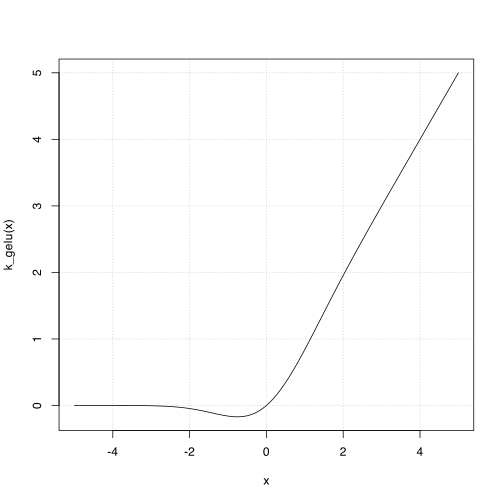

Gaussian Error Linear Unit (GELU) activation function.

@description
If `approximate` is `TRUE`, it is defined as:
`f(x) = 0.5 * x * (1 + tanh(sqrt(2 / pi) * (x + 0.044715 * x^3)))`

Or if `approximate` is `FALSE`, it is defined as:
`f(x) = x * P(X <= x) = 0.5 * x * (1 + erf(x / sqrt(2)))`,
where `P(X) ~ N(0, 1)`.

# Examples

```r
x <- k_array(c(-1., 0., 1.))
k_gelu(x)
```

```
## tf.Tensor([-0.15880796  0.          0.841192  ], shape=(3), dtype=float32)
```

```r
k_gelu(x, FALSE)
```

```
## tf.Tensor([-0.15865526  0.          0.8413447 ], shape=(3), dtype=float32)
```


```r
x <- seq(-5, 5, .1)
plot(x, k_gelu(x),
     type = "l", #, frame.plot = FALSE,
     panel.first = grid())
```



@returns
A tensor with the same shape as `x`.

@param x Input tensor.
@param approximate Approximate version of GELU activation. Defaults to `TRUE`.

@export
@family ops
@seealso
+ <https:/keras.io/keras_core/api/ops/nn#gelu-function>
+ <https://www.tensorflow.org/api_docs/python/tf/keras/ops/gelu>
