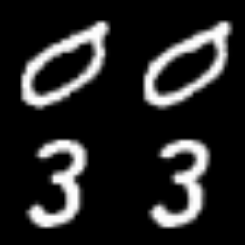
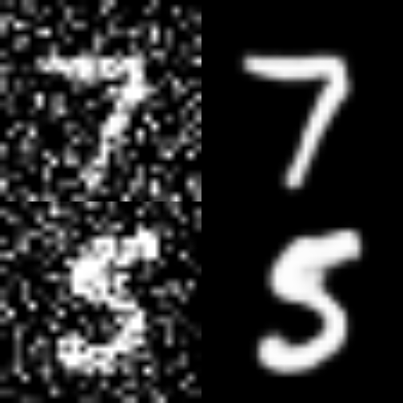

## Introduction

This example demonstrates how to implement a deep convolutional autoencoder
for image denoising, mapping noisy digits images from the MNIST dataset to
clean digits images. This implementation is based on an original blog post
titled [Building Autoencoders in Keras](https://blog.keras.io/building-autoencoders-in-keras.html)
by [François Chollet](https://twitter.com/fchollet).

## Setup


```r
library(keras3)

# Normalizes the supplied array and reshapes it.
preprocess <- function(array) {
  array_reshape(array/255, c(dim(array)[1], 28, 28, 1))
}

# Adds random noise to each image in the supplied array.
noise <- function(array) {
  noise_factor <- 0.4
  noisy_array <- array + noise_factor * random_normal(dim(array))
  op_clip(noisy_array, 0.0, 1.0)
}

display <- function(array1, array2) {
  n <- 2
  indices <- sample.int(dim(array1)[1], n)
  images1 <- as.array(array1)[indices,,,]
  images2 <- as.array(array2)[indices,,,]

  par(mfrow = c(2, n), mar = c(0,0,0,0))
  for (i in seq_len(n)) {
    plot(as.raster(images1[i,,]))
    plot(as.raster(images2[i,, ]))
  }
}
```

## Prepare the data


```r
# Since we only need images from the dataset to encode and decode, we
# won't use the labels.
c(c(train_data, .), c(test_data, .)) %<-% dataset_mnist()

# Normalize and reshape the data
train_data <- preprocess(train_data)
test_data <- preprocess(test_data)

# Create a copy of the data with added noise
noisy_train_data <- noise(train_data)
noisy_test_data <- noise(test_data)

# Display the train data and a version of it with added noise
display(train_data, noisy_train_data)
```


## Build the autoencoder

We are going to use the Functional API to build our convolutional autoencoder.


```r
input <- layer_input(shape=c(28, 28, 1))

# Encoder
enc <- input %>%
  layer_conv_2d(filters=32, kernel_size=c(3, 3), activation="relu", padding="same") %>%
  layer_max_pooling_2d(pool_size=c(2, 2), padding="same") %>%
  layer_conv_2d(filters=32, kernel_size=c(3, 3), activation="relu", padding="same") %>%
  layer_max_pooling_2d(pool_size=c(2, 2), padding="same")

# Decoder
dec <- enc %>%
  layer_conv_2d_transpose(
    filters=32, kernel_size=c(3, 3), strides = 2, activation="relu", padding="same") %>%
  layer_conv_2d_transpose(
    filters=32, kernel_size=c(3, 3), strides = 2, activation="relu", padding="same") %>%
  layer_conv_2d(filters=1, kernel_size=c(3, 3), activation="sigmoid", padding="same")

# Autoencoder
autoencoder <- keras_model(input, dec)
autoencoder %>% compile(optimizer="adam", loss="binary_crossentropy")
autoencoder %>% summary()
```

```
## Model: "functional_1"
## ┏━━━━━━━━━━━━━━━━━━━━━━━━━━━━━━━━━┳━━━━━━━━━━━━━━━━━━━━━━━━━━━┳━━━━━━━━━━━━┓
## ┃ Layer (type)                    ┃ Output Shape              ┃    Param # ┃
## ┡━━━━━━━━━━━━━━━━━━━━━━━━━━━━━━━━━╇━━━━━━━━━━━━━━━━━━━━━━━━━━━╇━━━━━━━━━━━━┩
## │ input_layer (InputLayer)        │ (None, 28, 28, 1)         │          0 │
## ├─────────────────────────────────┼───────────────────────────┼────────────┤
## │ conv2d_1 (Conv2D)               │ (None, 28, 28, 32)        │        320 │
## ├─────────────────────────────────┼───────────────────────────┼────────────┤
## │ max_pooling2d_1 (MaxPooling2D)  │ (None, 14, 14, 32)        │          0 │
## ├─────────────────────────────────┼───────────────────────────┼────────────┤
## │ conv2d (Conv2D)                 │ (None, 14, 14, 32)        │      9,248 │
## ├─────────────────────────────────┼───────────────────────────┼────────────┤
## │ max_pooling2d (MaxPooling2D)    │ (None, 7, 7, 32)          │          0 │
## ├─────────────────────────────────┼───────────────────────────┼────────────┤
## │ conv2d_transpose_1              │ (None, 14, 14, 32)        │      9,248 │
## │ (Conv2DTranspose)               │                           │            │
## ├─────────────────────────────────┼───────────────────────────┼────────────┤
## │ conv2d_transpose                │ (None, 28, 28, 32)        │      9,248 │
## │ (Conv2DTranspose)               │                           │            │
## ├─────────────────────────────────┼───────────────────────────┼────────────┤
## │ conv2d_2 (Conv2D)               │ (None, 28, 28, 1)         │        289 │
## └─────────────────────────────────┴───────────────────────────┴────────────┘
##  Total params: 28,353 (110.75 KB)
##  Trainable params: 28,353 (110.75 KB)
##  Non-trainable params: 0 (0.00 B)
```

Now we can train our autoencoder using `train_data` as both our input data
and target. Notice we are setting up the validation data using the same
format.


```r
autoencoder %>% fit(
    x=train_data,
    y=train_data,
    epochs=50,
    batch_size=128,
    shuffle=TRUE,
    validation_data=list(test_data, test_data),
)
```

```
## Epoch 1/50
## 469/469 - 6s - 14ms/step - loss: 0.1322 - val_loss: 0.0736
## Epoch 2/50
## 469/469 - 1s - 3ms/step - loss: 0.0721 - val_loss: 0.0698
## Epoch 3/50
## 469/469 - 1s - 3ms/step - loss: 0.0695 - val_loss: 0.0681
## Epoch 4/50
## 469/469 - 1s - 3ms/step - loss: 0.0682 - val_loss: 0.0672
## Epoch 5/50
## 469/469 - 1s - 3ms/step - loss: 0.0674 - val_loss: 0.0665
## Epoch 6/50
## 469/469 - 1s - 3ms/step - loss: 0.0667 - val_loss: 0.0660
## Epoch 7/50
## 469/469 - 1s - 3ms/step - loss: 0.0663 - val_loss: 0.0656
## Epoch 8/50
## 469/469 - 1s - 3ms/step - loss: 0.0659 - val_loss: 0.0652
## Epoch 9/50
## 469/469 - 1s - 3ms/step - loss: 0.0655 - val_loss: 0.0649
## Epoch 10/50
## 469/469 - 1s - 3ms/step - loss: 0.0652 - val_loss: 0.0646
## Epoch 11/50
## 469/469 - 1s - 3ms/step - loss: 0.0650 - val_loss: 0.0644
## Epoch 12/50
## 469/469 - 1s - 3ms/step - loss: 0.0647 - val_loss: 0.0642
## Epoch 13/50
## 469/469 - 1s - 3ms/step - loss: 0.0645 - val_loss: 0.0640
## Epoch 14/50
## 469/469 - 1s - 3ms/step - loss: 0.0644 - val_loss: 0.0638
## Epoch 15/50
## 469/469 - 1s - 3ms/step - loss: 0.0642 - val_loss: 0.0637
## Epoch 16/50
## 469/469 - 1s - 3ms/step - loss: 0.0640 - val_loss: 0.0635
## Epoch 17/50
## 469/469 - 1s - 3ms/step - loss: 0.0639 - val_loss: 0.0634
## Epoch 18/50
## 469/469 - 1s - 3ms/step - loss: 0.0638 - val_loss: 0.0633
## Epoch 19/50
## 469/469 - 1s - 3ms/step - loss: 0.0637 - val_loss: 0.0632
## Epoch 20/50
## 469/469 - 1s - 3ms/step - loss: 0.0636 - val_loss: 0.0631
## Epoch 21/50
## 469/469 - 1s - 3ms/step - loss: 0.0635 - val_loss: 0.0630
## Epoch 22/50
## 469/469 - 1s - 3ms/step - loss: 0.0634 - val_loss: 0.0629
## Epoch 23/50
## 469/469 - 1s - 3ms/step - loss: 0.0633 - val_loss: 0.0628
## Epoch 24/50
## 469/469 - 1s - 3ms/step - loss: 0.0632 - val_loss: 0.0628
## Epoch 25/50
## 469/469 - 1s - 3ms/step - loss: 0.0632 - val_loss: 0.0627
## Epoch 26/50
## 469/469 - 1s - 3ms/step - loss: 0.0631 - val_loss: 0.0626
## Epoch 27/50
## 469/469 - 1s - 3ms/step - loss: 0.0630 - val_loss: 0.0626
## Epoch 28/50
## 469/469 - 1s - 3ms/step - loss: 0.0630 - val_loss: 0.0625
## Epoch 29/50
## 469/469 - 1s - 3ms/step - loss: 0.0629 - val_loss: 0.0625
## Epoch 30/50
## 469/469 - 1s - 3ms/step - loss: 0.0629 - val_loss: 0.0624
## Epoch 31/50
## 469/469 - 1s - 3ms/step - loss: 0.0628 - val_loss: 0.0624
## Epoch 32/50
## 469/469 - 1s - 3ms/step - loss: 0.0628 - val_loss: 0.0623
## Epoch 33/50
## 469/469 - 1s - 3ms/step - loss: 0.0627 - val_loss: 0.0623
## Epoch 34/50
## 469/469 - 1s - 3ms/step - loss: 0.0627 - val_loss: 0.0622
## Epoch 35/50
## 469/469 - 1s - 3ms/step - loss: 0.0626 - val_loss: 0.0622
## Epoch 36/50
## 469/469 - 1s - 3ms/step - loss: 0.0626 - val_loss: 0.0622
## Epoch 37/50
## 469/469 - 1s - 3ms/step - loss: 0.0626 - val_loss: 0.0621
## Epoch 38/50
## 469/469 - 1s - 3ms/step - loss: 0.0625 - val_loss: 0.0621
## Epoch 39/50
## 469/469 - 1s - 3ms/step - loss: 0.0625 - val_loss: 0.0621
## Epoch 40/50
## 469/469 - 1s - 3ms/step - loss: 0.0625 - val_loss: 0.0621
## Epoch 41/50
## 469/469 - 1s - 3ms/step - loss: 0.0624 - val_loss: 0.0620
## Epoch 42/50
## 469/469 - 1s - 3ms/step - loss: 0.0624 - val_loss: 0.0620
## Epoch 43/50
## 469/469 - 1s - 3ms/step - loss: 0.0624 - val_loss: 0.0620
## Epoch 44/50
## 469/469 - 1s - 3ms/step - loss: 0.0624 - val_loss: 0.0620
## Epoch 45/50
## 469/469 - 1s - 3ms/step - loss: 0.0623 - val_loss: 0.0619
## Epoch 46/50
## 469/469 - 1s - 3ms/step - loss: 0.0623 - val_loss: 0.0619
## Epoch 47/50
## 469/469 - 1s - 3ms/step - loss: 0.0623 - val_loss: 0.0619
## Epoch 48/50
## 469/469 - 1s - 3ms/step - loss: 0.0623 - val_loss: 0.0619
## Epoch 49/50
## 469/469 - 1s - 3ms/step - loss: 0.0622 - val_loss: 0.0619
## Epoch 50/50
## 469/469 - 1s - 3ms/step - loss: 0.0622 - val_loss: 0.0618
```

Let's predict on our test dataset and display the original image together with
the prediction from our autoencoder.

Notice how the predictions are pretty close to the original images, although
not quite the same.


```r
predictions <- autoencoder %>% predict(test_data)
```

```
## 313/313 - 1s - 3ms/step
```

```r
display(test_data, predictions)
```



Now that we know that our autoencoder works, let's retrain it using the noisy
data as our input and the clean data as our target. We want our autoencoder to
learn how to denoise the images.


```r
autoencoder %>% fit(
    x=noisy_train_data,
    y=train_data,
    epochs=100,
    batch_size=128,
    shuffle=TRUE,
    validation_data=list(noisy_test_data, test_data),
)
```

```
## Epoch 1/100
## 469/469 - 1s - 3ms/step - loss: 0.1000 - val_loss: 0.0930
## Epoch 2/100
## 469/469 - 1s - 3ms/step - loss: 0.0926 - val_loss: 0.0908
## Epoch 3/100
## 469/469 - 1s - 3ms/step - loss: 0.0910 - val_loss: 0.0897
## Epoch 4/100
## 469/469 - 1s - 3ms/step - loss: 0.0901 - val_loss: 0.0888
## Epoch 5/100
## 469/469 - 1s - 3ms/step - loss: 0.0893 - val_loss: 0.0882
## Epoch 6/100
## 469/469 - 1s - 3ms/step - loss: 0.0888 - val_loss: 0.0877
## Epoch 7/100
## 469/469 - 1s - 3ms/step - loss: 0.0884 - val_loss: 0.0874
## Epoch 8/100
## 469/469 - 1s - 3ms/step - loss: 0.0880 - val_loss: 0.0871
## Epoch 9/100
## 469/469 - 1s - 3ms/step - loss: 0.0877 - val_loss: 0.0868
## Epoch 10/100
## 469/469 - 1s - 3ms/step - loss: 0.0875 - val_loss: 0.0867
## Epoch 11/100
## 469/469 - 1s - 3ms/step - loss: 0.0873 - val_loss: 0.0865
## Epoch 12/100
## 469/469 - 1s - 3ms/step - loss: 0.0871 - val_loss: 0.0864
## Epoch 13/100
## 469/469 - 1s - 3ms/step - loss: 0.0869 - val_loss: 0.0862
## Epoch 14/100
## 469/469 - 1s - 3ms/step - loss: 0.0868 - val_loss: 0.0861
## Epoch 15/100
## 469/469 - 1s - 3ms/step - loss: 0.0866 - val_loss: 0.0860
## Epoch 16/100
## 469/469 - 1s - 3ms/step - loss: 0.0865 - val_loss: 0.0859
## Epoch 17/100
## 469/469 - 1s - 3ms/step - loss: 0.0864 - val_loss: 0.0858
## Epoch 18/100
## 469/469 - 1s - 3ms/step - loss: 0.0863 - val_loss: 0.0857
## Epoch 19/100
## 469/469 - 1s - 3ms/step - loss: 0.0862 - val_loss: 0.0856
## Epoch 20/100
## 469/469 - 1s - 3ms/step - loss: 0.0861 - val_loss: 0.0855
## Epoch 21/100
## 469/469 - 1s - 3ms/step - loss: 0.0860 - val_loss: 0.0854
## Epoch 22/100
## 469/469 - 1s - 3ms/step - loss: 0.0859 - val_loss: 0.0854
## Epoch 23/100
## 469/469 - 1s - 3ms/step - loss: 0.0858 - val_loss: 0.0853
## Epoch 24/100
## 469/469 - 1s - 3ms/step - loss: 0.0858 - val_loss: 0.0852
## Epoch 25/100
## 469/469 - 1s - 3ms/step - loss: 0.0857 - val_loss: 0.0852
## Epoch 26/100
## 469/469 - 1s - 3ms/step - loss: 0.0856 - val_loss: 0.0851
## Epoch 27/100
## 469/469 - 1s - 3ms/step - loss: 0.0856 - val_loss: 0.0850
## Epoch 28/100
## 469/469 - 1s - 3ms/step - loss: 0.0855 - val_loss: 0.0850
## Epoch 29/100
## 469/469 - 1s - 3ms/step - loss: 0.0854 - val_loss: 0.0850
## Epoch 30/100
## 469/469 - 1s - 3ms/step - loss: 0.0854 - val_loss: 0.0849
## Epoch 31/100
## 469/469 - 1s - 3ms/step - loss: 0.0853 - val_loss: 0.0849
## Epoch 32/100
## 469/469 - 1s - 3ms/step - loss: 0.0853 - val_loss: 0.0849
## Epoch 33/100
## 469/469 - 1s - 3ms/step - loss: 0.0852 - val_loss: 0.0848
## Epoch 34/100
## 469/469 - 1s - 3ms/step - loss: 0.0852 - val_loss: 0.0848
## Epoch 35/100
## 469/469 - 1s - 3ms/step - loss: 0.0852 - val_loss: 0.0847
## Epoch 36/100
## 469/469 - 1s - 3ms/step - loss: 0.0851 - val_loss: 0.0847
## Epoch 37/100
## 469/469 - 1s - 3ms/step - loss: 0.0851 - val_loss: 0.0847
## Epoch 38/100
## 469/469 - 1s - 3ms/step - loss: 0.0851 - val_loss: 0.0847
## Epoch 39/100
## 469/469 - 1s - 3ms/step - loss: 0.0850 - val_loss: 0.0846
## Epoch 40/100
## 469/469 - 1s - 3ms/step - loss: 0.0850 - val_loss: 0.0846
## Epoch 41/100
## 469/469 - 1s - 3ms/step - loss: 0.0850 - val_loss: 0.0846
## Epoch 42/100
## 469/469 - 1s - 3ms/step - loss: 0.0849 - val_loss: 0.0846
## Epoch 43/100
## 469/469 - 1s - 3ms/step - loss: 0.0849 - val_loss: 0.0846
## Epoch 44/100
## 469/469 - 1s - 3ms/step - loss: 0.0849 - val_loss: 0.0845
## Epoch 45/100
## 469/469 - 1s - 3ms/step - loss: 0.0849 - val_loss: 0.0845
## Epoch 46/100
## 469/469 - 1s - 3ms/step - loss: 0.0848 - val_loss: 0.0845
## Epoch 47/100
## 469/469 - 1s - 3ms/step - loss: 0.0848 - val_loss: 0.0845
## Epoch 48/100
## 469/469 - 1s - 3ms/step - loss: 0.0848 - val_loss: 0.0845
## Epoch 49/100
## 469/469 - 1s - 3ms/step - loss: 0.0848 - val_loss: 0.0844
## Epoch 50/100
## 469/469 - 1s - 3ms/step - loss: 0.0848 - val_loss: 0.0844
## Epoch 51/100
## 469/469 - 1s - 3ms/step - loss: 0.0847 - val_loss: 0.0844
## Epoch 52/100
## 469/469 - 1s - 3ms/step - loss: 0.0847 - val_loss: 0.0844
## Epoch 53/100
## 469/469 - 1s - 3ms/step - loss: 0.0847 - val_loss: 0.0844
## Epoch 54/100
## 469/469 - 1s - 3ms/step - loss: 0.0847 - val_loss: 0.0844
## Epoch 55/100
## 469/469 - 1s - 3ms/step - loss: 0.0847 - val_loss: 0.0844
## Epoch 56/100
## 469/469 - 1s - 3ms/step - loss: 0.0846 - val_loss: 0.0843
## Epoch 57/100
## 469/469 - 1s - 3ms/step - loss: 0.0846 - val_loss: 0.0843
## Epoch 58/100
## 469/469 - 1s - 3ms/step - loss: 0.0846 - val_loss: 0.0843
## Epoch 59/100
## 469/469 - 1s - 3ms/step - loss: 0.0846 - val_loss: 0.0843
## Epoch 60/100
## 469/469 - 1s - 3ms/step - loss: 0.0846 - val_loss: 0.0843
## Epoch 61/100
## 469/469 - 1s - 3ms/step - loss: 0.0846 - val_loss: 0.0843
## Epoch 62/100
## 469/469 - 1s - 3ms/step - loss: 0.0846 - val_loss: 0.0843
## Epoch 63/100
## 469/469 - 1s - 3ms/step - loss: 0.0845 - val_loss: 0.0842
## Epoch 64/100
## 469/469 - 1s - 3ms/step - loss: 0.0845 - val_loss: 0.0842
## Epoch 65/100
## 469/469 - 1s - 3ms/step - loss: 0.0845 - val_loss: 0.0842
## Epoch 66/100
## 469/469 - 1s - 3ms/step - loss: 0.0845 - val_loss: 0.0842
## Epoch 67/100
## 469/469 - 1s - 3ms/step - loss: 0.0845 - val_loss: 0.0842
## Epoch 68/100
## 469/469 - 1s - 3ms/step - loss: 0.0845 - val_loss: 0.0842
## Epoch 69/100
## 469/469 - 1s - 3ms/step - loss: 0.0845 - val_loss: 0.0842
## Epoch 70/100
## 469/469 - 1s - 3ms/step - loss: 0.0845 - val_loss: 0.0842
## Epoch 71/100
## 469/469 - 1s - 3ms/step - loss: 0.0844 - val_loss: 0.0842
## Epoch 72/100
## 469/469 - 1s - 3ms/step - loss: 0.0844 - val_loss: 0.0842
## Epoch 73/100
## 469/469 - 1s - 3ms/step - loss: 0.0844 - val_loss: 0.0842
## Epoch 74/100
## 469/469 - 1s - 3ms/step - loss: 0.0844 - val_loss: 0.0842
## Epoch 75/100
## 469/469 - 1s - 3ms/step - loss: 0.0844 - val_loss: 0.0842
## Epoch 76/100
## 469/469 - 1s - 3ms/step - loss: 0.0844 - val_loss: 0.0842
## Epoch 77/100
## 469/469 - 1s - 3ms/step - loss: 0.0844 - val_loss: 0.0842
## Epoch 78/100
## 469/469 - 1s - 3ms/step - loss: 0.0844 - val_loss: 0.0841
## Epoch 79/100
## 469/469 - 1s - 3ms/step - loss: 0.0844 - val_loss: 0.0841
## Epoch 80/100
## 469/469 - 1s - 3ms/step - loss: 0.0843 - val_loss: 0.0841
## Epoch 81/100
## 469/469 - 1s - 3ms/step - loss: 0.0843 - val_loss: 0.0841
## Epoch 82/100
## 469/469 - 1s - 3ms/step - loss: 0.0843 - val_loss: 0.0841
## Epoch 83/100
## 469/469 - 1s - 3ms/step - loss: 0.0843 - val_loss: 0.0841
## Epoch 84/100
## 469/469 - 1s - 3ms/step - loss: 0.0843 - val_loss: 0.0841
## Epoch 85/100
## 469/469 - 1s - 3ms/step - loss: 0.0843 - val_loss: 0.0841
## Epoch 86/100
## 469/469 - 1s - 3ms/step - loss: 0.0843 - val_loss: 0.0841
## Epoch 87/100
## 469/469 - 1s - 3ms/step - loss: 0.0843 - val_loss: 0.0841
## Epoch 88/100
## 469/469 - 1s - 3ms/step - loss: 0.0843 - val_loss: 0.0841
## Epoch 89/100
## 469/469 - 1s - 3ms/step - loss: 0.0843 - val_loss: 0.0841
## Epoch 90/100
## 469/469 - 1s - 3ms/step - loss: 0.0843 - val_loss: 0.0841
## Epoch 91/100
## 469/469 - 1s - 3ms/step - loss: 0.0843 - val_loss: 0.0841
## Epoch 92/100
## 469/469 - 1s - 3ms/step - loss: 0.0842 - val_loss: 0.0841
## Epoch 93/100
## 469/469 - 1s - 3ms/step - loss: 0.0842 - val_loss: 0.0841
## Epoch 94/100
## 469/469 - 1s - 3ms/step - loss: 0.0842 - val_loss: 0.0840
## Epoch 95/100
## 469/469 - 1s - 3ms/step - loss: 0.0842 - val_loss: 0.0840
## Epoch 96/100
## 469/469 - 1s - 3ms/step - loss: 0.0842 - val_loss: 0.0840
## Epoch 97/100
## 469/469 - 1s - 3ms/step - loss: 0.0842 - val_loss: 0.0840
## Epoch 98/100
## 469/469 - 1s - 3ms/step - loss: 0.0842 - val_loss: 0.0840
## Epoch 99/100
## 469/469 - 1s - 3ms/step - loss: 0.0842 - val_loss: 0.0840
## Epoch 100/100
## 469/469 - 1s - 3ms/step - loss: 0.0842 - val_loss: 0.0840
```

Let's now predict on the noisy data and display the results of our autoencoder.

Notice how the autoencoder does an amazing job at removing the noise from the
input images.


```r
predictions <- autoencoder %>% predict(noisy_test_data)
```

```
## 313/313 - 0s - 717us/step
```

```r
display(noisy_test_data, predictions)
```


