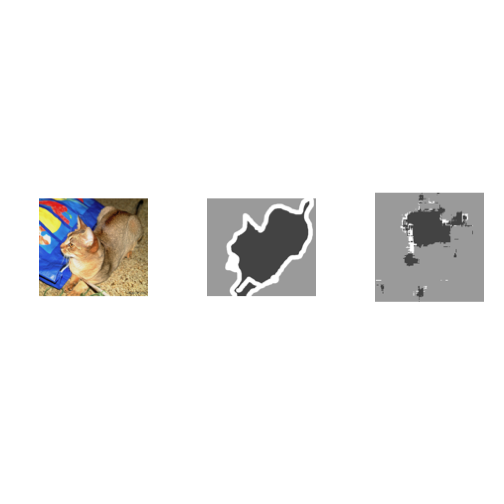

## Download the data


```r
options(timeout = 5000)
download.file(
  "https://www.robots.ox.ac.uk/~vgg/data/pets/data/images.tar.gz",
  "datasets/images.tar.gz"
)
download.file(
  "https://www.robots.ox.ac.uk/~vgg/data/pets/data/annotations.tar.gz",
  "datasets/annotations.tar.gz"
)

untar("datasets/images.tar.gz", exdir = "datasets")
untar("datasets/annotations.tar.gz", exdir = "datasets")
```


## Prepare paths of input images and target segmentation masks


```r
library(keras3)
input_dir <- "datasets/images/"
target_dir <- "datasets/annotations/trimaps/"
img_size <- c(160, 160)
num_classes <- 3
batch_size <- 32

input_img_paths <- fs::dir_ls(input_dir, glob = "*.jpg") %>% sort()
target_img_paths <- fs::dir_ls(target_dir, glob = "*.png") %>% sort()

cat("Number of samples:", length(input_img_paths), "\n")
```

```
## Number of samples: 7390
```

```r
for (i in 1:10) {
  cat(input_img_paths[i], "|", target_img_paths[i], "\n")
}
```

```
## datasets/images/Abyssinian_1.jpg | datasets/annotations/trimaps/Abyssinian_1.png
## datasets/images/Abyssinian_10.jpg | datasets/annotations/trimaps/Abyssinian_10.png
## datasets/images/Abyssinian_100.jpg | datasets/annotations/trimaps/Abyssinian_100.png
## datasets/images/Abyssinian_101.jpg | datasets/annotations/trimaps/Abyssinian_101.png
## datasets/images/Abyssinian_102.jpg | datasets/annotations/trimaps/Abyssinian_102.png
## datasets/images/Abyssinian_103.jpg | datasets/annotations/trimaps/Abyssinian_103.png
## datasets/images/Abyssinian_104.jpg | datasets/annotations/trimaps/Abyssinian_104.png
## datasets/images/Abyssinian_105.jpg | datasets/annotations/trimaps/Abyssinian_105.png
## datasets/images/Abyssinian_106.jpg | datasets/annotations/trimaps/Abyssinian_106.png
## datasets/images/Abyssinian_107.jpg | datasets/annotations/trimaps/Abyssinian_107.png
```

## What does one input image and corresponding segmentation mask look like?


```r
# Display input image #10
input_img_paths[10] %>%
  jpeg::readJPEG() %>%
  as.raster() %>%
  plot()
```


```r
target_img_paths[10] %>%
  png::readPNG() %>%
  magrittr::multiply_by(255) %>%
  as.raster(max = 3) %>%
  plot()
```


## Prepare dataset to load & vectorize batches of data


```r
library(tensorflow)
library(tfdatasets)


# Returns a tf_dataset
get_dataset <- function(batch_size, img_size, input_img_paths, target_img_paths,
                        max_dataset_len = NULL) {

  img_size <- as.integer(img_size)

  load_img_masks <- function(input_img_path, target_img_path) {
    input_img <- input_img_path %>%
      tf$io$read_file() %>%
      tf$io$decode_jpeg(channels = 3) %>%
      tf$image$resize(img_size) %>%
      tf$image$convert_image_dtype("float32")

    target_img <- target_img_path %>%
      tf$io$read_file() %>%
      tf$io$decode_png(channels = 1) %>%
      tf$image$resize(img_size, method = "nearest") %>%
      tf$image$convert_image_dtype("uint8")

    # Ground truth labels are 1, 2, 3. Subtract one to make them 0, 1, 2:
    target_img <- target_img - 1L

    list(input_img, target_img)
  }

  if (!is.null(max_dataset_len)) {
    input_img_paths <- input_img_paths[1:max_dataset_len]
    target_img_paths <- target_img_paths[1:max_dataset_len]
  }

  list(input_img_paths, target_img_paths) %>%
    tensor_slices_dataset() %>%
    dataset_map(load_img_masks, num_parallel_calls = tf$data$AUTOTUNE) %>%
    dataset_batch(batch_size)
}
```

## Prepare U-Net Xception-style model


```r
get_model <- function(img_size, num_classes) {

  inputs <- layer_input(shape = c(img_size, 3))

  ### [First half of the network: downsampling inputs] ###

  # Entry block
  x <- inputs %>%
    layer_conv_2d(filters = 32, kernel_size = 3, strides = 2, padding = "same") %>%
    layer_batch_normalization() %>%
    layer_activation("relu")

  previous_block_activation <- x  # Set aside residual

  for (filters in c(64, 128, 256)) {
    x <- x %>%
      layer_activation("relu") %>%
      layer_separable_conv_2d(filters = filters, kernel_size = 3, padding = "same") %>%
      layer_batch_normalization() %>%

      layer_activation("relu") %>%
      layer_separable_conv_2d(filters = filters, kernel_size = 3, padding = "same") %>%
      layer_batch_normalization() %>%

      layer_max_pooling_2d(pool_size = 3, strides = 2, padding = "same")

    residual <- previous_block_activation %>%
      layer_conv_2d(filters = filters, kernel_size = 1, strides = 2, padding = "same")

    x <- layer_add(list(x, residual))  # Add back residual
    previous_block_activation <- x  # Set aside next residual
  }

  ### [Second half of the network: upsampling inputs] ###

  for (filters in c(256, 128, 64, 32)) {
    x <- x %>%
      layer_activation("relu") %>%
      layer_conv_2d_transpose(filters = filters, kernel_size = 3, padding = "same") %>%
      layer_batch_normalization() %>%

      layer_activation("relu") %>%
      layer_conv_2d_transpose(filters = filters, kernel_size = 3, padding = "same") %>%
      layer_batch_normalization() %>%

      layer_upsampling_2d(size = 2)

    # Project residual
    residual <- previous_block_activation %>%
      layer_upsampling_2d(size = 2) %>%
      layer_conv_2d(filters = filters, kernel_size = 1, padding = "same")

    x <- layer_add(list(x, residual))  # Add back residual
    previous_block_activation <- x  # Set aside next residual
  }

  # Add a per-pixel classification layer
  outputs <- x %>%
    layer_conv_2d(num_classes, 3, activation="softmax", padding="same")

  # Define the model
  keras_model(inputs, outputs)
}

# Build model
model <- get_model(img_size, num_classes)
summary(model)
```

```
## Model: "functional_1"
## ┏━━━━━━━━━━━━━━━━━━━┳━━━━━━━━━━━━━━━━━┳━━━━━━━━┳━━━━━━━━━━━━━━━━━━━┳━━━━━━━┓
## ┃                   ┃                 ┃  Param ┃                   ┃       ┃
## ┃ Layer (type)      ┃ Output Shape    ┃      # ┃ Connected to      ┃ Trai… ┃
## ┡━━━━━━━━━━━━━━━━━━━╇━━━━━━━━━━━━━━━━━╇━━━━━━━━╇━━━━━━━━━━━━━━━━━━━╇━━━━━━━┩
## │ input_layer       │ (None, 160,     │      0 │ -                 │   -   │
## │ (InputLayer)      │ 160, 3)         │        │                   │       │
## ├───────────────────┼─────────────────┼────────┼───────────────────┼───────┤
## │ conv2d (Conv2D)   │ (None, 80, 80,  │    896 │ input_layer[0][0] │   Y   │
## │                   │ 32)             │        │                   │       │
## ├───────────────────┼─────────────────┼────────┼───────────────────┼───────┤
## │ batch_normalizat… │ (None, 80, 80,  │    128 │ conv2d[0][0]      │   Y   │
## │ (BatchNormalizat… │ 32)             │        │                   │       │
## ├───────────────────┼─────────────────┼────────┼───────────────────┼───────┤
## │ activation        │ (None, 80, 80,  │      0 │ batch_normalizat… │   -   │
## │ (Activation)      │ 32)             │        │                   │       │
## ├───────────────────┼─────────────────┼────────┼───────────────────┼───────┤
## │ activation_2      │ (None, 80, 80,  │      0 │ activation[0][0]  │   -   │
## │ (Activation)      │ 32)             │        │                   │       │
## ├───────────────────┼─────────────────┼────────┼───────────────────┼───────┤
## │ separable_conv2d… │ (None, 80, 80,  │  2,400 │ activation_2[0][… │   Y   │
## │ (SeparableConv2D) │ 64)             │        │                   │       │
## ├───────────────────┼─────────────────┼────────┼───────────────────┼───────┤
## │ batch_normalizat… │ (None, 80, 80,  │    256 │ separable_conv2d… │   Y   │
## │ (BatchNormalizat… │ 64)             │        │                   │       │
## ├───────────────────┼─────────────────┼────────┼───────────────────┼───────┤
## │ activation_1      │ (None, 80, 80,  │      0 │ batch_normalizat… │   -   │
## │ (Activation)      │ 64)             │        │                   │       │
## ├───────────────────┼─────────────────┼────────┼───────────────────┼───────┤
## │ separable_conv2d  │ (None, 80, 80,  │  4,736 │ activation_1[0][… │   Y   │
## │ (SeparableConv2D) │ 64)             │        │                   │       │
## ├───────────────────┼─────────────────┼────────┼───────────────────┼───────┤
## │ batch_normalizat… │ (None, 80, 80,  │    256 │ separable_conv2d… │   Y   │
## │ (BatchNormalizat… │ 64)             │        │                   │       │
## ├───────────────────┼─────────────────┼────────┼───────────────────┼───────┤
## │ max_pooling2d     │ (None, 40, 40,  │      0 │ batch_normalizat… │   -   │
## │ (MaxPooling2D)    │ 64)             │        │                   │       │
## ├───────────────────┼─────────────────┼────────┼───────────────────┼───────┤
## │ conv2d_1 (Conv2D) │ (None, 40, 40,  │  2,112 │ activation[0][0]  │   Y   │
## │                   │ 64)             │        │                   │       │
## ├───────────────────┼─────────────────┼────────┼───────────────────┼───────┤
## │ add (Add)         │ (None, 40, 40,  │      0 │ max_pooling2d[0]… │   -   │
## │                   │ 64)             │        │ conv2d_1[0][0]    │       │
## ├───────────────────┼─────────────────┼────────┼───────────────────┼───────┤
## │ activation_4      │ (None, 40, 40,  │      0 │ add[0][0]         │   -   │
## │ (Activation)      │ 64)             │        │                   │       │
## ├───────────────────┼─────────────────┼────────┼───────────────────┼───────┤
## │ separable_conv2d… │ (None, 40, 40,  │  8,896 │ activation_4[0][… │   Y   │
## │ (SeparableConv2D) │ 128)            │        │                   │       │
## ├───────────────────┼─────────────────┼────────┼───────────────────┼───────┤
## │ batch_normalizat… │ (None, 40, 40,  │    512 │ separable_conv2d… │   Y   │
## │ (BatchNormalizat… │ 128)            │        │                   │       │
## ├───────────────────┼─────────────────┼────────┼───────────────────┼───────┤
## │ activation_3      │ (None, 40, 40,  │      0 │ batch_normalizat… │   -   │
## │ (Activation)      │ 128)            │        │                   │       │
## ├───────────────────┼─────────────────┼────────┼───────────────────┼───────┤
## │ separable_conv2d… │ (None, 40, 40,  │ 17,664 │ activation_3[0][… │   Y   │
## │ (SeparableConv2D) │ 128)            │        │                   │       │
## ├───────────────────┼─────────────────┼────────┼───────────────────┼───────┤
## │ batch_normalizat… │ (None, 40, 40,  │    512 │ separable_conv2d… │   Y   │
## │ (BatchNormalizat… │ 128)            │        │                   │       │
## ├───────────────────┼─────────────────┼────────┼───────────────────┼───────┤
## │ max_pooling2d_1   │ (None, 20, 20,  │      0 │ batch_normalizat… │   -   │
## │ (MaxPooling2D)    │ 128)            │        │                   │       │
## ├───────────────────┼─────────────────┼────────┼───────────────────┼───────┤
## │ conv2d_2 (Conv2D) │ (None, 20, 20,  │  8,320 │ add[0][0]         │   Y   │
## │                   │ 128)            │        │                   │       │
## ├───────────────────┼─────────────────┼────────┼───────────────────┼───────┤
## │ add_1 (Add)       │ (None, 20, 20,  │      0 │ max_pooling2d_1[… │   -   │
## │                   │ 128)            │        │ conv2d_2[0][0]    │       │
## ├───────────────────┼─────────────────┼────────┼───────────────────┼───────┤
## │ activation_6      │ (None, 20, 20,  │      0 │ add_1[0][0]       │   -   │
## │ (Activation)      │ 128)            │        │                   │       │
## ├───────────────────┼─────────────────┼────────┼───────────────────┼───────┤
## │ separable_conv2d… │ (None, 20, 20,  │ 34,176 │ activation_6[0][… │   Y   │
## │ (SeparableConv2D) │ 256)            │        │                   │       │
## ├───────────────────┼─────────────────┼────────┼───────────────────┼───────┤
## │ batch_normalizat… │ (None, 20, 20,  │  1,024 │ separable_conv2d… │   Y   │
## │ (BatchNormalizat… │ 256)            │        │                   │       │
## ├───────────────────┼─────────────────┼────────┼───────────────────┼───────┤
## │ activation_5      │ (None, 20, 20,  │      0 │ batch_normalizat… │   -   │
## │ (Activation)      │ 256)            │        │                   │       │
## ├───────────────────┼─────────────────┼────────┼───────────────────┼───────┤
## │ separable_conv2d… │ (None, 20, 20,  │ 68,096 │ activation_5[0][… │   Y   │
## │ (SeparableConv2D) │ 256)            │        │                   │       │
## ├───────────────────┼─────────────────┼────────┼───────────────────┼───────┤
## │ batch_normalizat… │ (None, 20, 20,  │  1,024 │ separable_conv2d… │   Y   │
## │ (BatchNormalizat… │ 256)            │        │                   │       │
## ├───────────────────┼─────────────────┼────────┼───────────────────┼───────┤
## │ max_pooling2d_2   │ (None, 10, 10,  │      0 │ batch_normalizat… │   -   │
## │ (MaxPooling2D)    │ 256)            │        │                   │       │
## ├───────────────────┼─────────────────┼────────┼───────────────────┼───────┤
## │ conv2d_3 (Conv2D) │ (None, 10, 10,  │ 33,024 │ add_1[0][0]       │   Y   │
## │                   │ 256)            │        │                   │       │
## ├───────────────────┼─────────────────┼────────┼───────────────────┼───────┤
## │ add_2 (Add)       │ (None, 10, 10,  │      0 │ max_pooling2d_2[… │   -   │
## │                   │ 256)            │        │ conv2d_3[0][0]    │       │
## ├───────────────────┼─────────────────┼────────┼───────────────────┼───────┤
## │ activation_8      │ (None, 10, 10,  │      0 │ add_2[0][0]       │   -   │
## │ (Activation)      │ 256)            │        │                   │       │
## ├───────────────────┼─────────────────┼────────┼───────────────────┼───────┤
## │ conv2d_transpose… │ (None, 10, 10,  │ 590,0… │ activation_8[0][… │   Y   │
## │ (Conv2DTranspose) │ 256)            │        │                   │       │
## ├───────────────────┼─────────────────┼────────┼───────────────────┼───────┤
## │ batch_normalizat… │ (None, 10, 10,  │  1,024 │ conv2d_transpose… │   Y   │
## │ (BatchNormalizat… │ 256)            │        │                   │       │
## ├───────────────────┼─────────────────┼────────┼───────────────────┼───────┤
## │ activation_7      │ (None, 10, 10,  │      0 │ batch_normalizat… │   -   │
## │ (Activation)      │ 256)            │        │                   │       │
## ├───────────────────┼─────────────────┼────────┼───────────────────┼───────┤
## │ conv2d_transpose  │ (None, 10, 10,  │ 590,0… │ activation_7[0][… │   Y   │
## │ (Conv2DTranspose) │ 256)            │        │                   │       │
## ├───────────────────┼─────────────────┼────────┼───────────────────┼───────┤
## │ batch_normalizat… │ (None, 10, 10,  │  1,024 │ conv2d_transpose… │   Y   │
## │ (BatchNormalizat… │ 256)            │        │                   │       │
## ├───────────────────┼─────────────────┼────────┼───────────────────┼───────┤
## │ up_sampling2d_1   │ (None, 20, 20,  │      0 │ add_2[0][0]       │   -   │
## │ (UpSampling2D)    │ 256)            │        │                   │       │
## ├───────────────────┼─────────────────┼────────┼───────────────────┼───────┤
## │ up_sampling2d     │ (None, 20, 20,  │      0 │ batch_normalizat… │   -   │
## │ (UpSampling2D)    │ 256)            │        │                   │       │
## ├───────────────────┼─────────────────┼────────┼───────────────────┼───────┤
## │ conv2d_4 (Conv2D) │ (None, 20, 20,  │ 65,792 │ up_sampling2d_1[… │   Y   │
## │                   │ 256)            │        │                   │       │
## ├───────────────────┼─────────────────┼────────┼───────────────────┼───────┤
## │ add_3 (Add)       │ (None, 20, 20,  │      0 │ up_sampling2d[0]… │   -   │
## │                   │ 256)            │        │ conv2d_4[0][0]    │       │
## ├───────────────────┼─────────────────┼────────┼───────────────────┼───────┤
## │ activation_10     │ (None, 20, 20,  │      0 │ add_3[0][0]       │   -   │
## │ (Activation)      │ 256)            │        │                   │       │
## ├───────────────────┼─────────────────┼────────┼───────────────────┼───────┤
## │ conv2d_transpose… │ (None, 20, 20,  │ 295,0… │ activation_10[0]… │   Y   │
## │ (Conv2DTranspose) │ 128)            │        │                   │       │
## ├───────────────────┼─────────────────┼────────┼───────────────────┼───────┤
## │ batch_normalizat… │ (None, 20, 20,  │    512 │ conv2d_transpose… │   Y   │
## │ (BatchNormalizat… │ 128)            │        │                   │       │
## ├───────────────────┼─────────────────┼────────┼───────────────────┼───────┤
## │ activation_9      │ (None, 20, 20,  │      0 │ batch_normalizat… │   -   │
## │ (Activation)      │ 128)            │        │                   │       │
## ├───────────────────┼─────────────────┼────────┼───────────────────┼───────┤
## │ conv2d_transpose… │ (None, 20, 20,  │ 147,5… │ activation_9[0][… │   Y   │
## │ (Conv2DTranspose) │ 128)            │        │                   │       │
## ├───────────────────┼─────────────────┼────────┼───────────────────┼───────┤
## │ batch_normalizat… │ (None, 20, 20,  │    512 │ conv2d_transpose… │   Y   │
## │ (BatchNormalizat… │ 128)            │        │                   │       │
## ├───────────────────┼─────────────────┼────────┼───────────────────┼───────┤
## │ up_sampling2d_3   │ (None, 40, 40,  │      0 │ add_3[0][0]       │   -   │
## │ (UpSampling2D)    │ 256)            │        │                   │       │
## ├───────────────────┼─────────────────┼────────┼───────────────────┼───────┤
## │ up_sampling2d_2   │ (None, 40, 40,  │      0 │ batch_normalizat… │   -   │
## │ (UpSampling2D)    │ 128)            │        │                   │       │
## ├───────────────────┼─────────────────┼────────┼───────────────────┼───────┤
## │ conv2d_5 (Conv2D) │ (None, 40, 40,  │ 32,896 │ up_sampling2d_3[… │   Y   │
## │                   │ 128)            │        │                   │       │
## ├───────────────────┼─────────────────┼────────┼───────────────────┼───────┤
## │ add_4 (Add)       │ (None, 40, 40,  │      0 │ up_sampling2d_2[… │   -   │
## │                   │ 128)            │        │ conv2d_5[0][0]    │       │
## ├───────────────────┼─────────────────┼────────┼───────────────────┼───────┤
## │ activation_12     │ (None, 40, 40,  │      0 │ add_4[0][0]       │   -   │
## │ (Activation)      │ 128)            │        │                   │       │
## ├───────────────────┼─────────────────┼────────┼───────────────────┼───────┤
## │ conv2d_transpose… │ (None, 40, 40,  │ 73,792 │ activation_12[0]… │   Y   │
## │ (Conv2DTranspose) │ 64)             │        │                   │       │
## ├───────────────────┼─────────────────┼────────┼───────────────────┼───────┤
## │ batch_normalizat… │ (None, 40, 40,  │    256 │ conv2d_transpose… │   Y   │
## │ (BatchNormalizat… │ 64)             │        │                   │       │
## ├───────────────────┼─────────────────┼────────┼───────────────────┼───────┤
## │ activation_11     │ (None, 40, 40,  │      0 │ batch_normalizat… │   -   │
## │ (Activation)      │ 64)             │        │                   │       │
## ├───────────────────┼─────────────────┼────────┼───────────────────┼───────┤
## │ conv2d_transpose… │ (None, 40, 40,  │ 36,928 │ activation_11[0]… │   Y   │
## │ (Conv2DTranspose) │ 64)             │        │                   │       │
## ├───────────────────┼─────────────────┼────────┼───────────────────┼───────┤
## │ batch_normalizat… │ (None, 40, 40,  │    256 │ conv2d_transpose… │   Y   │
## │ (BatchNormalizat… │ 64)             │        │                   │       │
## ├───────────────────┼─────────────────┼────────┼───────────────────┼───────┤
## │ up_sampling2d_5   │ (None, 80, 80,  │      0 │ add_4[0][0]       │   -   │
## │ (UpSampling2D)    │ 128)            │        │                   │       │
## ├───────────────────┼─────────────────┼────────┼───────────────────┼───────┤
## │ up_sampling2d_4   │ (None, 80, 80,  │      0 │ batch_normalizat… │   -   │
## │ (UpSampling2D)    │ 64)             │        │                   │       │
## ├───────────────────┼─────────────────┼────────┼───────────────────┼───────┤
## │ conv2d_6 (Conv2D) │ (None, 80, 80,  │  8,256 │ up_sampling2d_5[… │   Y   │
## │                   │ 64)             │        │                   │       │
## ├───────────────────┼─────────────────┼────────┼───────────────────┼───────┤
## │ add_5 (Add)       │ (None, 80, 80,  │      0 │ up_sampling2d_4[… │   -   │
## │                   │ 64)             │        │ conv2d_6[0][0]    │       │
## ├───────────────────┼─────────────────┼────────┼───────────────────┼───────┤
## │ activation_14     │ (None, 80, 80,  │      0 │ add_5[0][0]       │   -   │
## │ (Activation)      │ 64)             │        │                   │       │
## ├───────────────────┼─────────────────┼────────┼───────────────────┼───────┤
## │ conv2d_transpose… │ (None, 80, 80,  │ 18,464 │ activation_14[0]… │   Y   │
## │ (Conv2DTranspose) │ 32)             │        │                   │       │
## ├───────────────────┼─────────────────┼────────┼───────────────────┼───────┤
## │ batch_normalizat… │ (None, 80, 80,  │    128 │ conv2d_transpose… │   Y   │
## │ (BatchNormalizat… │ 32)             │        │                   │       │
## ├───────────────────┼─────────────────┼────────┼───────────────────┼───────┤
## │ activation_13     │ (None, 80, 80,  │      0 │ batch_normalizat… │   -   │
## │ (Activation)      │ 32)             │        │                   │       │
## ├───────────────────┼─────────────────┼────────┼───────────────────┼───────┤
## │ conv2d_transpose… │ (None, 80, 80,  │  9,248 │ activation_13[0]… │   Y   │
## │ (Conv2DTranspose) │ 32)             │        │                   │       │
## ├───────────────────┼─────────────────┼────────┼───────────────────┼───────┤
## │ batch_normalizat… │ (None, 80, 80,  │    128 │ conv2d_transpose… │   Y   │
## │ (BatchNormalizat… │ 32)             │        │                   │       │
## ├───────────────────┼─────────────────┼────────┼───────────────────┼───────┤
## │ up_sampling2d_7   │ (None, 160,     │      0 │ add_5[0][0]       │   -   │
## │ (UpSampling2D)    │ 160, 64)        │        │                   │       │
## ├───────────────────┼─────────────────┼────────┼───────────────────┼───────┤
## │ up_sampling2d_6   │ (None, 160,     │      0 │ batch_normalizat… │   -   │
## │ (UpSampling2D)    │ 160, 32)        │        │                   │       │
## ├───────────────────┼─────────────────┼────────┼───────────────────┼───────┤
## │ conv2d_7 (Conv2D) │ (None, 160,     │  2,080 │ up_sampling2d_7[… │   Y   │
## │                   │ 160, 32)        │        │                   │       │
## ├───────────────────┼─────────────────┼────────┼───────────────────┼───────┤
## │ add_6 (Add)       │ (None, 160,     │      0 │ up_sampling2d_6[… │   -   │
## │                   │ 160, 32)        │        │ conv2d_7[0][0]    │       │
## ├───────────────────┼─────────────────┼────────┼───────────────────┼───────┤
## │ conv2d_8 (Conv2D) │ (None, 160,     │    867 │ add_6[0][0]       │   Y   │
## │                   │ 160, 3)         │        │                   │       │
## └───────────────────┴─────────────────┴────────┴───────────────────┴───────┘
##  Total params: 2,058,979 (7.85 MB)
##  Trainable params: 2,055,203 (7.84 MB)
##  Non-trainable params: 3,776 (14.75 KB)
```

## Set aside a validation split


```r
# Split our img paths into a training and a validation set
val_samples <- 1000
val_samples <- sample.int(length(input_img_paths), val_samples)

train_input_img_paths <- input_img_paths[-val_samples]
train_target_img_paths <- target_img_paths[-val_samples]

val_input_img_paths <- input_img_paths[val_samples]
val_target_img_paths <- target_img_paths[val_samples]

# Instantiate dataset for each split
# Limit input files in `max_dataset_len` for faster epoch training time.
# Remove the `max_dataset_len` arg when running with full dataset.
train_dataset <- get_dataset(
    batch_size,
    img_size,
    train_input_img_paths,
    train_target_img_paths,
    max_dataset_len=1000
)
valid_dataset <- get_dataset(
    batch_size, img_size, val_input_img_paths, val_target_img_paths
)
```

## Train the model


```r
# Configure the model for training.
# We use the "sparse" version of categorical_crossentropy
# because our target data is integers.
model %>% compile(
  optimizer = optimizer_adam(1e-4),
  loss="sparse_categorical_crossentropy"
)

callbacks <- list(
    callback_model_checkpoint("models/oxford_segmentation.keras", save_best_only=TRUE)
)

# Train the model, doing validation at the end of each epoch.
epochs <- 50
model %>% fit(
    train_dataset,
    epochs=epochs,
    validation_data=valid_dataset,
    callbacks=callbacks,
    verbose=2
)
```

```
## Epoch 1/50
## 32/32 - 45s - 1s/step - loss: 1.3455 - val_loss: 1.7096
## Epoch 2/50
## 32/32 - 2s - 60ms/step - loss: 0.9089 - val_loss: 1.9931
## Epoch 3/50
## 32/32 - 2s - 60ms/step - loss: 0.7865 - val_loss: 2.1244
## Epoch 4/50
## 32/32 - 2s - 60ms/step - loss: 0.7201 - val_loss: 2.3190
## Epoch 5/50
## 32/32 - 2s - 60ms/step - loss: 0.6853 - val_loss: 2.4227
## Epoch 6/50
## 32/32 - 2s - 60ms/step - loss: 0.6599 - val_loss: 2.5936
## Epoch 7/50
## 32/32 - 2s - 60ms/step - loss: 0.6389 - val_loss: 2.7136
## Epoch 8/50
## 32/32 - 2s - 60ms/step - loss: 0.6174 - val_loss: 2.9013
## Epoch 9/50
## 32/32 - 2s - 60ms/step - loss: 0.5980 - val_loss: 3.0063
## Epoch 10/50
## 32/32 - 2s - 60ms/step - loss: 0.5798 - val_loss: 3.1939
## Epoch 11/50
## 32/32 - 2s - 60ms/step - loss: 0.5626 - val_loss: 3.2025
## Epoch 12/50
## 32/32 - 2s - 60ms/step - loss: 0.5460 - val_loss: 3.3455
## Epoch 13/50
## 32/32 - 2s - 60ms/step - loss: 0.5285 - val_loss: 3.2085
## Epoch 14/50
## 32/32 - 2s - 60ms/step - loss: 0.5111 - val_loss: 3.1622
## Epoch 15/50
## 32/32 - 2s - 60ms/step - loss: 0.4923 - val_loss: 2.8455
## Epoch 16/50
## 32/32 - 2s - 60ms/step - loss: 0.4720 - val_loss: 2.6736
## Epoch 17/50
## 32/32 - 2s - 60ms/step - loss: 0.4499 - val_loss: 2.2929
## Epoch 18/50
## 32/32 - 2s - 60ms/step - loss: 0.4264 - val_loss: 1.8973
## Epoch 19/50
## 32/32 - 2s - 66ms/step - loss: 0.4025 - val_loss: 1.5789
## Epoch 20/50
## 32/32 - 2s - 65ms/step - loss: 0.3783 - val_loss: 1.3167
## Epoch 21/50
## 32/32 - 2s - 65ms/step - loss: 0.3546 - val_loss: 1.1754
## Epoch 22/50
## 32/32 - 2s - 66ms/step - loss: 0.3320 - val_loss: 1.0962
## Epoch 23/50
## 32/32 - 2s - 65ms/step - loss: 0.3112 - val_loss: 1.0775
## Epoch 24/50
## 32/32 - 2s - 66ms/step - loss: 0.2925 - val_loss: 1.0512
## Epoch 25/50
## 32/32 - 2s - 60ms/step - loss: 0.2764 - val_loss: 1.1000
## Epoch 26/50
## 32/32 - 2s - 60ms/step - loss: 0.2631 - val_loss: 1.1848
## Epoch 27/50
## 32/32 - 2s - 60ms/step - loss: 0.2539 - val_loss: 1.2546
## Epoch 28/50
## 32/32 - 2s - 61ms/step - loss: 0.2570 - val_loss: 1.4891
## Epoch 29/50
## 32/32 - 2s - 61ms/step - loss: 0.3205 - val_loss: 1.6042
## Epoch 30/50
## 32/32 - 2s - 61ms/step - loss: 0.3542 - val_loss: 2.9505
## Epoch 31/50
## 32/32 - 2s - 61ms/step - loss: 0.3216 - val_loss: 3.2543
## Epoch 32/50
## 32/32 - 2s - 61ms/step - loss: 0.3009 - val_loss: 2.1233
## Epoch 33/50
## 32/32 - 2s - 61ms/step - loss: 0.2965 - val_loss: 2.2265
## Epoch 34/50
## 32/32 - 2s - 61ms/step - loss: 0.3049 - val_loss: 1.8055
## Epoch 35/50
## 32/32 - 2s - 61ms/step - loss: 0.3095 - val_loss: 1.8008
## Epoch 36/50
## 32/32 - 2s - 61ms/step - loss: 0.3170 - val_loss: 1.8574
## Epoch 37/50
## 32/32 - 2s - 61ms/step - loss: 0.3020 - val_loss: 1.7064
## Epoch 38/50
## 32/32 - 2s - 61ms/step - loss: 0.2958 - val_loss: 1.7051
## Epoch 39/50
## 32/32 - 2s - 61ms/step - loss: 0.2854 - val_loss: 1.8939
## Epoch 40/50
## 32/32 - 2s - 61ms/step - loss: 0.2795 - val_loss: 1.6266
## Epoch 41/50
## 32/32 - 2s - 61ms/step - loss: 0.2763 - val_loss: 1.8793
## Epoch 42/50
## 32/32 - 2s - 61ms/step - loss: 0.2771 - val_loss: 1.3258
## Epoch 43/50
## 32/32 - 2s - 61ms/step - loss: 0.2753 - val_loss: 1.5669
## Epoch 44/50
## 32/32 - 2s - 61ms/step - loss: 0.2681 - val_loss: 1.0652
## Epoch 45/50
## 32/32 - 2s - 61ms/step - loss: 0.2583 - val_loss: 3.5556
## Epoch 46/50
## 32/32 - 2s - 61ms/step - loss: 0.2533 - val_loss: 8.3074
## Epoch 47/50
## 32/32 - 2s - 61ms/step - loss: 0.2553 - val_loss: 6.4332
## Epoch 48/50
## 32/32 - 2s - 61ms/step - loss: 0.2459 - val_loss: 4.1409
## Epoch 49/50
## 32/32 - 2s - 61ms/step - loss: 0.2373 - val_loss: 5.3787
## Epoch 50/50
## 32/32 - 2s - 61ms/step - loss: 0.2346 - val_loss: 8.9867
```

## Visualize predictions


```r
model <- load_model("models/oxford_segmentation.keras")
# Generate predictions for all images in the validation set
val_dataset <- get_dataset(
    batch_size, img_size, val_input_img_paths, val_target_img_paths
)
val_preds <- predict(model, val_dataset)
```

```
## 32/32 - 4s - 116ms/step
```

```r
display_mask <- function(i) {
  # Quick utility to display a model's prediction.
  mask <- val_preds[i,,,] %>%
    apply(c(1,2), which.max) %>%
    array_reshape(dim = c(img_size, 1))
  mask <- abind::abind(mask, mask, mask, along = 3)
  plot(as.raster(mask, max = 3))
}

# Display results for validation image #10
i <- 10

par(mfrow = c(1, 3))
# Display input image
input_img_paths[i] %>%
  jpeg::readJPEG() %>%
  as.raster() %>%
  plot()

# Display ground-truth target mask
target_img_paths[i] %>%
  png::readPNG() %>%
  magrittr::multiply_by(255) %>%
  as.raster(max = 3) %>%
  plot()

# Display mask predicted by our model
display_mask(i)  # Note that the model only sees inputs at 150x150.
```


