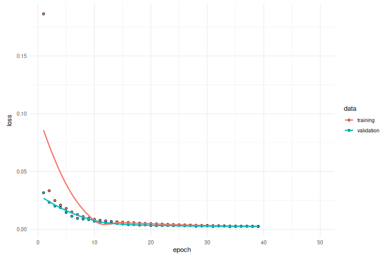
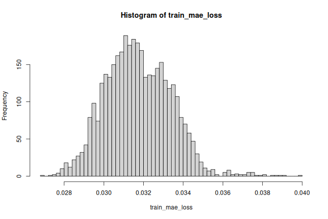

## Introduction

This script demonstrates how you can use a reconstruction convolutional
autoencoder model to detect anomalies in timeseries data.

## Setup


``` r
library(dplyr, warn.conflicts = FALSE)
library(ggplot2)
theme_set(theme_minimal())

library(listarrays)
library(tfdatasets, exclude = c("shape"))
library(keras3)
```


## Load the data

We will use the [Numenta Anomaly Benchmark(NAB)](
https://www.kaggle.com/boltzmannbrain/nab) dataset. It provides artificial
timeseries data containing labeled anomalous periods of behavior. Data are
ordered, timestamped, single-valued metrics.

We will use the `art_daily_small_noise.csv` file for training and the
`art_daily_jumpsup.csv` file for testing. The simplicity of this dataset
allows us to demonstrate anomaly detection.


``` r
get_data <- function(url_suffix) {
  url_root <- "https://raw.githubusercontent.com/numenta/NAB/master/data/"
  url <- paste0(url_root, url_suffix)
  file <- get_file(origin = url) # cache file locally
  # parse csv; 2 columns with types: datetime (T), double (d)
  readr::read_csv(file, col_types = "Td")
}

df_small_noise   <- get_data("artificialNoAnomaly/art_daily_small_noise.csv")
df_daily_jumpsup <- get_data("artificialWithAnomaly/art_daily_jumpsup.csv")
```


## Quick look at the data


``` r
df_small_noise
```

```
## # A tibble: 4,032 × 2
##    timestamp           value
##    <dttm>              <dbl>
##  1 2014-04-01 00:00:00  18.3
##  2 2014-04-01 00:05:00  22.0
##  3 2014-04-01 00:10:00  18.6
##  4 2014-04-01 00:15:00  22.0
##  5 2014-04-01 00:20:00  21.9
##  6 2014-04-01 00:25:00  21.2
##  7 2014-04-01 00:30:00  20.6
##  8 2014-04-01 00:35:00  20.3
##  9 2014-04-01 00:40:00  21.5
## 10 2014-04-01 00:45:00  19.2
## # ℹ 4,022 more rows
```

``` r
df_daily_jumpsup
```

```
## # A tibble: 4,032 × 2
##    timestamp           value
##    <dttm>              <dbl>
##  1 2014-04-01 00:00:00  19.8
##  2 2014-04-01 00:05:00  20.5
##  3 2014-04-01 00:10:00  20.0
##  4 2014-04-01 00:15:00  21.5
##  5 2014-04-01 00:20:00  20.2
##  6 2014-04-01 00:25:00  19.9
##  7 2014-04-01 00:30:00  21.7
##  8 2014-04-01 00:35:00  20.9
##  9 2014-04-01 00:40:00  18.4
## 10 2014-04-01 00:45:00  18.7
## # ℹ 4,022 more rows
```

## Visualize the data
### Timeseries data without anomalies

We will use the following data for training.


``` r
plot_ts <- function(df) {
  ggplot(df, aes(x = timestamp, y = value)) + geom_line() +
    scale_x_datetime(date_breaks = "1 day", date_labels = "%b-%d")
}

plot_ts(df_small_noise) + ggtitle("Without Anomaly")
```


### Timeseries data with anomalies

We will use the following data for testing and see if the sudden jump up in the
data is detected as an anomaly.


``` r
plot_ts(df_daily_jumpsup) + ggtitle("With Anomaly")
```


## Prepare training data

Get data values from the training timeseries data file and normalize the
`value` data. We have a `value` for every 5 mins for 14 days.

-   24 * 60 / 5 = **288 timesteps per day**
-   288 * 14 = **4032 data points** in total


``` r
df_train <- df_small_noise |>
  mutate(value = (value - mean(value)) / sd(value))

cat("Number of training samples:", nrow(df_train), "\n")
```

```
## Number of training samples: 4032
```


### Create sequences
Create sequences combining `TIME_STEPS` contiguous data values from the
training data.


``` r
TIME_STEPS <- 288

as_dataset <- function(df) {
  x <- as.matrix(df$value)
  ds <- timeseries_dataset_from_array(x, NULL, sequence_length = TIME_STEPS)
  # Because the dataset is small, cast TF Dataset to an R array for convenience.
  ds |> as_array_iterator() |> iterate() |> bind_on_rows()
}

x_train <- as_dataset(df_train)
writeLines(sprintf("Training input shape: (%s)", toString(dim(x_train))))
```

```
## Training input shape: (3745, 288, 1)
```

## Build a model

We will build a convolutional reconstruction autoencoder model. The model will
take input of shape `(batch_size, sequence_length, num_features)` and return
output of the same shape. In this case, `sequence_length` is 288 and
`num_features` is 1.


``` r
model <- keras_model_sequential(input_shape = c(TIME_STEPS, 1)) |>
  layer_conv_1d(
    filters = 32, kernel_size = 7, padding = "same",
    strides = 2, activation = "relu"
  ) |>
  layer_dropout(rate = 0.2) |>
  layer_conv_1d(
    filters = 16, kernel_size = 7, padding = "same",
    strides = 2, activation = "relu"
  ) |>
  layer_conv_1d_transpose(
    filters = 16, kernel_size = 7, padding = "same",
    strides = 2, activation = "relu"
  ) |>
  layer_dropout(rate = 0.2) |>
  layer_conv_1d_transpose(
    filters = 32, kernel_size = 7, padding = "same",
    strides = 2, activation = "relu"
  ) |>
  layer_conv_1d_transpose(filters = 1, kernel_size = 7, padding = "same")

model |> compile(optimizer=optimizer_adam(learning_rate=0.001), loss="mse")
model
```

```
## Model: "sequential"
## ┏━━━━━━━━━━━━━━━━━━━━━━━━━━━━━━━━━┳━━━━━━━━━━━━━━━━━━━━━━━━┳━━━━━━━━━━━━━━━┓
## ┃ Layer (type)                    ┃ Output Shape           ┃       Param # ┃
## ┡━━━━━━━━━━━━━━━━━━━━━━━━━━━━━━━━━╇━━━━━━━━━━━━━━━━━━━━━━━━╇━━━━━━━━━━━━━━━┩
## │ conv1d (Conv1D)                 │ (None, 144, 32)        │           256 │
## ├─────────────────────────────────┼────────────────────────┼───────────────┤
## │ dropout (Dropout)               │ (None, 144, 32)        │             0 │
## ├─────────────────────────────────┼────────────────────────┼───────────────┤
## │ conv1d_1 (Conv1D)               │ (None, 72, 16)         │         3,600 │
## ├─────────────────────────────────┼────────────────────────┼───────────────┤
## │ conv1d_transpose                │ (None, 144, 16)        │         1,808 │
## │ (Conv1DTranspose)               │                        │               │
## ├─────────────────────────────────┼────────────────────────┼───────────────┤
## │ dropout_1 (Dropout)             │ (None, 144, 16)        │             0 │
## ├─────────────────────────────────┼────────────────────────┼───────────────┤
## │ conv1d_transpose_1              │ (None, 288, 32)        │         3,616 │
## │ (Conv1DTranspose)               │                        │               │
## ├─────────────────────────────────┼────────────────────────┼───────────────┤
## │ conv1d_transpose_2              │ (None, 288, 1)         │           225 │
## │ (Conv1DTranspose)               │                        │               │
## └─────────────────────────────────┴────────────────────────┴───────────────┘
##  Total params: 9,505 (37.13 KB)
##  Trainable params: 9,505 (37.13 KB)
##  Non-trainable params: 0 (0.00 B)
```


## Train the model

Please note that we are using `x_train` as both the input and the target
since this is a reconstruction model.


``` r
history = model |> fit(
  x_train, x_train,
  epochs = 50,
  validation_split = 0.1,
  callbacks = c(
    callback_early_stopping(
      monitor = "val_loss", patience = 5, mode = "min"
    )
  )
)
```

```
## Epoch 1/50
## 106/106 - 7s - 62ms/step - loss: 0.1863 - val_loss: 0.0316
## Epoch 2/50
## 106/106 - 0s - 2ms/step - loss: 0.0333 - val_loss: 0.0233
## Epoch 3/50
## 106/106 - 0s - 2ms/step - loss: 0.0248 - val_loss: 0.0201
## Epoch 4/50
## 106/106 - 0s - 2ms/step - loss: 0.0209 - val_loss: 0.0186
## Epoch 5/50
## 106/106 - 0s - 2ms/step - loss: 0.0179 - val_loss: 0.0146
## Epoch 6/50
## 106/106 - 0s - 2ms/step - loss: 0.0150 - val_loss: 0.0113
## Epoch 7/50
## 106/106 - 0s - 2ms/step - loss: 0.0127 - val_loss: 0.0094
## Epoch 8/50
## 106/106 - 0s - 2ms/step - loss: 0.0109 - val_loss: 0.0088
## Epoch 9/50
## 106/106 - 0s - 3ms/step - loss: 0.0096 - val_loss: 0.0084
## Epoch 10/50
## 106/106 - 0s - 2ms/step - loss: 0.0086 - val_loss: 0.0069
## Epoch 11/50
## 106/106 - 0s - 2ms/step - loss: 0.0078 - val_loss: 0.0062
## Epoch 12/50
## 106/106 - 0s - 2ms/step - loss: 0.0073 - val_loss: 0.0058
## Epoch 13/50
## 106/106 - 0s - 2ms/step - loss: 0.0067 - val_loss: 0.0054
## Epoch 14/50
## 106/106 - 0s - 2ms/step - loss: 0.0063 - val_loss: 0.0051
## Epoch 15/50
## 106/106 - 0s - 2ms/step - loss: 0.0060 - val_loss: 0.0045
## Epoch 16/50
## 106/106 - 0s - 2ms/step - loss: 0.0058 - val_loss: 0.0039
## Epoch 17/50
## 106/106 - 0s - 2ms/step - loss: 0.0055 - val_loss: 0.0041
## Epoch 18/50
## 106/106 - 0s - 2ms/step - loss: 0.0052 - val_loss: 0.0036
## Epoch 19/50
## 106/106 - 0s - 2ms/step - loss: 0.0050 - val_loss: 0.0037
## Epoch 20/50
## 106/106 - 0s - 2ms/step - loss: 0.0048 - val_loss: 0.0033
## Epoch 21/50
## 106/106 - 0s - 2ms/step - loss: 0.0046 - val_loss: 0.0031
## Epoch 22/50
## 106/106 - 0s - 2ms/step - loss: 0.0044 - val_loss: 0.0032
## Epoch 23/50
## 106/106 - 0s - 2ms/step - loss: 0.0042 - val_loss: 0.0033
## Epoch 24/50
## 106/106 - 0s - 2ms/step - loss: 0.0040 - val_loss: 0.0031
## Epoch 25/50
## 106/106 - 0s - 2ms/step - loss: 0.0038 - val_loss: 0.0032
## Epoch 26/50
## 106/106 - 0s - 2ms/step - loss: 0.0036 - val_loss: 0.0031
## Epoch 27/50
## 106/106 - 0s - 2ms/step - loss: 0.0035 - val_loss: 0.0031
## Epoch 28/50
## 106/106 - 0s - 2ms/step - loss: 0.0033 - val_loss: 0.0025
## Epoch 29/50
## 106/106 - 0s - 2ms/step - loss: 0.0032 - val_loss: 0.0026
## Epoch 30/50
## 106/106 - 0s - 2ms/step - loss: 0.0031 - val_loss: 0.0029
## Epoch 31/50
## 106/106 - 0s - 2ms/step - loss: 0.0030 - val_loss: 0.0024
## Epoch 32/50
## 106/106 - 0s - 2ms/step - loss: 0.0029 - val_loss: 0.0025
## Epoch 33/50
## 106/106 - 0s - 2ms/step - loss: 0.0028 - val_loss: 0.0025
## Epoch 34/50
## 106/106 - 0s - 2ms/step - loss: 0.0027 - val_loss: 0.0022
## Epoch 35/50
## 106/106 - 0s - 2ms/step - loss: 0.0026 - val_loss: 0.0023
## Epoch 36/50
## 106/106 - 0s - 2ms/step - loss: 0.0026 - val_loss: 0.0025
## Epoch 37/50
## 106/106 - 0s - 2ms/step - loss: 0.0025 - val_loss: 0.0025
## Epoch 38/50
## 106/106 - 0s - 2ms/step - loss: 0.0025 - val_loss: 0.0023
## Epoch 39/50
## 106/106 - 0s - 2ms/step - loss: 0.0024 - val_loss: 0.0023
```

Let's plot training and validation loss to see how the training went.


``` r
plot(history)
```



## Detecting anomalies

We will detect anomalies by determining how well our model can reconstruct
the input data.


1.   Find MAE loss on training samples.
2.   Find max MAE loss value. This is the worst our model has performed trying
to reconstruct a sample. We will make this the `threshold` for anomaly
detection.
3.   If the reconstruction loss for a sample is greater than this `threshold`
value then we can infer that the model is seeing a pattern that it isn't
familiar with. We will label this sample as an `anomaly`.


``` r
# Get train MAE loss.
x_train_pred <- model |> predict(x_train)
```

```
## 118/118 - 0s - 3ms/step
```

``` r
train_mae_loss <- apply(abs(x_train_pred - x_train), 1, mean)

hist(train_mae_loss, breaks = 50)
```



``` r
# Get reconstruction loss threshold.
threshold <- max(train_mae_loss)
cat("Reconstruction error threshold: ", threshold, "\n")
```

```
## Reconstruction error threshold:  0.03930207
```


### Compare recontruction

Just for fun, let's see how our model has recontructed the first sample.
This is the 288 timesteps from day 1 of our training dataset.


``` r
# Checking how the first sequence is learnt
plot(NULL, NULL, ylab = 'Value',
     xlim = c(0, TIME_STEPS),
     ylim = range(c(x_train[1,,], x_train_pred[1,,])))
lines(x_train[1,,])
lines(x_train_pred[1,,], col = 'red')
legend("topleft", lty = 1,
       legend = c("actual", "predicted"),
       col = c("black", "red"))
```


### Prepare test data


``` r
df_test <- df_daily_jumpsup |>
  mutate(value =
           (value - mean(df_small_noise$value)) /
             sd(df_small_noise$value))

df_test |> head()
plot_ts(df_test)
```


``` r
# Create sequences from test values.
x_test <- as_dataset(df_test)

# Get test MAE loss.
x_test_pred <- model |> predict(x_test)
test_mae_loss <- apply(abs(x_test_pred - x_test), 1, mean)

hist(test_mae_loss, breaks = 50, xlab = "test MAE loss", ylab = "No of samples")
```


``` r
# Detect all the samples which are anomalies.
anomalies <- test_mae_loss > threshold
cat("Number of anomaly samples:", sum(anomalies), "\n")
cat("Indices of anomaly samples:", which(anomalies), "\n", fill = TRUE)
```

```
## # A tibble: 6 × 2
##   timestamp            value
##   <dttm>               <dbl>
## 1 2014-04-01 00:00:00 -0.808
## 2 2014-04-01 00:05:00 -0.781
## 3 2014-04-01 00:10:00 -0.801
## 4 2014-04-01 00:15:00 -0.746
## 5 2014-04-01 00:20:00 -0.792
## 6 2014-04-01 00:25:00 -0.802
## 118/118 - 0s - 763us/step
## Number of anomaly samples: 486
## Indices of anomaly samples: 216 218 220 396 507 793 795 1659 1945 1946 1947
## 1949 2013 2016 2017 2021 2025 2029 2033 2037 2041 2045 2046 2049 2052 2053
## 2054 2056 2057 2058 2060 2061 2062 2064 2065 2066 2068 2069 2070 2072 2073
## 2074 2076 2077 2078 2080 2081 2082 2084 2085 2086 2088 2089 2090 2092 2093
## 2094 2096 2097 2098 2100 2101 2102 2105 2108 2109 2112 2113 2117 2121 2124
## 2126 2129 2141 2145 2153 2521 2522 2523 2525 2538 2542 2546 2550 2698 2700
## 2702 2703 2704 2705 2706 2707 2708 2709 2710 2711 2712 2713 2714 2715 2716
## 2717 2718 2719 2720 2721 2722 2723 2724 2725 2726 2727 2728 2729 2730 2731
## 2732 2733 2734 2735 2736 2737 2738 2739 2740 2741 2742 2743 2744 2745 2746
## 2747 2748 2749 2750 2751 2752 2753 2754 2755 2756 2757 2758 2759 2760 2761
## 2762 2763 2764 2765 2766 2767 2768 2769 2770 2771 2772 2773 2774 2775 2776
## 2777 2778 2779 2780 2781 2782 2783 2784 2785 2786 2787 2788 2789 2790 2791
## 2792 2793 2794 2795 2796 2797 2798 2799 2800 2801 2802 2803 2804 2805 2806
## 2807 2808 2809 2810 2811 2812 2813 2814 2815 2816 2817 2818 2819 2820 2821
## 2822 2823 2824 2825 2826 2827 2828 2829 2830 2831 2832 2833 2834 2835 2836
## 2837 2838 2839 2840 2841 2842 2843 2844 2845 2846 2847 2848 2849 2850 2851
## 2852 2853 2854 2855 2856 2857 2858 2859 2860 2861 2862 2863 2864 2865 2866
## 2867 2868 2869 2870 2871 2872 2873 2874 2875 2876 2877 2878 2879 2880 2881
## 2882 2883 2884 2885 2886 2887 2888 2889 2890 2891 2892 2893 2894 2895 2896
## 2897 2898 2899 2900 2901 2902 2903 2904 2905 2906 2907 2908 2909 2910 2911
## 2912 2913 2914 2915 2916 2917 2918 2919 2920 2921 2922 2923 2924 2925 2926
## 2927 2928 2929 2930 2931 2932 2933 2934 2935 2936 2937 2938 2939 2940 2941
## 2942 2943 2944 2945 2946 2947 2948 2949 2950 2951 2952 2953 2954 2955 2956
## 2957 2958 2959 2960 2961 2962 2963 2964 2965 2966 2967 2968 2969 2970 2971
## 2972 2973 2974 2975 2976 2977 2978 2979 2980 2981 2982 2983 2984 2985 2986
## 2987 2988 2989 2990 2991 2992 2993 2994 2995 2996 2997 2998 2999 3000 3001
## 3002 3003 3004 3005 3006 3007 3008 3009 3010 3011 3012 3013 3014 3015 3016
## 3017 3018 3019 3020 3021 3022 3023 3024 3025 3026 3027 3028 3029 3030 3031
## 3032 3033 3034 3035 3036 3037 3038 3039 3040 3041 3042 3043 3044 3045 3046
## 3047 3048 3049 3050 3051 3052 3053 3054 3055 3056 3057 3058 3059 3060 3061
## 3062 3063 3064 3065 3066 3067 3068 3069 3070 3071 3072 3073 3074 3075 3076
## 3077 3078 3079 3080 3081 3082 3083 3084 3085 3086 3087 3088 3089 3090 3091
## 3092 3093 3094 3095 3096 3097 3098 3099 3100 3101
```


## Plot anomalies

We now know the samples of the data which are anomalies. With this, we will
find the corresponding `timestamps` from the original test data. We will be
using the following method to do that:

Let's say time_steps = 3 and we have 10 training values. Our `x_train` will
look like this:

- 0, 1, 2
- 1, 2, 3
- 2, 3, 4
- 3, 4, 5
- 4, 5, 6
- 5, 6, 7
- 6, 7, 8
- 7, 8, 9

All except the initial and the final time_steps-1 data values, will appear in
`time_steps` number of samples. So, if we know that the samples
[(3, 4, 5), (4, 5, 6), (5, 6, 7)] are anomalies, we can say that the data point
5 is an anomaly.

Let's overlay the anomalies on the original test data plot.


``` r
is_anomaly <- test_mae_loss > threshold
is_anomaly <- is_anomaly &
  zoo::rollsum(is_anomaly, TIME_STEPS,
               align = "right", na.pad = TRUE) >= TIME_STEPS

with(df_test, {
  plot(value ~ timestamp, type = 'l', xaxt = 'n', las = 2)
  axis.POSIXct(1, at = seq(timestamp[1], tail(timestamp, 1), by = "days"),
               format = "%b-%d")
})

with(df_test[which(is_anomaly),], {
  points(value ~ timestamp, col = "red")
})
```


