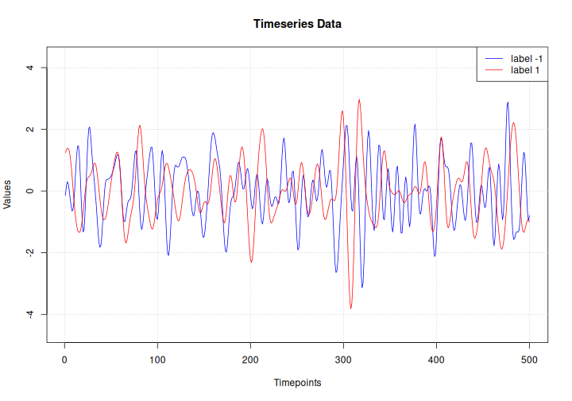
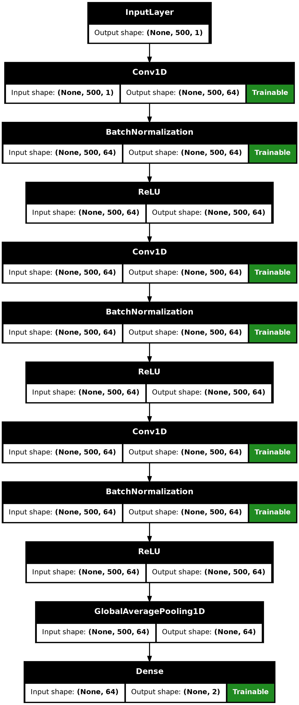
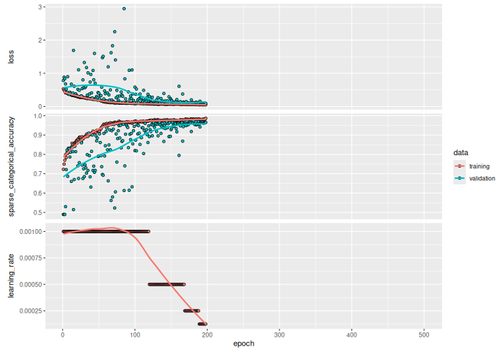
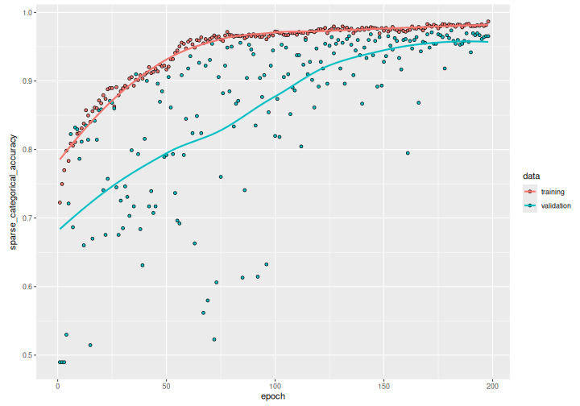

## Introduction

This example shows how to do timeseries classification from scratch, starting from raw
CSV timeseries files on disk. We demonstrate the workflow on the FordA dataset from the
[UCR/UEA archive](https://www.cs.ucr.edu/%7Eeamonn/time_series_data_2018/).

## Setup


``` r
library(keras3)
use_backend("jax")
```

## Load the data: the FordA dataset

### Dataset description

The dataset we are using here is called FordA.
The data comes from the UCR archive.
The dataset contains 3601 training instances and another 1320 testing instances.
Each timeseries corresponds to a measurement of engine noise captured by a motor sensor.
For this task, the goal is to automatically detect the presence of a specific issue with
the engine. The problem is a balanced binary classification task. The full description of
this dataset can be found [here](http://www.j-wichard.de/publications/FordPaper.pdf).

### Read the TSV data

We will use the `FordA_TRAIN` file for training and the
`FordA_TEST` file for testing. The simplicity of this dataset
allows us to demonstrate effectively how to use ConvNets for timeseries classification.
In this file, the first column corresponds to the label.


``` r
get_data <- function(path) {
  if(path |> startsWith("https://"))
    path <- get_file(origin = path)  # cache file locally

  data <- readr::read_tsv(
    path, col_names = FALSE,
    # Each row is: one integer (the label),
    # followed by 500 doubles (the timeseries)
    col_types = paste0("i", strrep("d", 500))
  )

  y <- as.matrix(data[[1]])
  x <- as.matrix(data[,-1])
  dimnames(x) <- dimnames(y) <- NULL

  list(x, y)
}

root_url <- "https://raw.githubusercontent.com/hfawaz/cd-diagram/master/FordA/"
c(x_train, y_train) %<-% get_data(paste0(root_url, "FordA_TRAIN.tsv"))
c(x_test, y_test) %<-% get_data(paste0(root_url, "FordA_TEST.tsv"))

str(keras3:::named_list(
  x_train, y_train,
  x_test, y_test
))
```

```
## List of 4
##  $ x_train: num [1:3601, 1:500] -0.797 0.805 0.728 -0.234 -0.171 ...
##  $ y_train: int [1:3601, 1] -1 1 -1 -1 -1 1 1 1 1 1 ...
##  $ x_test : num [1:1320, 1:500] -0.14 0.334 0.717 1.24 -1.159 ...
##  $ y_test : int [1:1320, 1] -1 -1 -1 1 -1 1 -1 -1 1 1 ...
```


## Visualize the data

Here we visualize one timeseries example for each class in the dataset.


``` r
plot(NULL, main = "Timeseries Data",
     xlab = "Timepoints",  ylab = "Values",
     xlim = c(1, ncol(x_test)),
     ylim = range(x_test))
grid()
lines(x_test[match(-1, y_test), ], col = "blue")
lines(x_test[match( 1, y_test), ], col = "red")
legend("topright", legend=c("label -1", "label 1"), col=c("blue", "red"), lty=1)
```




## Standardize the data

Our timeseries are already in a single length (500). However, their values are
usually in various ranges. This is not ideal for a neural network;
in general we should seek to make the input values normalized.
For this specific dataset, the data is already z-normalized: each timeseries sample
has a mean equal to zero and a standard deviation equal to one. This type of
normalization is very common for timeseries classification problems, see
[Bagnall et al. (2016)](https://link.springer.com/article/10.1007/s10618-016-0483-9).

Note that the timeseries data used here are univariate, meaning we only have one channel
per timeseries example.
We will therefore transform the timeseries into a multivariate one with one channel
using a simple reshaping via numpy.
This will allow us to construct a model that is easily applicable to multivariate time
series.


``` r
dim(x_train) <- c(dim(x_train), 1)
dim(x_test) <- c(dim(x_test), 1)
```


Finally, in order to use `sparse_categorical_crossentropy`, we will have to count
the number of classes beforehand.


``` r
num_classes <- length(unique(y_train))
```


Now we shuffle the training set because we will be using the `validation_split` option
later when training.


``` r
c(x_train, y_train) %<-% listarrays::shuffle_rows(x_train, y_train)
# idx <- sample.int(nrow(x_train))
# x_train %<>% .[idx,, ,drop = FALSE]
# y_train %<>% .[idx,  ,drop = FALSE]
```


Standardize the labels to positive integers.
The expected labels will then be 0 and 1.


``` r
y_train[y_train == -1L] <- 0L
y_test[y_test == -1L] <- 0L
```


## Build a model

We build a Fully Convolutional Neural Network originally proposed in
[this paper](https://arxiv.org/abs/1611.06455).
The implementation is based on the TF 2 version provided
[here](https://github.com/hfawaz/dl-4-tsc/).
The following hyperparameters (kernel_size, filters, the usage of BatchNorm) were found
via random search using [KerasTuner](https://github.com/keras-team/keras-tuner).


``` r
make_model <- function(input_shape) {
  inputs <- keras_input(input_shape)

  outputs <- inputs |>
    # conv1
    layer_conv_1d(filters = 64, kernel_size = 3, padding = "same") |>
    layer_batch_normalization() |>
    layer_activation_relu() |>
    # conv2
    layer_conv_1d(filters = 64, kernel_size = 3, padding = "same") |>
    layer_batch_normalization() |>
    layer_activation_relu() |>
    # conv3
    layer_conv_1d(filters = 64, kernel_size = 3, padding = "same") |>
    layer_batch_normalization() |>
    layer_activation_relu() |>
    # pooling
    layer_global_average_pooling_1d() |>
    # final output
    layer_dense(num_classes, activation = "softmax")

  keras_model(inputs, outputs)
}

model <- make_model(input_shape = dim(x_train)[-1])
```


``` r
model
```

```
## Model: "functional"
## ┏━━━━━━━━━━━━━━━━━━━━━━━━━━━━━┳━━━━━━━━━━━━━━━━━━━━━━━┳━━━━━━━━━━━━┳━━━━━━━┓
## ┃ Layer (type)                ┃ Output Shape          ┃    Param # ┃ Trai… ┃
## ┡━━━━━━━━━━━━━━━━━━━━━━━━━━━━━╇━━━━━━━━━━━━━━━━━━━━━━━╇━━━━━━━━━━━━╇━━━━━━━┩
## │ input_layer (InputLayer)    │ (None, 500, 1)        │          0 │   -   │
## ├─────────────────────────────┼───────────────────────┼────────────┼───────┤
## │ conv1d (Conv1D)             │ (None, 500, 64)       │        256 │   Y   │
## ├─────────────────────────────┼───────────────────────┼────────────┼───────┤
## │ batch_normalization         │ (None, 500, 64)       │        256 │   Y   │
## │ (BatchNormalization)        │                       │            │       │
## ├─────────────────────────────┼───────────────────────┼────────────┼───────┤
## │ re_lu (ReLU)                │ (None, 500, 64)       │          0 │   -   │
## ├─────────────────────────────┼───────────────────────┼────────────┼───────┤
## │ conv1d_1 (Conv1D)           │ (None, 500, 64)       │     12,352 │   Y   │
## ├─────────────────────────────┼───────────────────────┼────────────┼───────┤
## │ batch_normalization_1       │ (None, 500, 64)       │        256 │   Y   │
## │ (BatchNormalization)        │                       │            │       │
## ├─────────────────────────────┼───────────────────────┼────────────┼───────┤
## │ re_lu_1 (ReLU)              │ (None, 500, 64)       │          0 │   -   │
## ├─────────────────────────────┼───────────────────────┼────────────┼───────┤
## │ conv1d_2 (Conv1D)           │ (None, 500, 64)       │     12,352 │   Y   │
## ├─────────────────────────────┼───────────────────────┼────────────┼───────┤
## │ batch_normalization_2       │ (None, 500, 64)       │        256 │   Y   │
## │ (BatchNormalization)        │                       │            │       │
## ├─────────────────────────────┼───────────────────────┼────────────┼───────┤
## │ re_lu_2 (ReLU)              │ (None, 500, 64)       │          0 │   -   │
## ├─────────────────────────────┼───────────────────────┼────────────┼───────┤
## │ global_average_pooling1d    │ (None, 64)            │          0 │   -   │
## │ (GlobalAveragePooling1D)    │                       │            │       │
## ├─────────────────────────────┼───────────────────────┼────────────┼───────┤
## │ dense (Dense)               │ (None, 2)             │        130 │   Y   │
## └─────────────────────────────┴───────────────────────┴────────────┴───────┘
##  Total params: 25,858 (101.01 KB)
##  Trainable params: 25,474 (99.51 KB)
##  Non-trainable params: 384 (1.50 KB)
```

``` r
plot(model, show_shapes = TRUE)
```

<div class="figure">

<p class="caption">plot of chunk unnamed-chunk-9</p>
</div>


## Train the model


``` r
epochs <- 500
batch_size <- 32

callbacks <- c(
  callback_model_checkpoint(
    "best_model.keras", save_best_only = TRUE,
    monitor = "val_loss"
  ),
  callback_reduce_lr_on_plateau(
    monitor = "val_loss", factor = 0.5,
    patience = 20, min_lr = 0.0001
  ),
  callback_early_stopping(
    monitor = "val_loss", patience = 50,
    verbose = 1
  )
)


model |> compile(
  optimizer = "adam",
  loss = "sparse_categorical_crossentropy",
  metrics = "sparse_categorical_accuracy"
)

history <- model |> fit(
  x_train, y_train,
  batch_size = batch_size,
  epochs = epochs,
  callbacks = callbacks,
  validation_split = 0.2
)
```

```
## Epoch 1/500
## 90/90 - 2s - 18ms/step - loss: 0.5305 - sparse_categorical_accuracy: 0.7226 - val_loss: 0.7836 - val_sparse_categorical_accuracy: 0.4896 - learning_rate: 0.0010
## Epoch 2/500
## 90/90 - 0s - 3ms/step - loss: 0.4923 - sparse_categorical_accuracy: 0.7497 - val_loss: 0.8835 - val_sparse_categorical_accuracy: 0.4896 - learning_rate: 0.0010
## Epoch 3/500
## 90/90 - 0s - 2ms/step - loss: 0.4543 - sparse_categorical_accuracy: 0.7698 - val_loss: 0.8377 - val_sparse_categorical_accuracy: 0.4896 - learning_rate: 0.0010
## Epoch 4/500
## 90/90 - 0s - 3ms/step - loss: 0.4099 - sparse_categorical_accuracy: 0.7983 - val_loss: 0.6798 - val_sparse_categorical_accuracy: 0.5298 - learning_rate: 0.0010
## Epoch 5/500
## 90/90 - 0s - 3ms/step - loss: 0.4210 - sparse_categorical_accuracy: 0.7833 - val_loss: 0.5218 - val_sparse_categorical_accuracy: 0.7212 - learning_rate: 0.0010
## Epoch 6/500
## 90/90 - 0s - 3ms/step - loss: 0.4007 - sparse_categorical_accuracy: 0.8087 - val_loss: 0.4295 - val_sparse_categorical_accuracy: 0.8225 - learning_rate: 0.0010
## Epoch 7/500
## 90/90 - 0s - 2ms/step - loss: 0.3931 - sparse_categorical_accuracy: 0.8056 - val_loss: 0.8992 - val_sparse_categorical_accuracy: 0.6865 - learning_rate: 0.0010
## Epoch 8/500
## 90/90 - 0s - 2ms/step - loss: 0.3809 - sparse_categorical_accuracy: 0.8108 - val_loss: 0.3725 - val_sparse_categorical_accuracy: 0.8322 - learning_rate: 0.0010
## Epoch 9/500
## 90/90 - 0s - 2ms/step - loss: 0.3734 - sparse_categorical_accuracy: 0.8229 - val_loss: 0.3647 - val_sparse_categorical_accuracy: 0.8294 - learning_rate: 0.0010
## Epoch 10/500
## 90/90 - 0s - 2ms/step - loss: 0.3712 - sparse_categorical_accuracy: 0.8240 - val_loss: 0.4302 - val_sparse_categorical_accuracy: 0.7864 - learning_rate: 0.0010
## Epoch 11/500
## 90/90 - 0s - 2ms/step - loss: 0.3607 - sparse_categorical_accuracy: 0.8309 - val_loss: 0.3896 - val_sparse_categorical_accuracy: 0.8114 - learning_rate: 0.0010
## Epoch 12/500
## 90/90 - 0s - 2ms/step - loss: 0.3506 - sparse_categorical_accuracy: 0.8378 - val_loss: 0.6731 - val_sparse_categorical_accuracy: 0.6602 - learning_rate: 0.0010
## Epoch 13/500
## 90/90 - 0s - 2ms/step - loss: 0.3334 - sparse_categorical_accuracy: 0.8573 - val_loss: 0.3612 - val_sparse_categorical_accuracy: 0.8350 - learning_rate: 0.0010
## Epoch 14/500
## 90/90 - 0s - 2ms/step - loss: 0.3367 - sparse_categorical_accuracy: 0.8497 - val_loss: 0.4063 - val_sparse_categorical_accuracy: 0.8141 - learning_rate: 0.0010
## Epoch 15/500
## 90/90 - 0s - 2ms/step - loss: 0.3361 - sparse_categorical_accuracy: 0.8403 - val_loss: 1.6892 - val_sparse_categorical_accuracy: 0.5146 - learning_rate: 0.0010
## Epoch 16/500
## 90/90 - 0s - 2ms/step - loss: 0.3340 - sparse_categorical_accuracy: 0.8559 - val_loss: 0.6099 - val_sparse_categorical_accuracy: 0.6699 - learning_rate: 0.0010
## Epoch 17/500
## 90/90 - 0s - 2ms/step - loss: 0.3138 - sparse_categorical_accuracy: 0.8611 - val_loss: 0.3490 - val_sparse_categorical_accuracy: 0.8419 - learning_rate: 0.0010
## Epoch 18/500
## 90/90 - 0s - 2ms/step - loss: 0.3140 - sparse_categorical_accuracy: 0.8601 - val_loss: 0.3829 - val_sparse_categorical_accuracy: 0.8141 - learning_rate: 0.0010
## Epoch 19/500
## 90/90 - 0s - 2ms/step - loss: 0.3076 - sparse_categorical_accuracy: 0.8715 - val_loss: 0.3382 - val_sparse_categorical_accuracy: 0.8571 - learning_rate: 0.0010
## Epoch 20/500
## 90/90 - 0s - 2ms/step - loss: 0.3069 - sparse_categorical_accuracy: 0.8674 - val_loss: 0.3206 - val_sparse_categorical_accuracy: 0.8585 - learning_rate: 0.0010
## Epoch 21/500
## 90/90 - 0s - 2ms/step - loss: 0.2841 - sparse_categorical_accuracy: 0.8792 - val_loss: 0.5172 - val_sparse_categorical_accuracy: 0.7406 - learning_rate: 0.0010
## Epoch 22/500
## 90/90 - 0s - 2ms/step - loss: 0.2988 - sparse_categorical_accuracy: 0.8740 - val_loss: 1.1048 - val_sparse_categorical_accuracy: 0.6755 - learning_rate: 0.0010
## Epoch 23/500
## 90/90 - 0s - 2ms/step - loss: 0.2797 - sparse_categorical_accuracy: 0.8878 - val_loss: 0.4888 - val_sparse_categorical_accuracy: 0.7573 - learning_rate: 0.0010
## Epoch 24/500
## 90/90 - 0s - 2ms/step - loss: 0.2772 - sparse_categorical_accuracy: 0.8896 - val_loss: 0.2943 - val_sparse_categorical_accuracy: 0.8710 - learning_rate: 0.0010
## Epoch 25/500
## 90/90 - 0s - 2ms/step - loss: 0.2701 - sparse_categorical_accuracy: 0.8896 - val_loss: 0.3093 - val_sparse_categorical_accuracy: 0.8682 - learning_rate: 0.0010
## Epoch 26/500
## 90/90 - 0s - 2ms/step - loss: 0.3152 - sparse_categorical_accuracy: 0.8628 - val_loss: 0.3156 - val_sparse_categorical_accuracy: 0.8599 - learning_rate: 0.0010
## Epoch 27/500
## 90/90 - 0s - 2ms/step - loss: 0.2683 - sparse_categorical_accuracy: 0.8910 - val_loss: 0.5393 - val_sparse_categorical_accuracy: 0.7448 - learning_rate: 0.0010
## Epoch 28/500
## 90/90 - 0s - 2ms/step - loss: 0.2819 - sparse_categorical_accuracy: 0.8792 - val_loss: 0.8030 - val_sparse_categorical_accuracy: 0.6755 - learning_rate: 0.0010
## Epoch 29/500
## 90/90 - 0s - 2ms/step - loss: 0.2651 - sparse_categorical_accuracy: 0.8851 - val_loss: 0.5675 - val_sparse_categorical_accuracy: 0.7254 - learning_rate: 0.0010
## Epoch 30/500
## 90/90 - 0s - 2ms/step - loss: 0.2615 - sparse_categorical_accuracy: 0.8892 - val_loss: 1.3264 - val_sparse_categorical_accuracy: 0.6852 - learning_rate: 0.0010
## Epoch 31/500
## 90/90 - 0s - 2ms/step - loss: 0.2640 - sparse_categorical_accuracy: 0.8931 - val_loss: 0.5669 - val_sparse_categorical_accuracy: 0.7462 - learning_rate: 0.0010
## Epoch 32/500
## 90/90 - 0s - 2ms/step - loss: 0.2569 - sparse_categorical_accuracy: 0.8906 - val_loss: 0.6081 - val_sparse_categorical_accuracy: 0.7309 - learning_rate: 0.0010
## Epoch 33/500
## 90/90 - 0s - 2ms/step - loss: 0.2432 - sparse_categorical_accuracy: 0.9035 - val_loss: 1.1732 - val_sparse_categorical_accuracy: 0.7032 - learning_rate: 0.0010
## Epoch 34/500
## 90/90 - 0s - 2ms/step - loss: 0.2375 - sparse_categorical_accuracy: 0.9056 - val_loss: 0.3426 - val_sparse_categorical_accuracy: 0.7989 - learning_rate: 0.0010
## Epoch 35/500
## 90/90 - 0s - 2ms/step - loss: 0.2553 - sparse_categorical_accuracy: 0.8931 - val_loss: 1.0129 - val_sparse_categorical_accuracy: 0.7171 - learning_rate: 0.0010
## Epoch 36/500
## 90/90 - 0s - 2ms/step - loss: 0.2440 - sparse_categorical_accuracy: 0.9017 - val_loss: 0.2432 - val_sparse_categorical_accuracy: 0.9098 - learning_rate: 0.0010
## Epoch 37/500
## 90/90 - 0s - 2ms/step - loss: 0.2382 - sparse_categorical_accuracy: 0.9014 - val_loss: 0.3763 - val_sparse_categorical_accuracy: 0.7933 - learning_rate: 0.0010
## Epoch 38/500
## 90/90 - 0s - 2ms/step - loss: 0.2385 - sparse_categorical_accuracy: 0.9083 - val_loss: 0.7371 - val_sparse_categorical_accuracy: 0.6838 - learning_rate: 0.0010
## Epoch 39/500
## 90/90 - 0s - 2ms/step - loss: 0.2415 - sparse_categorical_accuracy: 0.9035 - val_loss: 0.9659 - val_sparse_categorical_accuracy: 0.6311 - learning_rate: 0.0010
## Epoch 40/500
## 90/90 - 0s - 2ms/step - loss: 0.2332 - sparse_categorical_accuracy: 0.9094 - val_loss: 0.4095 - val_sparse_categorical_accuracy: 0.8155 - learning_rate: 0.0010
## Epoch 41/500
## 90/90 - 0s - 2ms/step - loss: 0.2226 - sparse_categorical_accuracy: 0.9122 - val_loss: 0.2591 - val_sparse_categorical_accuracy: 0.9001 - learning_rate: 0.0010
## Epoch 42/500
## 90/90 - 0s - 2ms/step - loss: 0.2129 - sparse_categorical_accuracy: 0.9201 - val_loss: 1.0859 - val_sparse_categorical_accuracy: 0.7171 - learning_rate: 0.0010
## Epoch 43/500
## 90/90 - 0s - 2ms/step - loss: 0.2224 - sparse_categorical_accuracy: 0.9115 - val_loss: 0.8042 - val_sparse_categorical_accuracy: 0.7393 - learning_rate: 0.0010
## Epoch 44/500
## 90/90 - 0s - 2ms/step - loss: 0.2195 - sparse_categorical_accuracy: 0.9132 - val_loss: 1.5991 - val_sparse_categorical_accuracy: 0.7074 - learning_rate: 0.0010
## Epoch 45/500
## 90/90 - 0s - 2ms/step - loss: 0.2159 - sparse_categorical_accuracy: 0.9177 - val_loss: 0.6995 - val_sparse_categorical_accuracy: 0.7171 - learning_rate: 0.0010
## Epoch 46/500
## 90/90 - 0s - 2ms/step - loss: 0.2213 - sparse_categorical_accuracy: 0.9139 - val_loss: 0.2569 - val_sparse_categorical_accuracy: 0.8960 - learning_rate: 0.0010
## Epoch 47/500
## 90/90 - 0s - 2ms/step - loss: 0.2033 - sparse_categorical_accuracy: 0.9240 - val_loss: 0.3035 - val_sparse_categorical_accuracy: 0.8696 - learning_rate: 0.0010
## Epoch 48/500
## 90/90 - 0s - 2ms/step - loss: 0.1990 - sparse_categorical_accuracy: 0.9212 - val_loss: 0.2628 - val_sparse_categorical_accuracy: 0.8849 - learning_rate: 0.0010
## Epoch 49/500
## 90/90 - 0s - 2ms/step - loss: 0.1926 - sparse_categorical_accuracy: 0.9226 - val_loss: 0.4207 - val_sparse_categorical_accuracy: 0.7892 - learning_rate: 0.0010
## Epoch 50/500
## 90/90 - 0s - 2ms/step - loss: 0.2176 - sparse_categorical_accuracy: 0.9167 - val_loss: 0.4023 - val_sparse_categorical_accuracy: 0.7920 - learning_rate: 0.0010
## Epoch 51/500
## 90/90 - 0s - 2ms/step - loss: 0.2038 - sparse_categorical_accuracy: 0.9208 - val_loss: 0.2298 - val_sparse_categorical_accuracy: 0.9057 - learning_rate: 0.0010
## Epoch 52/500
## 90/90 - 0s - 2ms/step - loss: 0.1818 - sparse_categorical_accuracy: 0.9316 - val_loss: 0.3278 - val_sparse_categorical_accuracy: 0.8613 - learning_rate: 0.0010
## Epoch 53/500
## 90/90 - 0s - 2ms/step - loss: 0.1741 - sparse_categorical_accuracy: 0.9319 - val_loss: 0.3288 - val_sparse_categorical_accuracy: 0.7933 - learning_rate: 0.0010
## Epoch 54/500
## 90/90 - 0s - 2ms/step - loss: 0.1647 - sparse_categorical_accuracy: 0.9410 - val_loss: 0.5812 - val_sparse_categorical_accuracy: 0.7365 - learning_rate: 0.0010
## Epoch 55/500
## 90/90 - 0s - 2ms/step - loss: 0.1594 - sparse_categorical_accuracy: 0.9444 - val_loss: 1.4706 - val_sparse_categorical_accuracy: 0.6963 - learning_rate: 0.0010
## Epoch 56/500
## 90/90 - 0s - 2ms/step - loss: 0.1491 - sparse_categorical_accuracy: 0.9503 - val_loss: 1.5120 - val_sparse_categorical_accuracy: 0.6921 - learning_rate: 0.0010
## Epoch 57/500
## 90/90 - 0s - 2ms/step - loss: 0.1445 - sparse_categorical_accuracy: 0.9559 - val_loss: 0.2280 - val_sparse_categorical_accuracy: 0.9085 - learning_rate: 0.0010
## Epoch 58/500
## 90/90 - 0s - 2ms/step - loss: 0.1351 - sparse_categorical_accuracy: 0.9542 - val_loss: 0.4713 - val_sparse_categorical_accuracy: 0.7920 - learning_rate: 0.0010
## Epoch 59/500
## 90/90 - 0s - 2ms/step - loss: 0.1398 - sparse_categorical_accuracy: 0.9476 - val_loss: 0.3858 - val_sparse_categorical_accuracy: 0.8447 - learning_rate: 0.0010
## Epoch 60/500
## 90/90 - 0s - 2ms/step - loss: 0.1382 - sparse_categorical_accuracy: 0.9573 - val_loss: 0.1736 - val_sparse_categorical_accuracy: 0.9182 - learning_rate: 0.0010
## Epoch 61/500
## 90/90 - 0s - 2ms/step - loss: 0.1266 - sparse_categorical_accuracy: 0.9601 - val_loss: 0.1732 - val_sparse_categorical_accuracy: 0.9362 - learning_rate: 0.0010
## Epoch 62/500
## 90/90 - 0s - 2ms/step - loss: 0.1382 - sparse_categorical_accuracy: 0.9535 - val_loss: 0.4091 - val_sparse_categorical_accuracy: 0.8239 - learning_rate: 0.0010
## Epoch 63/500
## 90/90 - 0s - 2ms/step - loss: 0.1308 - sparse_categorical_accuracy: 0.9486 - val_loss: 1.1959 - val_sparse_categorical_accuracy: 0.6630 - learning_rate: 0.0010
## Epoch 64/500
## 90/90 - 0s - 2ms/step - loss: 0.1277 - sparse_categorical_accuracy: 0.9597 - val_loss: 0.3489 - val_sparse_categorical_accuracy: 0.8488 - learning_rate: 0.0010
## Epoch 65/500
## 90/90 - 0s - 2ms/step - loss: 0.1227 - sparse_categorical_accuracy: 0.9590 - val_loss: 0.1940 - val_sparse_categorical_accuracy: 0.9265 - learning_rate: 0.0010
## Epoch 66/500
## 90/90 - 0s - 2ms/step - loss: 0.1143 - sparse_categorical_accuracy: 0.9635 - val_loss: 0.5005 - val_sparse_categorical_accuracy: 0.8239 - learning_rate: 0.0010
## Epoch 67/500
## 90/90 - 0s - 2ms/step - loss: 0.1307 - sparse_categorical_accuracy: 0.9549 - val_loss: 1.6204 - val_sparse_categorical_accuracy: 0.5617 - learning_rate: 0.0010
## Epoch 68/500
## 90/90 - 0s - 2ms/step - loss: 0.1182 - sparse_categorical_accuracy: 0.9611 - val_loss: 0.1951 - val_sparse_categorical_accuracy: 0.9223 - learning_rate: 0.0010
## Epoch 69/500
## 90/90 - 0s - 2ms/step - loss: 0.1234 - sparse_categorical_accuracy: 0.9576 - val_loss: 1.8298 - val_sparse_categorical_accuracy: 0.5798 - learning_rate: 0.0010
## Epoch 70/500
## 90/90 - 0s - 2ms/step - loss: 0.1159 - sparse_categorical_accuracy: 0.9611 - val_loss: 0.1561 - val_sparse_categorical_accuracy: 0.9307 - learning_rate: 0.0010
## Epoch 71/500
## 90/90 - 0s - 2ms/step - loss: 0.1134 - sparse_categorical_accuracy: 0.9632 - val_loss: 0.1365 - val_sparse_categorical_accuracy: 0.9542 - learning_rate: 0.0010
## Epoch 72/500
## 90/90 - 0s - 2ms/step - loss: 0.1126 - sparse_categorical_accuracy: 0.9663 - val_loss: 2.2533 - val_sparse_categorical_accuracy: 0.5229 - learning_rate: 0.0010
## Epoch 73/500
## 90/90 - 0s - 2ms/step - loss: 0.1058 - sparse_categorical_accuracy: 0.9635 - val_loss: 1.4030 - val_sparse_categorical_accuracy: 0.6061 - learning_rate: 0.0010
## Epoch 74/500
## 90/90 - 0s - 2ms/step - loss: 0.1081 - sparse_categorical_accuracy: 0.9649 - val_loss: 0.2645 - val_sparse_categorical_accuracy: 0.9057 - learning_rate: 0.0010
## Epoch 75/500
## 90/90 - 0s - 2ms/step - loss: 0.1170 - sparse_categorical_accuracy: 0.9604 - val_loss: 0.4884 - val_sparse_categorical_accuracy: 0.7601 - learning_rate: 0.0010
## Epoch 76/500
## 90/90 - 0s - 2ms/step - loss: 0.1191 - sparse_categorical_accuracy: 0.9583 - val_loss: 0.3061 - val_sparse_categorical_accuracy: 0.8821 - learning_rate: 0.0010
## Epoch 77/500
## 90/90 - 0s - 2ms/step - loss: 0.1073 - sparse_categorical_accuracy: 0.9663 - val_loss: 0.1947 - val_sparse_categorical_accuracy: 0.9223 - learning_rate: 0.0010
## Epoch 78/500
## 90/90 - 0s - 2ms/step - loss: 0.1005 - sparse_categorical_accuracy: 0.9715 - val_loss: 0.1292 - val_sparse_categorical_accuracy: 0.9487 - learning_rate: 0.0010
## Epoch 79/500
## 90/90 - 0s - 2ms/step - loss: 0.1013 - sparse_categorical_accuracy: 0.9674 - val_loss: 0.3165 - val_sparse_categorical_accuracy: 0.8849 - learning_rate: 0.0010
## Epoch 80/500
## 90/90 - 0s - 2ms/step - loss: 0.1003 - sparse_categorical_accuracy: 0.9667 - val_loss: 0.1305 - val_sparse_categorical_accuracy: 0.9501 - learning_rate: 0.0010
## Epoch 81/500
## 90/90 - 0s - 2ms/step - loss: 0.1058 - sparse_categorical_accuracy: 0.9646 - val_loss: 0.4370 - val_sparse_categorical_accuracy: 0.8336 - learning_rate: 0.0010
## Epoch 82/500
## 90/90 - 0s - 2ms/step - loss: 0.0978 - sparse_categorical_accuracy: 0.9660 - val_loss: 0.3413 - val_sparse_categorical_accuracy: 0.8669 - learning_rate: 0.0010
## Epoch 83/500
## 90/90 - 0s - 2ms/step - loss: 0.1006 - sparse_categorical_accuracy: 0.9656 - val_loss: 0.3076 - val_sparse_categorical_accuracy: 0.8710 - learning_rate: 0.0010
## Epoch 84/500
## 90/90 - 0s - 2ms/step - loss: 0.1026 - sparse_categorical_accuracy: 0.9653 - val_loss: 0.1254 - val_sparse_categorical_accuracy: 0.9556 - learning_rate: 0.0010
## Epoch 85/500
## 90/90 - 0s - 2ms/step - loss: 0.1027 - sparse_categorical_accuracy: 0.9663 - val_loss: 2.9481 - val_sparse_categorical_accuracy: 0.6130 - learning_rate: 0.0010
## Epoch 86/500
## 90/90 - 0s - 2ms/step - loss: 0.1048 - sparse_categorical_accuracy: 0.9622 - val_loss: 0.8337 - val_sparse_categorical_accuracy: 0.7406 - learning_rate: 0.0010
## Epoch 87/500
## 90/90 - 0s - 2ms/step - loss: 0.1054 - sparse_categorical_accuracy: 0.9642 - val_loss: 0.2322 - val_sparse_categorical_accuracy: 0.9043 - learning_rate: 0.0010
## Epoch 88/500
## 90/90 - 0s - 2ms/step - loss: 0.0954 - sparse_categorical_accuracy: 0.9677 - val_loss: 0.1307 - val_sparse_categorical_accuracy: 0.9528 - learning_rate: 0.0010
## Epoch 89/500
## 90/90 - 0s - 2ms/step - loss: 0.0975 - sparse_categorical_accuracy: 0.9653 - val_loss: 0.1216 - val_sparse_categorical_accuracy: 0.9459 - learning_rate: 0.0010
## Epoch 90/500
## 90/90 - 0s - 2ms/step - loss: 0.0964 - sparse_categorical_accuracy: 0.9681 - val_loss: 0.1339 - val_sparse_categorical_accuracy: 0.9390 - learning_rate: 0.0010
## Epoch 91/500
## 90/90 - 0s - 2ms/step - loss: 0.1014 - sparse_categorical_accuracy: 0.9649 - val_loss: 0.4413 - val_sparse_categorical_accuracy: 0.8350 - learning_rate: 0.0010
## Epoch 92/500
## 90/90 - 0s - 2ms/step - loss: 0.0996 - sparse_categorical_accuracy: 0.9670 - val_loss: 1.0897 - val_sparse_categorical_accuracy: 0.6144 - learning_rate: 0.0010
## Epoch 93/500
## 90/90 - 0s - 2ms/step - loss: 0.1002 - sparse_categorical_accuracy: 0.9642 - val_loss: 0.2214 - val_sparse_categorical_accuracy: 0.9043 - learning_rate: 0.0010
## Epoch 94/500
## 90/90 - 0s - 2ms/step - loss: 0.1002 - sparse_categorical_accuracy: 0.9642 - val_loss: 0.3179 - val_sparse_categorical_accuracy: 0.8766 - learning_rate: 0.0010
## Epoch 95/500
## 90/90 - 0s - 2ms/step - loss: 0.0925 - sparse_categorical_accuracy: 0.9674 - val_loss: 0.2419 - val_sparse_categorical_accuracy: 0.9085 - learning_rate: 0.0010
## Epoch 96/500
## 90/90 - 0s - 2ms/step - loss: 0.1034 - sparse_categorical_accuracy: 0.9608 - val_loss: 1.1014 - val_sparse_categorical_accuracy: 0.6325 - learning_rate: 0.0010
## Epoch 97/500
## 90/90 - 0s - 2ms/step - loss: 0.1049 - sparse_categorical_accuracy: 0.9649 - val_loss: 0.3804 - val_sparse_categorical_accuracy: 0.8544 - learning_rate: 0.0010
## Epoch 98/500
## 90/90 - 0s - 2ms/step - loss: 0.0919 - sparse_categorical_accuracy: 0.9688 - val_loss: 0.1838 - val_sparse_categorical_accuracy: 0.9223 - learning_rate: 0.0010
## Epoch 99/500
## 90/90 - 0s - 2ms/step - loss: 0.0929 - sparse_categorical_accuracy: 0.9663 - val_loss: 0.1205 - val_sparse_categorical_accuracy: 0.9445 - learning_rate: 0.0010
## Epoch 100/500
## 90/90 - 0s - 2ms/step - loss: 0.0886 - sparse_categorical_accuracy: 0.9722 - val_loss: 0.5859 - val_sparse_categorical_accuracy: 0.8197 - learning_rate: 0.0010
## Epoch 101/500
## 90/90 - 0s - 2ms/step - loss: 0.0861 - sparse_categorical_accuracy: 0.9715 - val_loss: 0.3687 - val_sparse_categorical_accuracy: 0.8738 - learning_rate: 0.0010
## Epoch 102/500
## 90/90 - 0s - 2ms/step - loss: 0.0930 - sparse_categorical_accuracy: 0.9698 - val_loss: 0.5271 - val_sparse_categorical_accuracy: 0.8183 - learning_rate: 0.0010
## Epoch 103/500
## 90/90 - 0s - 2ms/step - loss: 0.0966 - sparse_categorical_accuracy: 0.9698 - val_loss: 0.1245 - val_sparse_categorical_accuracy: 0.9528 - learning_rate: 0.0010
## Epoch 104/500
## 90/90 - 0s - 2ms/step - loss: 0.0952 - sparse_categorical_accuracy: 0.9674 - val_loss: 0.2011 - val_sparse_categorical_accuracy: 0.9057 - learning_rate: 0.0010
## Epoch 105/500
## 90/90 - 0s - 2ms/step - loss: 0.1020 - sparse_categorical_accuracy: 0.9667 - val_loss: 0.1232 - val_sparse_categorical_accuracy: 0.9487 - learning_rate: 0.0010
## Epoch 106/500
## 90/90 - 0s - 2ms/step - loss: 0.0942 - sparse_categorical_accuracy: 0.9670 - val_loss: 0.2388 - val_sparse_categorical_accuracy: 0.9098 - learning_rate: 0.0010
## Epoch 107/500
## 90/90 - 0s - 2ms/step - loss: 0.0928 - sparse_categorical_accuracy: 0.9705 - val_loss: 0.3762 - val_sparse_categorical_accuracy: 0.8516 - learning_rate: 0.0010
## Epoch 108/500
## 90/90 - 0s - 2ms/step - loss: 0.0905 - sparse_categorical_accuracy: 0.9698 - val_loss: 0.2748 - val_sparse_categorical_accuracy: 0.8904 - learning_rate: 0.0010
## Epoch 109/500
## 90/90 - 0s - 2ms/step - loss: 0.0928 - sparse_categorical_accuracy: 0.9701 - val_loss: 0.2642 - val_sparse_categorical_accuracy: 0.8863 - learning_rate: 0.0010
## Epoch 110/500
## 90/90 - 0s - 2ms/step - loss: 0.0966 - sparse_categorical_accuracy: 0.9674 - val_loss: 0.1792 - val_sparse_categorical_accuracy: 0.9376 - learning_rate: 0.0010
## Epoch 111/500
## 90/90 - 0s - 2ms/step - loss: 0.0855 - sparse_categorical_accuracy: 0.9715 - val_loss: 0.1490 - val_sparse_categorical_accuracy: 0.9376 - learning_rate: 0.0010
## Epoch 112/500
## 90/90 - 0s - 2ms/step - loss: 0.0883 - sparse_categorical_accuracy: 0.9705 - val_loss: 0.4881 - val_sparse_categorical_accuracy: 0.8044 - learning_rate: 0.0010
## Epoch 113/500
## 90/90 - 0s - 2ms/step - loss: 0.0860 - sparse_categorical_accuracy: 0.9701 - val_loss: 0.1907 - val_sparse_categorical_accuracy: 0.9237 - learning_rate: 0.0010
## Epoch 114/500
## 90/90 - 0s - 2ms/step - loss: 0.1069 - sparse_categorical_accuracy: 0.9625 - val_loss: 0.1272 - val_sparse_categorical_accuracy: 0.9598 - learning_rate: 0.0010
## Epoch 115/500
## 90/90 - 0s - 2ms/step - loss: 0.0868 - sparse_categorical_accuracy: 0.9691 - val_loss: 0.2030 - val_sparse_categorical_accuracy: 0.9098 - learning_rate: 0.0010
## Epoch 116/500
## 90/90 - 0s - 2ms/step - loss: 0.0870 - sparse_categorical_accuracy: 0.9726 - val_loss: 0.1634 - val_sparse_categorical_accuracy: 0.9279 - learning_rate: 0.0010
## Epoch 117/500
## 90/90 - 0s - 2ms/step - loss: 0.0837 - sparse_categorical_accuracy: 0.9726 - val_loss: 0.2751 - val_sparse_categorical_accuracy: 0.9015 - learning_rate: 0.0010
## Epoch 118/500
## 90/90 - 0s - 2ms/step - loss: 0.0832 - sparse_categorical_accuracy: 0.9712 - val_loss: 0.3685 - val_sparse_categorical_accuracy: 0.8613 - learning_rate: 0.0010
## Epoch 119/500
## 90/90 - 0s - 2ms/step - loss: 0.0866 - sparse_categorical_accuracy: 0.9733 - val_loss: 0.1648 - val_sparse_categorical_accuracy: 0.9473 - learning_rate: 0.0010
## Epoch 120/500
## 90/90 - 0s - 2ms/step - loss: 0.0799 - sparse_categorical_accuracy: 0.9753 - val_loss: 0.3042 - val_sparse_categorical_accuracy: 0.8918 - learning_rate: 5.0000e-04
## Epoch 121/500
## 90/90 - 0s - 2ms/step - loss: 0.0744 - sparse_categorical_accuracy: 0.9753 - val_loss: 0.1884 - val_sparse_categorical_accuracy: 0.9279 - learning_rate: 5.0000e-04
## Epoch 122/500
## 90/90 - 0s - 2ms/step - loss: 0.0764 - sparse_categorical_accuracy: 0.9747 - val_loss: 0.2064 - val_sparse_categorical_accuracy: 0.9182 - learning_rate: 5.0000e-04
## Epoch 123/500
## 90/90 - 0s - 2ms/step - loss: 0.0753 - sparse_categorical_accuracy: 0.9774 - val_loss: 0.1107 - val_sparse_categorical_accuracy: 0.9542 - learning_rate: 5.0000e-04
## Epoch 124/500
## 90/90 - 0s - 2ms/step - loss: 0.0800 - sparse_categorical_accuracy: 0.9698 - val_loss: 0.2797 - val_sparse_categorical_accuracy: 0.8960 - learning_rate: 5.0000e-04
## Epoch 125/500
## 90/90 - 0s - 2ms/step - loss: 0.0770 - sparse_categorical_accuracy: 0.9740 - val_loss: 0.1065 - val_sparse_categorical_accuracy: 0.9515 - learning_rate: 5.0000e-04
## Epoch 126/500
## 90/90 - 0s - 2ms/step - loss: 0.0733 - sparse_categorical_accuracy: 0.9760 - val_loss: 0.0978 - val_sparse_categorical_accuracy: 0.9639 - learning_rate: 5.0000e-04
## Epoch 127/500
## 90/90 - 0s - 2ms/step - loss: 0.0703 - sparse_categorical_accuracy: 0.9795 - val_loss: 0.1310 - val_sparse_categorical_accuracy: 0.9404 - learning_rate: 5.0000e-04
## Epoch 128/500
## 90/90 - 0s - 2ms/step - loss: 0.0749 - sparse_categorical_accuracy: 0.9750 - val_loss: 0.1043 - val_sparse_categorical_accuracy: 0.9542 - learning_rate: 5.0000e-04
## Epoch 129/500
## 90/90 - 0s - 2ms/step - loss: 0.0745 - sparse_categorical_accuracy: 0.9757 - val_loss: 0.0997 - val_sparse_categorical_accuracy: 0.9598 - learning_rate: 5.0000e-04
## Epoch 130/500
## 90/90 - 0s - 2ms/step - loss: 0.0837 - sparse_categorical_accuracy: 0.9740 - val_loss: 0.2020 - val_sparse_categorical_accuracy: 0.9182 - learning_rate: 5.0000e-04
## Epoch 131/500
## 90/90 - 0s - 2ms/step - loss: 0.0679 - sparse_categorical_accuracy: 0.9795 - val_loss: 0.1114 - val_sparse_categorical_accuracy: 0.9556 - learning_rate: 5.0000e-04
## Epoch 132/500
## 90/90 - 0s - 2ms/step - loss: 0.0695 - sparse_categorical_accuracy: 0.9764 - val_loss: 0.2651 - val_sparse_categorical_accuracy: 0.8960 - learning_rate: 5.0000e-04
## Epoch 133/500
## 90/90 - 0s - 2ms/step - loss: 0.0664 - sparse_categorical_accuracy: 0.9778 - val_loss: 0.0963 - val_sparse_categorical_accuracy: 0.9612 - learning_rate: 5.0000e-04
## Epoch 134/500
## 90/90 - 0s - 2ms/step - loss: 0.0757 - sparse_categorical_accuracy: 0.9740 - val_loss: 0.1128 - val_sparse_categorical_accuracy: 0.9653 - learning_rate: 5.0000e-04
## Epoch 135/500
## 90/90 - 0s - 2ms/step - loss: 0.0729 - sparse_categorical_accuracy: 0.9764 - val_loss: 0.1093 - val_sparse_categorical_accuracy: 0.9528 - learning_rate: 5.0000e-04
## Epoch 136/500
## 90/90 - 0s - 2ms/step - loss: 0.0774 - sparse_categorical_accuracy: 0.9698 - val_loss: 0.2406 - val_sparse_categorical_accuracy: 0.9085 - learning_rate: 5.0000e-04
## Epoch 137/500
## 90/90 - 0s - 2ms/step - loss: 0.0781 - sparse_categorical_accuracy: 0.9733 - val_loss: 0.1453 - val_sparse_categorical_accuracy: 0.9445 - learning_rate: 5.0000e-04
## Epoch 138/500
## 90/90 - 0s - 2ms/step - loss: 0.0739 - sparse_categorical_accuracy: 0.9753 - val_loss: 0.1078 - val_sparse_categorical_accuracy: 0.9598 - learning_rate: 5.0000e-04
## Epoch 139/500
## 90/90 - 0s - 2ms/step - loss: 0.0806 - sparse_categorical_accuracy: 0.9743 - val_loss: 0.1620 - val_sparse_categorical_accuracy: 0.9376 - learning_rate: 5.0000e-04
## Epoch 140/500
## 90/90 - 0s - 2ms/step - loss: 0.0680 - sparse_categorical_accuracy: 0.9778 - val_loss: 0.3924 - val_sparse_categorical_accuracy: 0.8669 - learning_rate: 5.0000e-04
## Epoch 141/500
## 90/90 - 0s - 2ms/step - loss: 0.0713 - sparse_categorical_accuracy: 0.9747 - val_loss: 0.1350 - val_sparse_categorical_accuracy: 0.9487 - learning_rate: 5.0000e-04
## Epoch 142/500
## 90/90 - 0s - 2ms/step - loss: 0.0680 - sparse_categorical_accuracy: 0.9774 - val_loss: 0.1672 - val_sparse_categorical_accuracy: 0.9334 - learning_rate: 5.0000e-04
## Epoch 143/500
## 90/90 - 0s - 2ms/step - loss: 0.0719 - sparse_categorical_accuracy: 0.9757 - val_loss: 0.0959 - val_sparse_categorical_accuracy: 0.9598 - learning_rate: 5.0000e-04
## Epoch 144/500
## 90/90 - 0s - 2ms/step - loss: 0.0659 - sparse_categorical_accuracy: 0.9785 - val_loss: 0.1012 - val_sparse_categorical_accuracy: 0.9681 - learning_rate: 5.0000e-04
## Epoch 145/500
## 90/90 - 0s - 2ms/step - loss: 0.0681 - sparse_categorical_accuracy: 0.9774 - val_loss: 0.1695 - val_sparse_categorical_accuracy: 0.9376 - learning_rate: 5.0000e-04
## Epoch 146/500
## 90/90 - 0s - 2ms/step - loss: 0.0704 - sparse_categorical_accuracy: 0.9771 - val_loss: 0.1099 - val_sparse_categorical_accuracy: 0.9584 - learning_rate: 5.0000e-04
## Epoch 147/500
## 90/90 - 0s - 2ms/step - loss: 0.0719 - sparse_categorical_accuracy: 0.9760 - val_loss: 0.2931 - val_sparse_categorical_accuracy: 0.8918 - learning_rate: 5.0000e-04
## Epoch 148/500
## 90/90 - 0s - 2ms/step - loss: 0.0806 - sparse_categorical_accuracy: 0.9694 - val_loss: 0.0936 - val_sparse_categorical_accuracy: 0.9639 - learning_rate: 5.0000e-04
## Epoch 149/500
## 90/90 - 0s - 2ms/step - loss: 0.0683 - sparse_categorical_accuracy: 0.9771 - val_loss: 0.2392 - val_sparse_categorical_accuracy: 0.8932 - learning_rate: 5.0000e-04
## Epoch 150/500
## 90/90 - 0s - 2ms/step - loss: 0.0746 - sparse_categorical_accuracy: 0.9733 - val_loss: 0.2023 - val_sparse_categorical_accuracy: 0.9279 - learning_rate: 5.0000e-04
## Epoch 151/500
## 90/90 - 0s - 2ms/step - loss: 0.0699 - sparse_categorical_accuracy: 0.9774 - val_loss: 0.1761 - val_sparse_categorical_accuracy: 0.9362 - learning_rate: 5.0000e-04
## Epoch 152/500
## 90/90 - 0s - 2ms/step - loss: 0.0727 - sparse_categorical_accuracy: 0.9722 - val_loss: 0.1067 - val_sparse_categorical_accuracy: 0.9653 - learning_rate: 5.0000e-04
## Epoch 153/500
## 90/90 - 0s - 2ms/step - loss: 0.0707 - sparse_categorical_accuracy: 0.9747 - val_loss: 0.1248 - val_sparse_categorical_accuracy: 0.9515 - learning_rate: 5.0000e-04
## Epoch 154/500
## 90/90 - 0s - 2ms/step - loss: 0.0646 - sparse_categorical_accuracy: 0.9788 - val_loss: 0.1196 - val_sparse_categorical_accuracy: 0.9459 - learning_rate: 5.0000e-04
## Epoch 155/500
## 90/90 - 0s - 2ms/step - loss: 0.0714 - sparse_categorical_accuracy: 0.9757 - val_loss: 0.1064 - val_sparse_categorical_accuracy: 0.9626 - learning_rate: 5.0000e-04
## Epoch 156/500
## 90/90 - 0s - 2ms/step - loss: 0.0732 - sparse_categorical_accuracy: 0.9740 - val_loss: 0.1316 - val_sparse_categorical_accuracy: 0.9584 - learning_rate: 5.0000e-04
## Epoch 157/500
## 90/90 - 0s - 2ms/step - loss: 0.0743 - sparse_categorical_accuracy: 0.9715 - val_loss: 0.1640 - val_sparse_categorical_accuracy: 0.9334 - learning_rate: 5.0000e-04
## Epoch 158/500
## 90/90 - 0s - 2ms/step - loss: 0.0719 - sparse_categorical_accuracy: 0.9757 - val_loss: 0.2095 - val_sparse_categorical_accuracy: 0.9168 - learning_rate: 5.0000e-04
## Epoch 159/500
## 90/90 - 0s - 2ms/step - loss: 0.0715 - sparse_categorical_accuracy: 0.9729 - val_loss: 0.0953 - val_sparse_categorical_accuracy: 0.9598 - learning_rate: 5.0000e-04
## Epoch 160/500
## 90/90 - 0s - 2ms/step - loss: 0.0741 - sparse_categorical_accuracy: 0.9719 - val_loss: 0.1216 - val_sparse_categorical_accuracy: 0.9612 - learning_rate: 5.0000e-04
## Epoch 161/500
## 90/90 - 0s - 2ms/step - loss: 0.0708 - sparse_categorical_accuracy: 0.9736 - val_loss: 0.6086 - val_sparse_categorical_accuracy: 0.7947 - learning_rate: 5.0000e-04
## Epoch 162/500
## 90/90 - 0s - 2ms/step - loss: 0.0700 - sparse_categorical_accuracy: 0.9747 - val_loss: 0.1257 - val_sparse_categorical_accuracy: 0.9584 - learning_rate: 5.0000e-04
## Epoch 163/500
## 90/90 - 0s - 2ms/step - loss: 0.0626 - sparse_categorical_accuracy: 0.9795 - val_loss: 0.1478 - val_sparse_categorical_accuracy: 0.9473 - learning_rate: 5.0000e-04
## Epoch 164/500
## 90/90 - 0s - 2ms/step - loss: 0.0681 - sparse_categorical_accuracy: 0.9767 - val_loss: 0.0986 - val_sparse_categorical_accuracy: 0.9598 - learning_rate: 5.0000e-04
## Epoch 165/500
## 90/90 - 0s - 2ms/step - loss: 0.0665 - sparse_categorical_accuracy: 0.9764 - val_loss: 0.0969 - val_sparse_categorical_accuracy: 0.9639 - learning_rate: 5.0000e-04
## Epoch 166/500
## 90/90 - 0s - 2ms/step - loss: 0.0633 - sparse_categorical_accuracy: 0.9788 - val_loss: 0.3762 - val_sparse_categorical_accuracy: 0.8682 - learning_rate: 5.0000e-04
## Epoch 167/500
## 90/90 - 0s - 2ms/step - loss: 0.0650 - sparse_categorical_accuracy: 0.9767 - val_loss: 0.1368 - val_sparse_categorical_accuracy: 0.9431 - learning_rate: 5.0000e-04
## Epoch 168/500
## 90/90 - 0s - 2ms/step - loss: 0.0783 - sparse_categorical_accuracy: 0.9736 - val_loss: 0.1149 - val_sparse_categorical_accuracy: 0.9570 - learning_rate: 5.0000e-04
## Epoch 169/500
## 90/90 - 0s - 2ms/step - loss: 0.0648 - sparse_categorical_accuracy: 0.9774 - val_loss: 0.0990 - val_sparse_categorical_accuracy: 0.9556 - learning_rate: 2.5000e-04
## Epoch 170/500
## 90/90 - 0s - 2ms/step - loss: 0.0608 - sparse_categorical_accuracy: 0.9830 - val_loss: 0.1068 - val_sparse_categorical_accuracy: 0.9681 - learning_rate: 2.5000e-04
## Epoch 171/500
## 90/90 - 0s - 2ms/step - loss: 0.0586 - sparse_categorical_accuracy: 0.9806 - val_loss: 0.1497 - val_sparse_categorical_accuracy: 0.9487 - learning_rate: 2.5000e-04
## Epoch 172/500
## 90/90 - 0s - 2ms/step - loss: 0.0596 - sparse_categorical_accuracy: 0.9792 - val_loss: 0.0963 - val_sparse_categorical_accuracy: 0.9709 - learning_rate: 2.5000e-04
## Epoch 173/500
## 90/90 - 0s - 2ms/step - loss: 0.0573 - sparse_categorical_accuracy: 0.9819 - val_loss: 0.0994 - val_sparse_categorical_accuracy: 0.9542 - learning_rate: 2.5000e-04
## Epoch 174/500
## 90/90 - 0s - 2ms/step - loss: 0.0599 - sparse_categorical_accuracy: 0.9802 - val_loss: 0.1031 - val_sparse_categorical_accuracy: 0.9542 - learning_rate: 2.5000e-04
## Epoch 175/500
## 90/90 - 0s - 2ms/step - loss: 0.0616 - sparse_categorical_accuracy: 0.9767 - val_loss: 0.1018 - val_sparse_categorical_accuracy: 0.9681 - learning_rate: 2.5000e-04
## Epoch 176/500
## 90/90 - 0s - 2ms/step - loss: 0.0586 - sparse_categorical_accuracy: 0.9795 - val_loss: 0.1005 - val_sparse_categorical_accuracy: 0.9667 - learning_rate: 2.5000e-04
## Epoch 177/500
## 90/90 - 0s - 2ms/step - loss: 0.0585 - sparse_categorical_accuracy: 0.9830 - val_loss: 0.0977 - val_sparse_categorical_accuracy: 0.9639 - learning_rate: 2.5000e-04
## Epoch 178/500
## 90/90 - 0s - 2ms/step - loss: 0.0565 - sparse_categorical_accuracy: 0.9826 - val_loss: 0.2004 - val_sparse_categorical_accuracy: 0.9182 - learning_rate: 2.5000e-04
## Epoch 179/500
## 90/90 - 0s - 2ms/step - loss: 0.0575 - sparse_categorical_accuracy: 0.9799 - val_loss: 0.1025 - val_sparse_categorical_accuracy: 0.9667 - learning_rate: 2.5000e-04
## Epoch 180/500
## 90/90 - 0s - 2ms/step - loss: 0.0575 - sparse_categorical_accuracy: 0.9826 - val_loss: 0.1216 - val_sparse_categorical_accuracy: 0.9626 - learning_rate: 2.5000e-04
## Epoch 181/500
## 90/90 - 0s - 2ms/step - loss: 0.0599 - sparse_categorical_accuracy: 0.9816 - val_loss: 0.1001 - val_sparse_categorical_accuracy: 0.9736 - learning_rate: 2.5000e-04
## Epoch 182/500
## 90/90 - 0s - 2ms/step - loss: 0.0566 - sparse_categorical_accuracy: 0.9813 - val_loss: 0.0963 - val_sparse_categorical_accuracy: 0.9584 - learning_rate: 2.5000e-04
## Epoch 183/500
## 90/90 - 0s - 2ms/step - loss: 0.0582 - sparse_categorical_accuracy: 0.9792 - val_loss: 0.1123 - val_sparse_categorical_accuracy: 0.9542 - learning_rate: 2.5000e-04
## Epoch 184/500
## 90/90 - 0s - 2ms/step - loss: 0.0551 - sparse_categorical_accuracy: 0.9823 - val_loss: 0.1228 - val_sparse_categorical_accuracy: 0.9598 - learning_rate: 2.5000e-04
## Epoch 185/500
## 90/90 - 0s - 2ms/step - loss: 0.0574 - sparse_categorical_accuracy: 0.9819 - val_loss: 0.1205 - val_sparse_categorical_accuracy: 0.9528 - learning_rate: 2.5000e-04
## Epoch 186/500
## 90/90 - 0s - 2ms/step - loss: 0.0632 - sparse_categorical_accuracy: 0.9781 - val_loss: 0.1229 - val_sparse_categorical_accuracy: 0.9542 - learning_rate: 2.5000e-04
## Epoch 187/500
## 90/90 - 0s - 2ms/step - loss: 0.0561 - sparse_categorical_accuracy: 0.9809 - val_loss: 0.0987 - val_sparse_categorical_accuracy: 0.9584 - learning_rate: 2.5000e-04
## Epoch 188/500
## 90/90 - 0s - 2ms/step - loss: 0.0560 - sparse_categorical_accuracy: 0.9830 - val_loss: 0.0997 - val_sparse_categorical_accuracy: 0.9695 - learning_rate: 2.5000e-04
## Epoch 189/500
## 90/90 - 0s - 2ms/step - loss: 0.0512 - sparse_categorical_accuracy: 0.9833 - val_loss: 0.1267 - val_sparse_categorical_accuracy: 0.9570 - learning_rate: 1.2500e-04
## Epoch 190/500
## 90/90 - 0s - 2ms/step - loss: 0.0576 - sparse_categorical_accuracy: 0.9799 - val_loss: 0.1582 - val_sparse_categorical_accuracy: 0.9417 - learning_rate: 1.2500e-04
## Epoch 191/500
## 90/90 - 0s - 2ms/step - loss: 0.0534 - sparse_categorical_accuracy: 0.9802 - val_loss: 0.1094 - val_sparse_categorical_accuracy: 0.9695 - learning_rate: 1.2500e-04
## Epoch 192/500
## 90/90 - 0s - 2ms/step - loss: 0.0581 - sparse_categorical_accuracy: 0.9799 - val_loss: 0.1115 - val_sparse_categorical_accuracy: 0.9667 - learning_rate: 1.2500e-04
## Epoch 193/500
## 90/90 - 0s - 2ms/step - loss: 0.0533 - sparse_categorical_accuracy: 0.9813 - val_loss: 0.1087 - val_sparse_categorical_accuracy: 0.9695 - learning_rate: 1.2500e-04
## Epoch 194/500
## 90/90 - 0s - 2ms/step - loss: 0.0539 - sparse_categorical_accuracy: 0.9806 - val_loss: 0.0952 - val_sparse_categorical_accuracy: 0.9667 - learning_rate: 1.2500e-04
## Epoch 195/500
## 90/90 - 0s - 2ms/step - loss: 0.0539 - sparse_categorical_accuracy: 0.9826 - val_loss: 0.1002 - val_sparse_categorical_accuracy: 0.9612 - learning_rate: 1.2500e-04
## Epoch 196/500
## 90/90 - 0s - 2ms/step - loss: 0.0554 - sparse_categorical_accuracy: 0.9802 - val_loss: 0.0948 - val_sparse_categorical_accuracy: 0.9639 - learning_rate: 1.2500e-04
## Epoch 197/500
## 90/90 - 0s - 2ms/step - loss: 0.0525 - sparse_categorical_accuracy: 0.9816 - val_loss: 0.0942 - val_sparse_categorical_accuracy: 0.9653 - learning_rate: 1.2500e-04
## Epoch 198/500
## 90/90 - 0s - 2ms/step - loss: 0.0517 - sparse_categorical_accuracy: 0.9868 - val_loss: 0.0955 - val_sparse_categorical_accuracy: 0.9653 - learning_rate: 1.2500e-04
## Epoch 198: early stopping
```


## Evaluate model on test data


``` r
model <- load_model("best_model.keras")

results <- model |> evaluate(x_test, y_test)
```

```
## 42/42 - 0s - 8ms/step - loss: 0.0942 - sparse_categorical_accuracy: 0.9697
```

``` r
str(results)
```

```
## List of 2
##  $ loss                       : num 0.0942
##  $ sparse_categorical_accuracy: num 0.97
```

``` r
cat(
  "Test accuracy: ", results$sparse_categorical_accuracy, "\n",
  "Test loss: ", results$loss, "\n",
  sep = ""
)
```

```
## Test accuracy: 0.969697
## Test loss: 0.09418626
```


## Plot the model's training history


``` r
plot(history)
```



Plot just the training and validation accuracy:

``` r
plot(history, metric = "sparse_categorical_accuracy") +
  # scale x axis to actual number of epochs run before early stopping
  ggplot2::xlim(0, length(history$metrics$loss))
```



We can see how the training accuracy reaches almost 0.95 after 100 epochs.
However, by observing the validation accuracy we can see how the network still needs
training until it reaches almost 0.97 for both the validation and the training accuracy
after 200 epochs. Beyond the 200th epoch, if we continue on training, the validation
accuracy will start decreasing while the training accuracy will continue on increasing:
the model starts overfitting.
