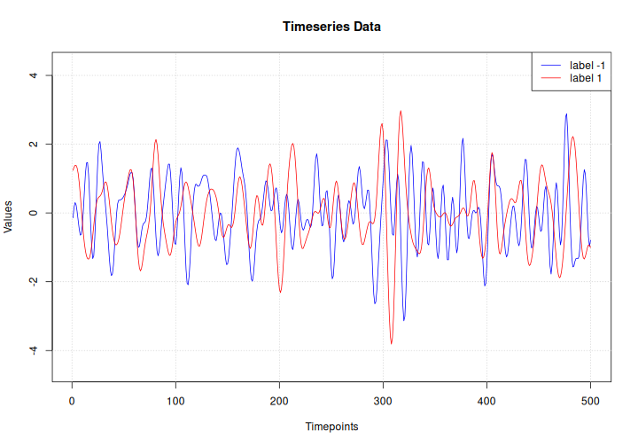

## Introduction

This example shows how to do timeseries classification from scratch, starting from raw
CSV timeseries files on disk. We demonstrate the workflow on the FordA dataset from the
[UCR/UEA archive](https://www.cs.ucr.edu/%7Eeamonn/time_series_data_2018/).

## Setup


``` r
library(keras3)
use_backend("jax")
```

## Load the data: the FordA dataset

### Dataset description

The dataset we are using here is called FordA.
The data comes from the UCR archive.
The dataset contains 3601 training instances and another 1320 testing instances.
Each timeseries corresponds to a measurement of engine noise captured by a motor sensor.
For this task, the goal is to automatically detect the presence of a specific issue with
the engine. The problem is a balanced binary classification task. The full description of
this dataset can be found [here](http://www.j-wichard.de/publications/FordPaper.pdf).

### Read the TSV data

We will use the `FordA_TRAIN` file for training and the
`FordA_TEST` file for testing. The simplicity of this dataset
allows us to demonstrate effectively how to use ConvNets for timeseries classification.
In this file, the first column corresponds to the label.


``` r
get_data <- function(path) {
  if(path |> startsWith("https://"))
    path <- get_file(origin = path)  # cache file locally

  data <- readr::read_tsv(
    path, col_names = FALSE,
    # Each row is: one integer (the label),
    # followed by 500 doubles (the timeseries)
    col_types = paste0("i", strrep("d", 500))
  )

  y <- as.matrix(data[[1]])
  x <- as.matrix(data[,-1])
  dimnames(x) <- dimnames(y) <- NULL

  list(x, y)
}

root_url <- "https://raw.githubusercontent.com/hfawaz/cd-diagram/master/FordA/"
c(x_train, y_train) %<-% get_data(paste0(root_url, "FordA_TRAIN.tsv"))
c(x_test, y_test) %<-% get_data(paste0(root_url, "FordA_TEST.tsv"))

str(keras3:::named_list(
  x_train, y_train,
  x_test, y_test
))
```

```
## List of 4
##  $ x_train: num [1:3601, 1:500] -0.797 0.805 0.728 -0.234 -0.171 ...
##  $ y_train: int [1:3601, 1] -1 1 -1 -1 -1 1 1 1 1 1 ...
##  $ x_test : num [1:1320, 1:500] -0.14 0.334 0.717 1.24 -1.159 ...
##  $ y_test : int [1:1320, 1] -1 -1 -1 1 -1 1 -1 -1 1 1 ...
```


## Visualize the data

Here we visualize one timeseries example for each class in the dataset.


``` r
plot(NULL, main = "Timeseries Data",
     xlab = "Timepoints",  ylab = "Values",
     xlim = c(1, ncol(x_test)),
     ylim = range(x_test))
grid()
lines(x_test[match(-1, y_test), ], col = "blue")
lines(x_test[match( 1, y_test), ], col = "red")
legend("topright", legend=c("label -1", "label 1"), col=c("blue", "red"), lty=1)
```




## Standardize the data

Our timeseries are already in a single length (500). However, their values are
usually in various ranges. This is not ideal for a neural network;
in general we should seek to make the input values normalized.
For this specific dataset, the data is already z-normalized: each timeseries sample
has a mean equal to zero and a standard deviation equal to one. This type of
normalization is very common for timeseries classification problems, see
[Bagnall et al. (2016)](https://link.springer.com/article/10.1007/s10618-016-0483-9).

Note that the timeseries data used here are univariate, meaning we only have one channel
per timeseries example.
We will therefore transform the timeseries into a multivariate one with one channel
using a simple reshaping via numpy.
This will allow us to construct a model that is easily applicable to multivariate time
series.


``` r
dim(x_train) <- c(dim(x_train), 1)
dim(x_test) <- c(dim(x_test), 1)
```


Finally, in order to use `sparse_categorical_crossentropy`, we will have to count
the number of classes beforehand.


``` r
num_classes <- length(unique(y_train))
```


Now we shuffle the training set because we will be using the `validation_split` option
later when training.


``` r
c(x_train, y_train) %<-% listarrays::shuffle_rows(x_train, y_train)
# idx <- sample.int(nrow(x_train))
# x_train %<>% .[idx,, ,drop = FALSE]
# y_train %<>% .[idx,  ,drop = FALSE]
```


Standardize the labels to positive integers.
The expected labels will then be 0 and 1.


``` r
y_train[y_train == -1L] <- 0L
y_test[y_test == -1L] <- 0L
```


## Build a model

We build a Fully Convolutional Neural Network originally proposed in
[this paper](https://arxiv.org/abs/1611.06455).
The implementation is based on the TF 2 version provided
[here](https://github.com/hfawaz/dl-4-tsc/).
The following hyperparameters (kernel_size, filters, the usage of BatchNorm) were found
via random search using [KerasTuner](https://github.com/keras-team/keras-tuner).


``` r
make_model <- function(input_shape) {
  inputs <- keras_input(input_shape)

  outputs <- inputs |>
    # conv1
    layer_conv_1d(filters = 64, kernel_size = 3, padding = "same") |>
    layer_batch_normalization() |>
    layer_activation_relu() |>
    # conv2
    layer_conv_1d(filters = 64, kernel_size = 3, padding = "same") |>
    layer_batch_normalization() |>
    layer_activation_relu() |>
    # conv3
    layer_conv_1d(filters = 64, kernel_size = 3, padding = "same") |>
    layer_batch_normalization() |>
    layer_activation_relu() |>
    # pooling
    layer_global_average_pooling_1d() |>
    # final output
    layer_dense(num_classes, activation = "softmax")

  keras_model(inputs, outputs)
}

model <- make_model(input_shape = dim(x_train)[-1])
```


``` r
model
```

```
## Model: "functional"
## ┏━━━━━━━━━━━━━━━━━━━━━━━━━━━━━┳━━━━━━━━━━━━━━━━━━━━━━━┳━━━━━━━━━━━━┳━━━━━━━┓
## ┃ Layer (type)                ┃ Output Shape          ┃    Param # ┃ Trai… ┃
## ┡━━━━━━━━━━━━━━━━━━━━━━━━━━━━━╇━━━━━━━━━━━━━━━━━━━━━━━╇━━━━━━━━━━━━╇━━━━━━━┩
## │ input_layer (InputLayer)    │ (None, 500, 1)        │          0 │   -   │
## ├─────────────────────────────┼───────────────────────┼────────────┼───────┤
## │ conv1d (Conv1D)             │ (None, 500, 64)       │        256 │   Y   │
## ├─────────────────────────────┼───────────────────────┼────────────┼───────┤
## │ batch_normalization         │ (None, 500, 64)       │        256 │   Y   │
## │ (BatchNormalization)        │                       │            │       │
## ├─────────────────────────────┼───────────────────────┼────────────┼───────┤
## │ re_lu (ReLU)                │ (None, 500, 64)       │          0 │   -   │
## ├─────────────────────────────┼───────────────────────┼────────────┼───────┤
## │ conv1d_1 (Conv1D)           │ (None, 500, 64)       │     12,352 │   Y   │
## ├─────────────────────────────┼───────────────────────┼────────────┼───────┤
## │ batch_normalization_1       │ (None, 500, 64)       │        256 │   Y   │
## │ (BatchNormalization)        │                       │            │       │
## ├─────────────────────────────┼───────────────────────┼────────────┼───────┤
## │ re_lu_1 (ReLU)              │ (None, 500, 64)       │          0 │   -   │
## ├─────────────────────────────┼───────────────────────┼────────────┼───────┤
## │ conv1d_2 (Conv1D)           │ (None, 500, 64)       │     12,352 │   Y   │
## ├─────────────────────────────┼───────────────────────┼────────────┼───────┤
## │ batch_normalization_2       │ (None, 500, 64)       │        256 │   Y   │
## │ (BatchNormalization)        │                       │            │       │
## ├─────────────────────────────┼───────────────────────┼────────────┼───────┤
## │ re_lu_2 (ReLU)              │ (None, 500, 64)       │          0 │   -   │
## ├─────────────────────────────┼───────────────────────┼────────────┼───────┤
## │ global_average_pooling1d    │ (None, 64)            │          0 │   -   │
## │ (GlobalAveragePooling1D)    │                       │            │       │
## ├─────────────────────────────┼───────────────────────┼────────────┼───────┤
## │ dense (Dense)               │ (None, 2)             │        130 │   Y   │
## └─────────────────────────────┴───────────────────────┴────────────┴───────┘
##  Total params: 25,858 (101.01 KB)
##  Trainable params: 25,474 (99.51 KB)
##  Non-trainable params: 384 (1.50 KB)
```

``` r
plot(model, show_shapes = TRUE)
```

<div class="figure">

<p class="caption">plot of chunk unnamed-chunk-9</p>
</div>


## Train the model


``` r
epochs <- 500
batch_size <- 32

callbacks <- c(
  callback_model_checkpoint(
    "best_model.keras", save_best_only = TRUE,
    monitor = "val_loss"
  ),
  callback_reduce_lr_on_plateau(
    monitor = "val_loss", factor = 0.5,
    patience = 20, min_lr = 0.0001
  ),
  callback_early_stopping(
    monitor = "val_loss", patience = 50,
    verbose = 1
  )
)


model |> compile(
  optimizer = "adam",
  loss = "sparse_categorical_crossentropy",
  metrics = "sparse_categorical_accuracy"
)

history <- model |> fit(
  x_train, y_train,
  batch_size = batch_size,
  epochs = epochs,
  callbacks = callbacks,
  validation_split = 0.2
)
```

```
## Epoch 1/500
## 90/90 - 2s - 23ms/step - loss: 0.5552 - sparse_categorical_accuracy: 0.7069 - val_loss: 0.8431 - val_sparse_categorical_accuracy: 0.4896 - learning_rate: 0.0010
## Epoch 2/500
## 90/90 - 1s - 6ms/step - loss: 0.4947 - sparse_categorical_accuracy: 0.7573 - val_loss: 0.8768 - val_sparse_categorical_accuracy: 0.4896 - learning_rate: 0.0010
## Epoch 3/500
## 90/90 - 0s - 2ms/step - loss: 0.4697 - sparse_categorical_accuracy: 0.7694 - val_loss: 0.7101 - val_sparse_categorical_accuracy: 0.4910 - learning_rate: 0.0010
## Epoch 4/500
## 90/90 - 0s - 2ms/step - loss: 0.4230 - sparse_categorical_accuracy: 0.7917 - val_loss: 0.6647 - val_sparse_categorical_accuracy: 0.5173 - learning_rate: 0.0010
## Epoch 5/500
## 90/90 - 0s - 2ms/step - loss: 0.4279 - sparse_categorical_accuracy: 0.7809 - val_loss: 0.5107 - val_sparse_categorical_accuracy: 0.7060 - learning_rate: 0.0010
## Epoch 6/500
## 90/90 - 0s - 2ms/step - loss: 0.4079 - sparse_categorical_accuracy: 0.8000 - val_loss: 0.4495 - val_sparse_categorical_accuracy: 0.7920 - learning_rate: 0.0010
## Epoch 7/500
## 90/90 - 0s - 1ms/step - loss: 0.4038 - sparse_categorical_accuracy: 0.7986 - val_loss: 0.5304 - val_sparse_categorical_accuracy: 0.6907 - learning_rate: 0.0010
## Epoch 8/500
## 90/90 - 0s - 2ms/step - loss: 0.3905 - sparse_categorical_accuracy: 0.8063 - val_loss: 0.3867 - val_sparse_categorical_accuracy: 0.8169 - learning_rate: 0.0010
## Epoch 9/500
## 90/90 - 0s - 1ms/step - loss: 0.3845 - sparse_categorical_accuracy: 0.8125 - val_loss: 0.4727 - val_sparse_categorical_accuracy: 0.7226 - learning_rate: 0.0010
## Epoch 10/500
## 90/90 - 0s - 1ms/step - loss: 0.3888 - sparse_categorical_accuracy: 0.8038 - val_loss: 0.3876 - val_sparse_categorical_accuracy: 0.8225 - learning_rate: 0.0010
## Epoch 11/500
## 90/90 - 0s - 1ms/step - loss: 0.3776 - sparse_categorical_accuracy: 0.8142 - val_loss: 0.5872 - val_sparse_categorical_accuracy: 0.7101 - learning_rate: 0.0010
## Epoch 12/500
## 90/90 - 0s - 1ms/step - loss: 0.3692 - sparse_categorical_accuracy: 0.8247 - val_loss: 0.4228 - val_sparse_categorical_accuracy: 0.7684 - learning_rate: 0.0010
## Epoch 13/500
## 90/90 - 0s - 2ms/step - loss: 0.3625 - sparse_categorical_accuracy: 0.8326 - val_loss: 0.3613 - val_sparse_categorical_accuracy: 0.8322 - learning_rate: 0.0010
## Epoch 14/500
## 90/90 - 0s - 1ms/step - loss: 0.3612 - sparse_categorical_accuracy: 0.8267 - val_loss: 0.4773 - val_sparse_categorical_accuracy: 0.7434 - learning_rate: 0.0010
## Epoch 15/500
## 90/90 - 0s - 1ms/step - loss: 0.3456 - sparse_categorical_accuracy: 0.8403 - val_loss: 0.3705 - val_sparse_categorical_accuracy: 0.8239 - learning_rate: 0.0010
## Epoch 16/500
## 90/90 - 0s - 1ms/step - loss: 0.3504 - sparse_categorical_accuracy: 0.8403 - val_loss: 0.4966 - val_sparse_categorical_accuracy: 0.7171 - learning_rate: 0.0010
## Epoch 17/500
## 90/90 - 0s - 1ms/step - loss: 0.3393 - sparse_categorical_accuracy: 0.8399 - val_loss: 0.3637 - val_sparse_categorical_accuracy: 0.8155 - learning_rate: 0.0010
## Epoch 18/500
## 90/90 - 0s - 1ms/step - loss: 0.3360 - sparse_categorical_accuracy: 0.8420 - val_loss: 0.6240 - val_sparse_categorical_accuracy: 0.7046 - learning_rate: 0.0010
## Epoch 19/500
## 90/90 - 0s - 2ms/step - loss: 0.3349 - sparse_categorical_accuracy: 0.8486 - val_loss: 0.5940 - val_sparse_categorical_accuracy: 0.6879 - learning_rate: 0.0010
## Epoch 20/500
## 90/90 - 0s - 2ms/step - loss: 0.3299 - sparse_categorical_accuracy: 0.8517 - val_loss: 0.3601 - val_sparse_categorical_accuracy: 0.8405 - learning_rate: 0.0010
## Epoch 21/500
## 90/90 - 0s - 1ms/step - loss: 0.3091 - sparse_categorical_accuracy: 0.8694 - val_loss: 0.3656 - val_sparse_categorical_accuracy: 0.8266 - learning_rate: 0.0010
## Epoch 22/500
## 90/90 - 0s - 1ms/step - loss: 0.3150 - sparse_categorical_accuracy: 0.8608 - val_loss: 0.3746 - val_sparse_categorical_accuracy: 0.8308 - learning_rate: 0.0010
## Epoch 23/500
## 90/90 - 0s - 1ms/step - loss: 0.3021 - sparse_categorical_accuracy: 0.8809 - val_loss: 0.5485 - val_sparse_categorical_accuracy: 0.7198 - learning_rate: 0.0010
## Epoch 24/500
## 90/90 - 0s - 2ms/step - loss: 0.3023 - sparse_categorical_accuracy: 0.8719 - val_loss: 0.2988 - val_sparse_categorical_accuracy: 0.8752 - learning_rate: 0.0010
## Epoch 25/500
## 90/90 - 0s - 1ms/step - loss: 0.2936 - sparse_categorical_accuracy: 0.8715 - val_loss: 0.3003 - val_sparse_categorical_accuracy: 0.8655 - learning_rate: 0.0010
## Epoch 26/500
## 90/90 - 0s - 1ms/step - loss: 0.2987 - sparse_categorical_accuracy: 0.8736 - val_loss: 0.3325 - val_sparse_categorical_accuracy: 0.8433 - learning_rate: 0.0010
## Epoch 27/500
## 90/90 - 0s - 1ms/step - loss: 0.2767 - sparse_categorical_accuracy: 0.8906 - val_loss: 0.4017 - val_sparse_categorical_accuracy: 0.7684 - learning_rate: 0.0010
## Epoch 28/500
## 90/90 - 0s - 1ms/step - loss: 0.2964 - sparse_categorical_accuracy: 0.8736 - val_loss: 0.3189 - val_sparse_categorical_accuracy: 0.8613 - learning_rate: 0.0010
## Epoch 29/500
## 90/90 - 0s - 1ms/step - loss: 0.2779 - sparse_categorical_accuracy: 0.8792 - val_loss: 0.4649 - val_sparse_categorical_accuracy: 0.7476 - learning_rate: 0.0010
## Epoch 30/500
## 90/90 - 0s - 2ms/step - loss: 0.2731 - sparse_categorical_accuracy: 0.8816 - val_loss: 0.2808 - val_sparse_categorical_accuracy: 0.8766 - learning_rate: 0.0010
## Epoch 31/500
## 90/90 - 0s - 1ms/step - loss: 0.2712 - sparse_categorical_accuracy: 0.8865 - val_loss: 0.3132 - val_sparse_categorical_accuracy: 0.8363 - learning_rate: 0.0010
## Epoch 32/500
## 90/90 - 0s - 2ms/step - loss: 0.2702 - sparse_categorical_accuracy: 0.8903 - val_loss: 0.2715 - val_sparse_categorical_accuracy: 0.8904 - learning_rate: 0.0010
## Epoch 33/500
## 90/90 - 0s - 1ms/step - loss: 0.2587 - sparse_categorical_accuracy: 0.8924 - val_loss: 0.3263 - val_sparse_categorical_accuracy: 0.8419 - learning_rate: 0.0010
## Epoch 34/500
## 90/90 - 0s - 2ms/step - loss: 0.2454 - sparse_categorical_accuracy: 0.9014 - val_loss: 0.3377 - val_sparse_categorical_accuracy: 0.8183 - learning_rate: 0.0010
## Epoch 35/500
## 90/90 - 0s - 1ms/step - loss: 0.2633 - sparse_categorical_accuracy: 0.8910 - val_loss: 0.4019 - val_sparse_categorical_accuracy: 0.8211 - learning_rate: 0.0010
## Epoch 36/500
## 90/90 - 0s - 1ms/step - loss: 0.2579 - sparse_categorical_accuracy: 0.8931 - val_loss: 0.4341 - val_sparse_categorical_accuracy: 0.7712 - learning_rate: 0.0010
## Epoch 37/500
## 90/90 - 0s - 1ms/step - loss: 0.2517 - sparse_categorical_accuracy: 0.8951 - val_loss: 1.0305 - val_sparse_categorical_accuracy: 0.7254 - learning_rate: 0.0010
## Epoch 38/500
## 90/90 - 0s - 1ms/step - loss: 0.2473 - sparse_categorical_accuracy: 0.9003 - val_loss: 0.2957 - val_sparse_categorical_accuracy: 0.8724 - learning_rate: 0.0010
## Epoch 39/500
## 90/90 - 0s - 1ms/step - loss: 0.2485 - sparse_categorical_accuracy: 0.8962 - val_loss: 0.4326 - val_sparse_categorical_accuracy: 0.8141 - learning_rate: 0.0010
## Epoch 40/500
## 90/90 - 0s - 1ms/step - loss: 0.2407 - sparse_categorical_accuracy: 0.9073 - val_loss: 0.2957 - val_sparse_categorical_accuracy: 0.8571 - learning_rate: 0.0010
## Epoch 41/500
## 90/90 - 0s - 1ms/step - loss: 0.2369 - sparse_categorical_accuracy: 0.9049 - val_loss: 0.3456 - val_sparse_categorical_accuracy: 0.8363 - learning_rate: 0.0010
## Epoch 42/500
## 90/90 - 0s - 1ms/step - loss: 0.2293 - sparse_categorical_accuracy: 0.9097 - val_loss: 0.2930 - val_sparse_categorical_accuracy: 0.8682 - learning_rate: 0.0010
## Epoch 43/500
## 90/90 - 0s - 1ms/step - loss: 0.2373 - sparse_categorical_accuracy: 0.8979 - val_loss: 1.3727 - val_sparse_categorical_accuracy: 0.5270 - learning_rate: 0.0010
## Epoch 44/500
## 90/90 - 0s - 1ms/step - loss: 0.2400 - sparse_categorical_accuracy: 0.8976 - val_loss: 0.4047 - val_sparse_categorical_accuracy: 0.7864 - learning_rate: 0.0010
## Epoch 45/500
## 90/90 - 0s - 1ms/step - loss: 0.2352 - sparse_categorical_accuracy: 0.9062 - val_loss: 0.3126 - val_sparse_categorical_accuracy: 0.8599 - learning_rate: 0.0010
## Epoch 46/500
## 90/90 - 0s - 2ms/step - loss: 0.2373 - sparse_categorical_accuracy: 0.9007 - val_loss: 0.2442 - val_sparse_categorical_accuracy: 0.8849 - learning_rate: 0.0010
## Epoch 47/500
## 90/90 - 0s - 1ms/step - loss: 0.2217 - sparse_categorical_accuracy: 0.9115 - val_loss: 0.3886 - val_sparse_categorical_accuracy: 0.8308 - learning_rate: 0.0010
## Epoch 48/500
## 90/90 - 0s - 2ms/step - loss: 0.2262 - sparse_categorical_accuracy: 0.9087 - val_loss: 0.2401 - val_sparse_categorical_accuracy: 0.9085 - learning_rate: 0.0010
## Epoch 49/500
## 90/90 - 0s - 1ms/step - loss: 0.2169 - sparse_categorical_accuracy: 0.9115 - val_loss: 0.7121 - val_sparse_categorical_accuracy: 0.7101 - learning_rate: 0.0010
## Epoch 50/500
## 90/90 - 0s - 1ms/step - loss: 0.2170 - sparse_categorical_accuracy: 0.9132 - val_loss: 0.3464 - val_sparse_categorical_accuracy: 0.8322 - learning_rate: 0.0010
## Epoch 51/500
## 90/90 - 0s - 1ms/step - loss: 0.2167 - sparse_categorical_accuracy: 0.9142 - val_loss: 0.3763 - val_sparse_categorical_accuracy: 0.8460 - learning_rate: 0.0010
## Epoch 52/500
## 90/90 - 0s - 1ms/step - loss: 0.2147 - sparse_categorical_accuracy: 0.9135 - val_loss: 0.3140 - val_sparse_categorical_accuracy: 0.8530 - learning_rate: 0.0010
## Epoch 53/500
## 90/90 - 0s - 1ms/step - loss: 0.2076 - sparse_categorical_accuracy: 0.9191 - val_loss: 0.3016 - val_sparse_categorical_accuracy: 0.8350 - learning_rate: 0.0010
## Epoch 54/500
## 90/90 - 0s - 1ms/step - loss: 0.2036 - sparse_categorical_accuracy: 0.9191 - val_loss: 0.3812 - val_sparse_categorical_accuracy: 0.8239 - learning_rate: 0.0010
## Epoch 55/500
## 90/90 - 0s - 1ms/step - loss: 0.1943 - sparse_categorical_accuracy: 0.9250 - val_loss: 0.2770 - val_sparse_categorical_accuracy: 0.8932 - learning_rate: 0.0010
## Epoch 56/500
## 90/90 - 0s - 1ms/step - loss: 0.1869 - sparse_categorical_accuracy: 0.9323 - val_loss: 0.2801 - val_sparse_categorical_accuracy: 0.8863 - learning_rate: 0.0010
## Epoch 57/500
## 90/90 - 0s - 2ms/step - loss: 0.1969 - sparse_categorical_accuracy: 0.9302 - val_loss: 0.2071 - val_sparse_categorical_accuracy: 0.9057 - learning_rate: 0.0010
## Epoch 58/500
## 90/90 - 0s - 1ms/step - loss: 0.1740 - sparse_categorical_accuracy: 0.9375 - val_loss: 0.4348 - val_sparse_categorical_accuracy: 0.7753 - learning_rate: 0.0010
## Epoch 59/500
## 90/90 - 0s - 1ms/step - loss: 0.1840 - sparse_categorical_accuracy: 0.9340 - val_loss: 0.3520 - val_sparse_categorical_accuracy: 0.8377 - learning_rate: 0.0010
## Epoch 60/500
## 90/90 - 0s - 2ms/step - loss: 0.1761 - sparse_categorical_accuracy: 0.9354 - val_loss: 0.1952 - val_sparse_categorical_accuracy: 0.9098 - learning_rate: 0.0010
## Epoch 61/500
## 90/90 - 0s - 1ms/step - loss: 0.1561 - sparse_categorical_accuracy: 0.9507 - val_loss: 0.5472 - val_sparse_categorical_accuracy: 0.7725 - learning_rate: 0.0010
## Epoch 62/500
## 90/90 - 0s - 1ms/step - loss: 0.1596 - sparse_categorical_accuracy: 0.9469 - val_loss: 0.8058 - val_sparse_categorical_accuracy: 0.6852 - learning_rate: 0.0010
## Epoch 63/500
## 90/90 - 0s - 1ms/step - loss: 0.1636 - sparse_categorical_accuracy: 0.9438 - val_loss: 0.2375 - val_sparse_categorical_accuracy: 0.9071 - learning_rate: 0.0010
## Epoch 64/500
## 90/90 - 0s - 2ms/step - loss: 0.1521 - sparse_categorical_accuracy: 0.9458 - val_loss: 0.1628 - val_sparse_categorical_accuracy: 0.9237 - learning_rate: 0.0010
## Epoch 65/500
## 90/90 - 0s - 2ms/step - loss: 0.1422 - sparse_categorical_accuracy: 0.9521 - val_loss: 0.1846 - val_sparse_categorical_accuracy: 0.9251 - learning_rate: 0.0010
## Epoch 66/500
## 90/90 - 0s - 1ms/step - loss: 0.1327 - sparse_categorical_accuracy: 0.9587 - val_loss: 0.1685 - val_sparse_categorical_accuracy: 0.9279 - learning_rate: 0.0010
## Epoch 67/500
## 90/90 - 0s - 1ms/step - loss: 0.1294 - sparse_categorical_accuracy: 0.9566 - val_loss: 0.2723 - val_sparse_categorical_accuracy: 0.8932 - learning_rate: 0.0010
## Epoch 68/500
## 90/90 - 0s - 2ms/step - loss: 0.1289 - sparse_categorical_accuracy: 0.9569 - val_loss: 0.1558 - val_sparse_categorical_accuracy: 0.9390 - learning_rate: 0.0010
## Epoch 69/500
## 90/90 - 0s - 2ms/step - loss: 0.1389 - sparse_categorical_accuracy: 0.9531 - val_loss: 0.3131 - val_sparse_categorical_accuracy: 0.8766 - learning_rate: 0.0010
## Epoch 70/500
## 90/90 - 0s - 2ms/step - loss: 0.1274 - sparse_categorical_accuracy: 0.9604 - val_loss: 0.2532 - val_sparse_categorical_accuracy: 0.8835 - learning_rate: 0.0010
## Epoch 71/500
## 90/90 - 0s - 1ms/step - loss: 0.1212 - sparse_categorical_accuracy: 0.9601 - val_loss: 0.4126 - val_sparse_categorical_accuracy: 0.8072 - learning_rate: 0.0010
## Epoch 72/500
## 90/90 - 0s - 1ms/step - loss: 0.1209 - sparse_categorical_accuracy: 0.9608 - val_loss: 0.1838 - val_sparse_categorical_accuracy: 0.9348 - learning_rate: 0.0010
## Epoch 73/500
## 90/90 - 0s - 1ms/step - loss: 0.1118 - sparse_categorical_accuracy: 0.9649 - val_loss: 0.2172 - val_sparse_categorical_accuracy: 0.9112 - learning_rate: 0.0010
## Epoch 74/500
## 90/90 - 0s - 1ms/step - loss: 0.1116 - sparse_categorical_accuracy: 0.9632 - val_loss: 1.2755 - val_sparse_categorical_accuracy: 0.7101 - learning_rate: 0.0010
## Epoch 75/500
## 90/90 - 0s - 1ms/step - loss: 0.1283 - sparse_categorical_accuracy: 0.9542 - val_loss: 0.3535 - val_sparse_categorical_accuracy: 0.8128 - learning_rate: 0.0010
## Epoch 76/500
## 90/90 - 0s - 1ms/step - loss: 0.1200 - sparse_categorical_accuracy: 0.9542 - val_loss: 0.1945 - val_sparse_categorical_accuracy: 0.9085 - learning_rate: 0.0010
## Epoch 77/500
## 90/90 - 0s - 1ms/step - loss: 0.1110 - sparse_categorical_accuracy: 0.9635 - val_loss: 0.1805 - val_sparse_categorical_accuracy: 0.9251 - learning_rate: 0.0010
## Epoch 78/500
## 90/90 - 0s - 1ms/step - loss: 0.1057 - sparse_categorical_accuracy: 0.9698 - val_loss: 0.4222 - val_sparse_categorical_accuracy: 0.8322 - learning_rate: 0.0010
## Epoch 79/500
## 90/90 - 0s - 1ms/step - loss: 0.1037 - sparse_categorical_accuracy: 0.9656 - val_loss: 0.1715 - val_sparse_categorical_accuracy: 0.9417 - learning_rate: 0.0010
## Epoch 80/500
## 90/90 - 0s - 2ms/step - loss: 0.1130 - sparse_categorical_accuracy: 0.9660 - val_loss: 0.2816 - val_sparse_categorical_accuracy: 0.8766 - learning_rate: 0.0010
## Epoch 81/500
## 90/90 - 0s - 2ms/step - loss: 0.1088 - sparse_categorical_accuracy: 0.9635 - val_loss: 0.1277 - val_sparse_categorical_accuracy: 0.9584 - learning_rate: 0.0010
## Epoch 82/500
## 90/90 - 0s - 1ms/step - loss: 0.0955 - sparse_categorical_accuracy: 0.9715 - val_loss: 0.2049 - val_sparse_categorical_accuracy: 0.9182 - learning_rate: 0.0010
## Epoch 83/500
## 90/90 - 0s - 1ms/step - loss: 0.1056 - sparse_categorical_accuracy: 0.9639 - val_loss: 0.4953 - val_sparse_categorical_accuracy: 0.7892 - learning_rate: 0.0010
## Epoch 84/500
## 90/90 - 0s - 1ms/step - loss: 0.0986 - sparse_categorical_accuracy: 0.9656 - val_loss: 0.2652 - val_sparse_categorical_accuracy: 0.8877 - learning_rate: 0.0010
## Epoch 85/500
## 90/90 - 0s - 2ms/step - loss: 0.0992 - sparse_categorical_accuracy: 0.9670 - val_loss: 0.1242 - val_sparse_categorical_accuracy: 0.9459 - learning_rate: 0.0010
## Epoch 86/500
## 90/90 - 0s - 1ms/step - loss: 0.0940 - sparse_categorical_accuracy: 0.9677 - val_loss: 0.1399 - val_sparse_categorical_accuracy: 0.9487 - learning_rate: 0.0010
## Epoch 87/500
## 90/90 - 0s - 2ms/step - loss: 0.1090 - sparse_categorical_accuracy: 0.9580 - val_loss: 0.1485 - val_sparse_categorical_accuracy: 0.9404 - learning_rate: 0.0010
## Epoch 88/500
## 90/90 - 0s - 1ms/step - loss: 0.0999 - sparse_categorical_accuracy: 0.9688 - val_loss: 0.1869 - val_sparse_categorical_accuracy: 0.9237 - learning_rate: 0.0010
## Epoch 89/500
## 90/90 - 0s - 1ms/step - loss: 0.0970 - sparse_categorical_accuracy: 0.9677 - val_loss: 0.8924 - val_sparse_categorical_accuracy: 0.7476 - learning_rate: 0.0010
## Epoch 90/500
## 90/90 - 0s - 1ms/step - loss: 0.0928 - sparse_categorical_accuracy: 0.9674 - val_loss: 0.1347 - val_sparse_categorical_accuracy: 0.9515 - learning_rate: 0.0010
## Epoch 91/500
## 90/90 - 0s - 1ms/step - loss: 0.1081 - sparse_categorical_accuracy: 0.9639 - val_loss: 0.1966 - val_sparse_categorical_accuracy: 0.9182 - learning_rate: 0.0010
## Epoch 92/500
## 90/90 - 0s - 1ms/step - loss: 0.0940 - sparse_categorical_accuracy: 0.9691 - val_loss: 0.1300 - val_sparse_categorical_accuracy: 0.9459 - learning_rate: 0.0010
## Epoch 93/500
## 90/90 - 0s - 1ms/step - loss: 0.0924 - sparse_categorical_accuracy: 0.9708 - val_loss: 0.2279 - val_sparse_categorical_accuracy: 0.9015 - learning_rate: 0.0010
## Epoch 94/500
## 90/90 - 0s - 1ms/step - loss: 0.0942 - sparse_categorical_accuracy: 0.9684 - val_loss: 0.1656 - val_sparse_categorical_accuracy: 0.9265 - learning_rate: 0.0010
## Epoch 95/500
## 90/90 - 0s - 1ms/step - loss: 0.0937 - sparse_categorical_accuracy: 0.9708 - val_loss: 0.4622 - val_sparse_categorical_accuracy: 0.8017 - learning_rate: 0.0010
## Epoch 96/500
## 90/90 - 0s - 1ms/step - loss: 0.1105 - sparse_categorical_accuracy: 0.9597 - val_loss: 0.3947 - val_sparse_categorical_accuracy: 0.8308 - learning_rate: 0.0010
## Epoch 97/500
## 90/90 - 0s - 2ms/step - loss: 0.1012 - sparse_categorical_accuracy: 0.9670 - val_loss: 0.1169 - val_sparse_categorical_accuracy: 0.9542 - learning_rate: 0.0010
## Epoch 98/500
## 90/90 - 0s - 1ms/step - loss: 0.0893 - sparse_categorical_accuracy: 0.9712 - val_loss: 0.2534 - val_sparse_categorical_accuracy: 0.8974 - learning_rate: 0.0010
## Epoch 99/500
## 90/90 - 0s - 1ms/step - loss: 0.0942 - sparse_categorical_accuracy: 0.9694 - val_loss: 0.1304 - val_sparse_categorical_accuracy: 0.9528 - learning_rate: 0.0010
## Epoch 100/500
## 90/90 - 0s - 1ms/step - loss: 0.0886 - sparse_categorical_accuracy: 0.9729 - val_loss: 0.2296 - val_sparse_categorical_accuracy: 0.9085 - learning_rate: 0.0010
## Epoch 101/500
## 90/90 - 0s - 1ms/step - loss: 0.0839 - sparse_categorical_accuracy: 0.9719 - val_loss: 0.1982 - val_sparse_categorical_accuracy: 0.9223 - learning_rate: 0.0010
## Epoch 102/500
## 90/90 - 0s - 1ms/step - loss: 0.0978 - sparse_categorical_accuracy: 0.9670 - val_loss: 0.1403 - val_sparse_categorical_accuracy: 0.9431 - learning_rate: 0.0010
## Epoch 103/500
## 90/90 - 0s - 1ms/step - loss: 0.0908 - sparse_categorical_accuracy: 0.9736 - val_loss: 0.1551 - val_sparse_categorical_accuracy: 0.9390 - learning_rate: 0.0010
## Epoch 104/500
## 90/90 - 0s - 1ms/step - loss: 0.0967 - sparse_categorical_accuracy: 0.9677 - val_loss: 0.1541 - val_sparse_categorical_accuracy: 0.9334 - learning_rate: 0.0010
## Epoch 105/500
## 90/90 - 0s - 1ms/step - loss: 0.0880 - sparse_categorical_accuracy: 0.9726 - val_loss: 0.1300 - val_sparse_categorical_accuracy: 0.9487 - learning_rate: 0.0010
## Epoch 106/500
## 90/90 - 0s - 1ms/step - loss: 0.0864 - sparse_categorical_accuracy: 0.9722 - val_loss: 0.1886 - val_sparse_categorical_accuracy: 0.9223 - learning_rate: 0.0010
## Epoch 107/500
## 90/90 - 0s - 1ms/step - loss: 0.0912 - sparse_categorical_accuracy: 0.9684 - val_loss: 0.1257 - val_sparse_categorical_accuracy: 0.9515 - learning_rate: 0.0010
## Epoch 108/500
## 90/90 - 0s - 1ms/step - loss: 0.0896 - sparse_categorical_accuracy: 0.9719 - val_loss: 0.1259 - val_sparse_categorical_accuracy: 0.9570 - learning_rate: 0.0010
## Epoch 109/500
## 90/90 - 0s - 1ms/step - loss: 0.0891 - sparse_categorical_accuracy: 0.9719 - val_loss: 0.2217 - val_sparse_categorical_accuracy: 0.9098 - learning_rate: 0.0010
## Epoch 110/500
## 90/90 - 0s - 1ms/step - loss: 0.0923 - sparse_categorical_accuracy: 0.9698 - val_loss: 0.1576 - val_sparse_categorical_accuracy: 0.9334 - learning_rate: 0.0010
## Epoch 111/500
## 90/90 - 0s - 1ms/step - loss: 0.0767 - sparse_categorical_accuracy: 0.9722 - val_loss: 0.1819 - val_sparse_categorical_accuracy: 0.9320 - learning_rate: 0.0010
## Epoch 112/500
## 90/90 - 0s - 2ms/step - loss: 0.0842 - sparse_categorical_accuracy: 0.9691 - val_loss: 0.1400 - val_sparse_categorical_accuracy: 0.9390 - learning_rate: 0.0010
## Epoch 113/500
## 90/90 - 0s - 1ms/step - loss: 0.0786 - sparse_categorical_accuracy: 0.9750 - val_loss: 0.1415 - val_sparse_categorical_accuracy: 0.9487 - learning_rate: 0.0010
## Epoch 114/500
## 90/90 - 0s - 2ms/step - loss: 0.0935 - sparse_categorical_accuracy: 0.9691 - val_loss: 0.1072 - val_sparse_categorical_accuracy: 0.9612 - learning_rate: 0.0010
## Epoch 115/500
## 90/90 - 0s - 1ms/step - loss: 0.0787 - sparse_categorical_accuracy: 0.9722 - val_loss: 0.2966 - val_sparse_categorical_accuracy: 0.8738 - learning_rate: 0.0010
## Epoch 116/500
## 90/90 - 0s - 1ms/step - loss: 0.0858 - sparse_categorical_accuracy: 0.9740 - val_loss: 0.1602 - val_sparse_categorical_accuracy: 0.9487 - learning_rate: 0.0010
## Epoch 117/500
## 90/90 - 0s - 1ms/step - loss: 0.0756 - sparse_categorical_accuracy: 0.9733 - val_loss: 0.1894 - val_sparse_categorical_accuracy: 0.9293 - learning_rate: 0.0010
## Epoch 118/500
## 90/90 - 0s - 1ms/step - loss: 0.0843 - sparse_categorical_accuracy: 0.9708 - val_loss: 1.7463 - val_sparse_categorical_accuracy: 0.7365 - learning_rate: 0.0010
## Epoch 119/500
## 90/90 - 0s - 2ms/step - loss: 0.0836 - sparse_categorical_accuracy: 0.9736 - val_loss: 0.1410 - val_sparse_categorical_accuracy: 0.9459 - learning_rate: 0.0010
## Epoch 120/500
## 90/90 - 0s - 1ms/step - loss: 0.0842 - sparse_categorical_accuracy: 0.9708 - val_loss: 0.1628 - val_sparse_categorical_accuracy: 0.9390 - learning_rate: 0.0010
## Epoch 121/500
## 90/90 - 0s - 1ms/step - loss: 0.0859 - sparse_categorical_accuracy: 0.9705 - val_loss: 0.8339 - val_sparse_categorical_accuracy: 0.7323 - learning_rate: 0.0010
## Epoch 122/500
## 90/90 - 0s - 1ms/step - loss: 0.0884 - sparse_categorical_accuracy: 0.9698 - val_loss: 0.3177 - val_sparse_categorical_accuracy: 0.8752 - learning_rate: 0.0010
## Epoch 123/500
## 90/90 - 0s - 1ms/step - loss: 0.0867 - sparse_categorical_accuracy: 0.9681 - val_loss: 0.1446 - val_sparse_categorical_accuracy: 0.9501 - learning_rate: 0.0010
## Epoch 124/500
## 90/90 - 0s - 1ms/step - loss: 0.0914 - sparse_categorical_accuracy: 0.9660 - val_loss: 0.3359 - val_sparse_categorical_accuracy: 0.8488 - learning_rate: 0.0010
## Epoch 125/500
## 90/90 - 0s - 1ms/step - loss: 0.0903 - sparse_categorical_accuracy: 0.9674 - val_loss: 0.1481 - val_sparse_categorical_accuracy: 0.9390 - learning_rate: 0.0010
## Epoch 126/500
## 90/90 - 0s - 1ms/step - loss: 0.0786 - sparse_categorical_accuracy: 0.9743 - val_loss: 0.1129 - val_sparse_categorical_accuracy: 0.9598 - learning_rate: 0.0010
## Epoch 127/500
## 90/90 - 0s - 1ms/step - loss: 0.0779 - sparse_categorical_accuracy: 0.9771 - val_loss: 0.2823 - val_sparse_categorical_accuracy: 0.8849 - learning_rate: 0.0010
## Epoch 128/500
## 90/90 - 0s - 1ms/step - loss: 0.0856 - sparse_categorical_accuracy: 0.9701 - val_loss: 0.1737 - val_sparse_categorical_accuracy: 0.9348 - learning_rate: 0.0010
## Epoch 129/500
## 90/90 - 0s - 1ms/step - loss: 0.0883 - sparse_categorical_accuracy: 0.9688 - val_loss: 0.1636 - val_sparse_categorical_accuracy: 0.9404 - learning_rate: 0.0010
## Epoch 130/500
## 90/90 - 0s - 1ms/step - loss: 0.0931 - sparse_categorical_accuracy: 0.9684 - val_loss: 0.8173 - val_sparse_categorical_accuracy: 0.7434 - learning_rate: 0.0010
## Epoch 131/500
## 90/90 - 0s - 1ms/step - loss: 0.0806 - sparse_categorical_accuracy: 0.9736 - val_loss: 0.1941 - val_sparse_categorical_accuracy: 0.9098 - learning_rate: 0.0010
## Epoch 132/500
## 90/90 - 0s - 1ms/step - loss: 0.0767 - sparse_categorical_accuracy: 0.9747 - val_loss: 0.5559 - val_sparse_categorical_accuracy: 0.8128 - learning_rate: 0.0010
## Epoch 133/500
## 90/90 - 0s - 2ms/step - loss: 0.0751 - sparse_categorical_accuracy: 0.9767 - val_loss: 0.1069 - val_sparse_categorical_accuracy: 0.9695 - learning_rate: 0.0010
## Epoch 134/500
## 90/90 - 0s - 1ms/step - loss: 0.0807 - sparse_categorical_accuracy: 0.9736 - val_loss: 0.1345 - val_sparse_categorical_accuracy: 0.9570 - learning_rate: 0.0010
## Epoch 135/500
## 90/90 - 0s - 2ms/step - loss: 0.0775 - sparse_categorical_accuracy: 0.9767 - val_loss: 0.1809 - val_sparse_categorical_accuracy: 0.9307 - learning_rate: 0.0010
## Epoch 136/500
## 90/90 - 0s - 1ms/step - loss: 0.0812 - sparse_categorical_accuracy: 0.9705 - val_loss: 0.3622 - val_sparse_categorical_accuracy: 0.8655 - learning_rate: 0.0010
## Epoch 137/500
## 90/90 - 0s - 1ms/step - loss: 0.0841 - sparse_categorical_accuracy: 0.9708 - val_loss: 0.3256 - val_sparse_categorical_accuracy: 0.8696 - learning_rate: 0.0010
## Epoch 138/500
## 90/90 - 0s - 1ms/step - loss: 0.0805 - sparse_categorical_accuracy: 0.9747 - val_loss: 0.1215 - val_sparse_categorical_accuracy: 0.9556 - learning_rate: 0.0010
## Epoch 139/500
## 90/90 - 0s - 1ms/step - loss: 0.0885 - sparse_categorical_accuracy: 0.9701 - val_loss: 0.1628 - val_sparse_categorical_accuracy: 0.9307 - learning_rate: 0.0010
## Epoch 140/500
## 90/90 - 0s - 1ms/step - loss: 0.0747 - sparse_categorical_accuracy: 0.9764 - val_loss: 0.1242 - val_sparse_categorical_accuracy: 0.9487 - learning_rate: 0.0010
## Epoch 141/500
## 90/90 - 0s - 1ms/step - loss: 0.0817 - sparse_categorical_accuracy: 0.9740 - val_loss: 0.8739 - val_sparse_categorical_accuracy: 0.7490 - learning_rate: 0.0010
## Epoch 142/500
## 90/90 - 0s - 1ms/step - loss: 0.0686 - sparse_categorical_accuracy: 0.9792 - val_loss: 0.3325 - val_sparse_categorical_accuracy: 0.8904 - learning_rate: 0.0010
## Epoch 143/500
## 90/90 - 0s - 1ms/step - loss: 0.0766 - sparse_categorical_accuracy: 0.9747 - val_loss: 0.3412 - val_sparse_categorical_accuracy: 0.8738 - learning_rate: 0.0010
## Epoch 144/500
## 90/90 - 0s - 1ms/step - loss: 0.0697 - sparse_categorical_accuracy: 0.9792 - val_loss: 0.1096 - val_sparse_categorical_accuracy: 0.9626 - learning_rate: 0.0010
## Epoch 145/500
## 90/90 - 0s - 1ms/step - loss: 0.0751 - sparse_categorical_accuracy: 0.9771 - val_loss: 0.1258 - val_sparse_categorical_accuracy: 0.9542 - learning_rate: 0.0010
## Epoch 146/500
## 90/90 - 0s - 1ms/step - loss: 0.0744 - sparse_categorical_accuracy: 0.9740 - val_loss: 0.1687 - val_sparse_categorical_accuracy: 0.9362 - learning_rate: 0.0010
## Epoch 147/500
## 90/90 - 0s - 1ms/step - loss: 0.0866 - sparse_categorical_accuracy: 0.9701 - val_loss: 0.1379 - val_sparse_categorical_accuracy: 0.9487 - learning_rate: 0.0010
## Epoch 148/500
## 90/90 - 0s - 1ms/step - loss: 0.0916 - sparse_categorical_accuracy: 0.9688 - val_loss: 0.3452 - val_sparse_categorical_accuracy: 0.8863 - learning_rate: 0.0010
## Epoch 149/500
## 90/90 - 0s - 1ms/step - loss: 0.0708 - sparse_categorical_accuracy: 0.9729 - val_loss: 0.1143 - val_sparse_categorical_accuracy: 0.9501 - learning_rate: 0.0010
## Epoch 150/500
## 90/90 - 0s - 1ms/step - loss: 0.0797 - sparse_categorical_accuracy: 0.9719 - val_loss: 1.3661 - val_sparse_categorical_accuracy: 0.6352 - learning_rate: 0.0010
## Epoch 151/500
## 90/90 - 0s - 1ms/step - loss: 0.0738 - sparse_categorical_accuracy: 0.9771 - val_loss: 0.3670 - val_sparse_categorical_accuracy: 0.8558 - learning_rate: 0.0010
## Epoch 152/500
## 90/90 - 0s - 1ms/step - loss: 0.0768 - sparse_categorical_accuracy: 0.9708 - val_loss: 0.3251 - val_sparse_categorical_accuracy: 0.8724 - learning_rate: 0.0010
## Epoch 153/500
## 90/90 - 0s - 1ms/step - loss: 0.0733 - sparse_categorical_accuracy: 0.9747 - val_loss: 0.1135 - val_sparse_categorical_accuracy: 0.9653 - learning_rate: 0.0010
## Epoch 154/500
## 90/90 - 1s - 6ms/step - loss: 0.0602 - sparse_categorical_accuracy: 0.9792 - val_loss: 0.1618 - val_sparse_categorical_accuracy: 0.9307 - learning_rate: 5.0000e-04
## Epoch 155/500
## 90/90 - 0s - 2ms/step - loss: 0.0640 - sparse_categorical_accuracy: 0.9771 - val_loss: 0.1387 - val_sparse_categorical_accuracy: 0.9501 - learning_rate: 5.0000e-04
## Epoch 156/500
## 90/90 - 0s - 2ms/step - loss: 0.0658 - sparse_categorical_accuracy: 0.9774 - val_loss: 0.1058 - val_sparse_categorical_accuracy: 0.9626 - learning_rate: 5.0000e-04
## Epoch 157/500
## 90/90 - 0s - 1ms/step - loss: 0.0634 - sparse_categorical_accuracy: 0.9767 - val_loss: 0.1064 - val_sparse_categorical_accuracy: 0.9626 - learning_rate: 5.0000e-04
## Epoch 158/500
## 90/90 - 0s - 1ms/step - loss: 0.0626 - sparse_categorical_accuracy: 0.9792 - val_loss: 0.2156 - val_sparse_categorical_accuracy: 0.9140 - learning_rate: 5.0000e-04
## Epoch 159/500
## 90/90 - 0s - 2ms/step - loss: 0.0636 - sparse_categorical_accuracy: 0.9774 - val_loss: 0.0985 - val_sparse_categorical_accuracy: 0.9653 - learning_rate: 5.0000e-04
## Epoch 160/500
## 90/90 - 0s - 1ms/step - loss: 0.0631 - sparse_categorical_accuracy: 0.9764 - val_loss: 0.1150 - val_sparse_categorical_accuracy: 0.9501 - learning_rate: 5.0000e-04
## Epoch 161/500
## 90/90 - 0s - 1ms/step - loss: 0.0614 - sparse_categorical_accuracy: 0.9806 - val_loss: 0.1097 - val_sparse_categorical_accuracy: 0.9626 - learning_rate: 5.0000e-04
## Epoch 162/500
## 90/90 - 0s - 1ms/step - loss: 0.0595 - sparse_categorical_accuracy: 0.9806 - val_loss: 0.1015 - val_sparse_categorical_accuracy: 0.9626 - learning_rate: 5.0000e-04
## Epoch 163/500
## 90/90 - 0s - 1ms/step - loss: 0.0562 - sparse_categorical_accuracy: 0.9809 - val_loss: 0.1058 - val_sparse_categorical_accuracy: 0.9626 - learning_rate: 5.0000e-04
## Epoch 164/500
## 90/90 - 0s - 1ms/step - loss: 0.0605 - sparse_categorical_accuracy: 0.9826 - val_loss: 0.1329 - val_sparse_categorical_accuracy: 0.9626 - learning_rate: 5.0000e-04
## Epoch 165/500
## 90/90 - 0s - 1ms/step - loss: 0.0607 - sparse_categorical_accuracy: 0.9788 - val_loss: 0.2095 - val_sparse_categorical_accuracy: 0.9154 - learning_rate: 5.0000e-04
## Epoch 166/500
## 90/90 - 0s - 1ms/step - loss: 0.0600 - sparse_categorical_accuracy: 0.9806 - val_loss: 0.1428 - val_sparse_categorical_accuracy: 0.9431 - learning_rate: 5.0000e-04
## Epoch 167/500
## 90/90 - 0s - 1ms/step - loss: 0.0585 - sparse_categorical_accuracy: 0.9799 - val_loss: 0.1110 - val_sparse_categorical_accuracy: 0.9556 - learning_rate: 5.0000e-04
## Epoch 168/500
## 90/90 - 0s - 1ms/step - loss: 0.0711 - sparse_categorical_accuracy: 0.9767 - val_loss: 0.1140 - val_sparse_categorical_accuracy: 0.9639 - learning_rate: 5.0000e-04
## Epoch 169/500
## 90/90 - 0s - 1ms/step - loss: 0.0579 - sparse_categorical_accuracy: 0.9802 - val_loss: 0.1411 - val_sparse_categorical_accuracy: 0.9445 - learning_rate: 5.0000e-04
## Epoch 170/500
## 90/90 - 0s - 1ms/step - loss: 0.0592 - sparse_categorical_accuracy: 0.9823 - val_loss: 0.1247 - val_sparse_categorical_accuracy: 0.9487 - learning_rate: 5.0000e-04
## Epoch 171/500
## 90/90 - 0s - 1ms/step - loss: 0.0552 - sparse_categorical_accuracy: 0.9813 - val_loss: 0.1801 - val_sparse_categorical_accuracy: 0.9390 - learning_rate: 5.0000e-04
## Epoch 172/500
## 90/90 - 0s - 1ms/step - loss: 0.0568 - sparse_categorical_accuracy: 0.9799 - val_loss: 0.1397 - val_sparse_categorical_accuracy: 0.9501 - learning_rate: 5.0000e-04
## Epoch 173/500
## 90/90 - 0s - 1ms/step - loss: 0.0562 - sparse_categorical_accuracy: 0.9813 - val_loss: 0.0987 - val_sparse_categorical_accuracy: 0.9653 - learning_rate: 5.0000e-04
## Epoch 174/500
## 90/90 - 0s - 1ms/step - loss: 0.0579 - sparse_categorical_accuracy: 0.9809 - val_loss: 0.4725 - val_sparse_categorical_accuracy: 0.8155 - learning_rate: 5.0000e-04
## Epoch 175/500
## 90/90 - 0s - 1ms/step - loss: 0.0599 - sparse_categorical_accuracy: 0.9774 - val_loss: 0.1617 - val_sparse_categorical_accuracy: 0.9320 - learning_rate: 5.0000e-04
## Epoch 176/500
## 90/90 - 0s - 1ms/step - loss: 0.0582 - sparse_categorical_accuracy: 0.9795 - val_loss: 0.1107 - val_sparse_categorical_accuracy: 0.9709 - learning_rate: 5.0000e-04
## Epoch 177/500
## 90/90 - 0s - 1ms/step - loss: 0.0563 - sparse_categorical_accuracy: 0.9851 - val_loss: 0.1061 - val_sparse_categorical_accuracy: 0.9667 - learning_rate: 5.0000e-04
## Epoch 178/500
## 90/90 - 0s - 2ms/step - loss: 0.0546 - sparse_categorical_accuracy: 0.9816 - val_loss: 0.1202 - val_sparse_categorical_accuracy: 0.9542 - learning_rate: 5.0000e-04
## Epoch 179/500
## 90/90 - 0s - 1ms/step - loss: 0.0534 - sparse_categorical_accuracy: 0.9816 - val_loss: 0.1045 - val_sparse_categorical_accuracy: 0.9709 - learning_rate: 5.0000e-04
## Epoch 180/500
## 90/90 - 0s - 1ms/step - loss: 0.0496 - sparse_categorical_accuracy: 0.9837 - val_loss: 0.1359 - val_sparse_categorical_accuracy: 0.9612 - learning_rate: 2.5000e-04
## Epoch 181/500
## 90/90 - 0s - 1ms/step - loss: 0.0533 - sparse_categorical_accuracy: 0.9837 - val_loss: 0.1016 - val_sparse_categorical_accuracy: 0.9709 - learning_rate: 2.5000e-04
## Epoch 182/500
## 90/90 - 0s - 1ms/step - loss: 0.0488 - sparse_categorical_accuracy: 0.9844 - val_loss: 0.1048 - val_sparse_categorical_accuracy: 0.9695 - learning_rate: 2.5000e-04
## Epoch 183/500
## 90/90 - 0s - 1ms/step - loss: 0.0510 - sparse_categorical_accuracy: 0.9823 - val_loss: 0.1122 - val_sparse_categorical_accuracy: 0.9681 - learning_rate: 2.5000e-04
## Epoch 184/500
## 90/90 - 0s - 1ms/step - loss: 0.0470 - sparse_categorical_accuracy: 0.9837 - val_loss: 0.1009 - val_sparse_categorical_accuracy: 0.9681 - learning_rate: 2.5000e-04
## Epoch 185/500
## 90/90 - 0s - 1ms/step - loss: 0.0498 - sparse_categorical_accuracy: 0.9847 - val_loss: 0.1312 - val_sparse_categorical_accuracy: 0.9459 - learning_rate: 2.5000e-04
## Epoch 186/500
## 90/90 - 0s - 1ms/step - loss: 0.0549 - sparse_categorical_accuracy: 0.9819 - val_loss: 0.1260 - val_sparse_categorical_accuracy: 0.9528 - learning_rate: 2.5000e-04
## Epoch 187/500
## 90/90 - 0s - 1ms/step - loss: 0.0487 - sparse_categorical_accuracy: 0.9854 - val_loss: 0.1080 - val_sparse_categorical_accuracy: 0.9681 - learning_rate: 2.5000e-04
## Epoch 188/500
## 90/90 - 0s - 1ms/step - loss: 0.0492 - sparse_categorical_accuracy: 0.9861 - val_loss: 0.1005 - val_sparse_categorical_accuracy: 0.9709 - learning_rate: 2.5000e-04
## Epoch 189/500
## 90/90 - 0s - 2ms/step - loss: 0.0459 - sparse_categorical_accuracy: 0.9861 - val_loss: 0.0976 - val_sparse_categorical_accuracy: 0.9681 - learning_rate: 2.5000e-04
## Epoch 190/500
## 90/90 - 0s - 1ms/step - loss: 0.0542 - sparse_categorical_accuracy: 0.9823 - val_loss: 0.1311 - val_sparse_categorical_accuracy: 0.9626 - learning_rate: 2.5000e-04
## Epoch 191/500
## 90/90 - 0s - 2ms/step - loss: 0.0486 - sparse_categorical_accuracy: 0.9837 - val_loss: 0.0975 - val_sparse_categorical_accuracy: 0.9626 - learning_rate: 2.5000e-04
## Epoch 192/500
## 90/90 - 0s - 1ms/step - loss: 0.0519 - sparse_categorical_accuracy: 0.9840 - val_loss: 0.1196 - val_sparse_categorical_accuracy: 0.9667 - learning_rate: 2.5000e-04
## Epoch 193/500
## 90/90 - 0s - 1ms/step - loss: 0.0490 - sparse_categorical_accuracy: 0.9861 - val_loss: 0.1074 - val_sparse_categorical_accuracy: 0.9709 - learning_rate: 2.5000e-04
## Epoch 194/500
## 90/90 - 0s - 1ms/step - loss: 0.0475 - sparse_categorical_accuracy: 0.9833 - val_loss: 0.1039 - val_sparse_categorical_accuracy: 0.9612 - learning_rate: 2.5000e-04
## Epoch 195/500
## 90/90 - 0s - 1ms/step - loss: 0.0490 - sparse_categorical_accuracy: 0.9861 - val_loss: 0.1021 - val_sparse_categorical_accuracy: 0.9723 - learning_rate: 2.5000e-04
## Epoch 196/500
## 90/90 - 0s - 2ms/step - loss: 0.0513 - sparse_categorical_accuracy: 0.9826 - val_loss: 0.0967 - val_sparse_categorical_accuracy: 0.9667 - learning_rate: 2.5000e-04
## Epoch 197/500
## 90/90 - 0s - 1ms/step - loss: 0.0493 - sparse_categorical_accuracy: 0.9830 - val_loss: 0.1192 - val_sparse_categorical_accuracy: 0.9473 - learning_rate: 2.5000e-04
## Epoch 198/500
## 90/90 - 0s - 2ms/step - loss: 0.0454 - sparse_categorical_accuracy: 0.9899 - val_loss: 0.0961 - val_sparse_categorical_accuracy: 0.9639 - learning_rate: 2.5000e-04
## Epoch 199/500
## 90/90 - 0s - 1ms/step - loss: 0.0502 - sparse_categorical_accuracy: 0.9833 - val_loss: 0.1078 - val_sparse_categorical_accuracy: 0.9556 - learning_rate: 2.5000e-04
## Epoch 200/500
## 90/90 - 0s - 1ms/step - loss: 0.0506 - sparse_categorical_accuracy: 0.9837 - val_loss: 0.1106 - val_sparse_categorical_accuracy: 0.9653 - learning_rate: 2.5000e-04
## Epoch 201/500
## 90/90 - 0s - 1ms/step - loss: 0.0472 - sparse_categorical_accuracy: 0.9868 - val_loss: 0.1010 - val_sparse_categorical_accuracy: 0.9598 - learning_rate: 2.5000e-04
## Epoch 202/500
## 90/90 - 0s - 1ms/step - loss: 0.0462 - sparse_categorical_accuracy: 0.9865 - val_loss: 0.1085 - val_sparse_categorical_accuracy: 0.9556 - learning_rate: 2.5000e-04
## Epoch 203/500
## 90/90 - 0s - 1ms/step - loss: 0.0477 - sparse_categorical_accuracy: 0.9844 - val_loss: 0.1034 - val_sparse_categorical_accuracy: 0.9612 - learning_rate: 2.5000e-04
## Epoch 204/500
## 90/90 - 0s - 1ms/step - loss: 0.0443 - sparse_categorical_accuracy: 0.9861 - val_loss: 0.0965 - val_sparse_categorical_accuracy: 0.9667 - learning_rate: 2.5000e-04
## Epoch 205/500
## 90/90 - 0s - 1ms/step - loss: 0.0474 - sparse_categorical_accuracy: 0.9847 - val_loss: 0.1034 - val_sparse_categorical_accuracy: 0.9598 - learning_rate: 2.5000e-04
## Epoch 206/500
## 90/90 - 0s - 2ms/step - loss: 0.0472 - sparse_categorical_accuracy: 0.9844 - val_loss: 0.1280 - val_sparse_categorical_accuracy: 0.9612 - learning_rate: 2.5000e-04
## Epoch 207/500
## 90/90 - 0s - 1ms/step - loss: 0.0520 - sparse_categorical_accuracy: 0.9823 - val_loss: 0.1021 - val_sparse_categorical_accuracy: 0.9695 - learning_rate: 2.5000e-04
## Epoch 208/500
## 90/90 - 0s - 1ms/step - loss: 0.0480 - sparse_categorical_accuracy: 0.9844 - val_loss: 0.1025 - val_sparse_categorical_accuracy: 0.9667 - learning_rate: 2.5000e-04
## Epoch 209/500
## 90/90 - 0s - 1ms/step - loss: 0.0442 - sparse_categorical_accuracy: 0.9858 - val_loss: 0.1018 - val_sparse_categorical_accuracy: 0.9626 - learning_rate: 2.5000e-04
## Epoch 210/500
## 90/90 - 0s - 1ms/step - loss: 0.0483 - sparse_categorical_accuracy: 0.9851 - val_loss: 0.1015 - val_sparse_categorical_accuracy: 0.9653 - learning_rate: 2.5000e-04
## Epoch 211/500
## 90/90 - 0s - 1ms/step - loss: 0.0453 - sparse_categorical_accuracy: 0.9875 - val_loss: 0.1026 - val_sparse_categorical_accuracy: 0.9584 - learning_rate: 2.5000e-04
## Epoch 212/500
## 90/90 - 0s - 1ms/step - loss: 0.0492 - sparse_categorical_accuracy: 0.9847 - val_loss: 0.1423 - val_sparse_categorical_accuracy: 0.9404 - learning_rate: 2.5000e-04
## Epoch 213/500
## 90/90 - 0s - 1ms/step - loss: 0.0486 - sparse_categorical_accuracy: 0.9861 - val_loss: 0.0977 - val_sparse_categorical_accuracy: 0.9681 - learning_rate: 2.5000e-04
## Epoch 214/500
## 90/90 - 0s - 1ms/step - loss: 0.0489 - sparse_categorical_accuracy: 0.9840 - val_loss: 0.1076 - val_sparse_categorical_accuracy: 0.9653 - learning_rate: 2.5000e-04
## Epoch 215/500
## 90/90 - 0s - 1ms/step - loss: 0.0460 - sparse_categorical_accuracy: 0.9865 - val_loss: 0.1117 - val_sparse_categorical_accuracy: 0.9695 - learning_rate: 2.5000e-04
## Epoch 216/500
## 90/90 - 0s - 1ms/step - loss: 0.0447 - sparse_categorical_accuracy: 0.9858 - val_loss: 0.1293 - val_sparse_categorical_accuracy: 0.9639 - learning_rate: 2.5000e-04
## Epoch 217/500
## 90/90 - 0s - 1ms/step - loss: 0.0459 - sparse_categorical_accuracy: 0.9844 - val_loss: 0.1071 - val_sparse_categorical_accuracy: 0.9681 - learning_rate: 2.5000e-04
## Epoch 218/500
## 90/90 - 0s - 2ms/step - loss: 0.0495 - sparse_categorical_accuracy: 0.9823 - val_loss: 0.1029 - val_sparse_categorical_accuracy: 0.9653 - learning_rate: 2.5000e-04
## Epoch 219/500
## 90/90 - 0s - 2ms/step - loss: 0.0427 - sparse_categorical_accuracy: 0.9868 - val_loss: 0.1258 - val_sparse_categorical_accuracy: 0.9626 - learning_rate: 1.2500e-04
## Epoch 220/500
## 90/90 - 0s - 2ms/step - loss: 0.0416 - sparse_categorical_accuracy: 0.9885 - val_loss: 0.0984 - val_sparse_categorical_accuracy: 0.9681 - learning_rate: 1.2500e-04
## Epoch 221/500
## 90/90 - 0s - 1ms/step - loss: 0.0443 - sparse_categorical_accuracy: 0.9847 - val_loss: 0.1090 - val_sparse_categorical_accuracy: 0.9695 - learning_rate: 1.2500e-04
## Epoch 222/500
## 90/90 - 0s - 2ms/step - loss: 0.0433 - sparse_categorical_accuracy: 0.9858 - val_loss: 0.0985 - val_sparse_categorical_accuracy: 0.9709 - learning_rate: 1.2500e-04
## Epoch 223/500
## 90/90 - 0s - 1ms/step - loss: 0.0426 - sparse_categorical_accuracy: 0.9868 - val_loss: 0.1078 - val_sparse_categorical_accuracy: 0.9695 - learning_rate: 1.2500e-04
## Epoch 224/500
## 90/90 - 0s - 1ms/step - loss: 0.0396 - sparse_categorical_accuracy: 0.9882 - val_loss: 0.0974 - val_sparse_categorical_accuracy: 0.9695 - learning_rate: 1.2500e-04
## Epoch 225/500
## 90/90 - 0s - 2ms/step - loss: 0.0444 - sparse_categorical_accuracy: 0.9882 - val_loss: 0.1055 - val_sparse_categorical_accuracy: 0.9667 - learning_rate: 1.2500e-04
## Epoch 226/500
## 90/90 - 0s - 2ms/step - loss: 0.0403 - sparse_categorical_accuracy: 0.9868 - val_loss: 0.1045 - val_sparse_categorical_accuracy: 0.9695 - learning_rate: 1.2500e-04
## Epoch 227/500
## 90/90 - 0s - 1ms/step - loss: 0.0448 - sparse_categorical_accuracy: 0.9840 - val_loss: 0.0972 - val_sparse_categorical_accuracy: 0.9653 - learning_rate: 1.2500e-04
## Epoch 228/500
## 90/90 - 0s - 1ms/step - loss: 0.0402 - sparse_categorical_accuracy: 0.9889 - val_loss: 0.0993 - val_sparse_categorical_accuracy: 0.9612 - learning_rate: 1.2500e-04
## Epoch 229/500
## 90/90 - 0s - 2ms/step - loss: 0.0415 - sparse_categorical_accuracy: 0.9872 - val_loss: 0.0953 - val_sparse_categorical_accuracy: 0.9639 - learning_rate: 1.2500e-04
## Epoch 230/500
## 90/90 - 0s - 1ms/step - loss: 0.0393 - sparse_categorical_accuracy: 0.9889 - val_loss: 0.0972 - val_sparse_categorical_accuracy: 0.9653 - learning_rate: 1.2500e-04
## Epoch 231/500
## 90/90 - 0s - 1ms/step - loss: 0.0443 - sparse_categorical_accuracy: 0.9865 - val_loss: 0.1020 - val_sparse_categorical_accuracy: 0.9709 - learning_rate: 1.2500e-04
## Epoch 232/500
## 90/90 - 0s - 1ms/step - loss: 0.0407 - sparse_categorical_accuracy: 0.9899 - val_loss: 0.1099 - val_sparse_categorical_accuracy: 0.9667 - learning_rate: 1.2500e-04
## Epoch 233/500
## 90/90 - 0s - 1ms/step - loss: 0.0414 - sparse_categorical_accuracy: 0.9875 - val_loss: 0.1026 - val_sparse_categorical_accuracy: 0.9695 - learning_rate: 1.2500e-04
## Epoch 234/500
## 90/90 - 0s - 1ms/step - loss: 0.0426 - sparse_categorical_accuracy: 0.9868 - val_loss: 0.1234 - val_sparse_categorical_accuracy: 0.9626 - learning_rate: 1.2500e-04
## Epoch 235/500
## 90/90 - 0s - 1ms/step - loss: 0.0433 - sparse_categorical_accuracy: 0.9844 - val_loss: 0.1481 - val_sparse_categorical_accuracy: 0.9487 - learning_rate: 1.2500e-04
## Epoch 236/500
## 90/90 - 0s - 1ms/step - loss: 0.0422 - sparse_categorical_accuracy: 0.9861 - val_loss: 0.1017 - val_sparse_categorical_accuracy: 0.9709 - learning_rate: 1.2500e-04
## Epoch 237/500
## 90/90 - 0s - 1ms/step - loss: 0.0438 - sparse_categorical_accuracy: 0.9858 - val_loss: 0.2307 - val_sparse_categorical_accuracy: 0.9154 - learning_rate: 1.2500e-04
## Epoch 238/500
## 90/90 - 0s - 1ms/step - loss: 0.0406 - sparse_categorical_accuracy: 0.9889 - val_loss: 0.1022 - val_sparse_categorical_accuracy: 0.9667 - learning_rate: 1.2500e-04
## Epoch 239/500
## 90/90 - 0s - 1ms/step - loss: 0.0410 - sparse_categorical_accuracy: 0.9889 - val_loss: 0.0972 - val_sparse_categorical_accuracy: 0.9626 - learning_rate: 1.2500e-04
## Epoch 240/500
## 90/90 - 0s - 1ms/step - loss: 0.0403 - sparse_categorical_accuracy: 0.9882 - val_loss: 0.1118 - val_sparse_categorical_accuracy: 0.9695 - learning_rate: 1.2500e-04
## Epoch 241/500
## 90/90 - 0s - 2ms/step - loss: 0.0410 - sparse_categorical_accuracy: 0.9882 - val_loss: 0.1051 - val_sparse_categorical_accuracy: 0.9653 - learning_rate: 1.2500e-04
## Epoch 242/500
## 90/90 - 0s - 1ms/step - loss: 0.0410 - sparse_categorical_accuracy: 0.9878 - val_loss: 0.1195 - val_sparse_categorical_accuracy: 0.9681 - learning_rate: 1.2500e-04
## Epoch 243/500
## 90/90 - 0s - 1ms/step - loss: 0.0425 - sparse_categorical_accuracy: 0.9861 - val_loss: 0.0996 - val_sparse_categorical_accuracy: 0.9695 - learning_rate: 1.2500e-04
## Epoch 244/500
## 90/90 - 0s - 1ms/step - loss: 0.0441 - sparse_categorical_accuracy: 0.9830 - val_loss: 0.0988 - val_sparse_categorical_accuracy: 0.9626 - learning_rate: 1.2500e-04
## Epoch 245/500
## 90/90 - 0s - 1ms/step - loss: 0.0403 - sparse_categorical_accuracy: 0.9875 - val_loss: 0.1022 - val_sparse_categorical_accuracy: 0.9653 - learning_rate: 1.2500e-04
## Epoch 246/500
## 90/90 - 0s - 1ms/step - loss: 0.0423 - sparse_categorical_accuracy: 0.9847 - val_loss: 0.1038 - val_sparse_categorical_accuracy: 0.9626 - learning_rate: 1.2500e-04
## Epoch 247/500
## 90/90 - 0s - 1ms/step - loss: 0.0382 - sparse_categorical_accuracy: 0.9878 - val_loss: 0.0996 - val_sparse_categorical_accuracy: 0.9667 - learning_rate: 1.2500e-04
## Epoch 248/500
## 90/90 - 0s - 1ms/step - loss: 0.0376 - sparse_categorical_accuracy: 0.9906 - val_loss: 0.0974 - val_sparse_categorical_accuracy: 0.9653 - learning_rate: 1.2500e-04
## Epoch 249/500
## 90/90 - 0s - 1ms/step - loss: 0.0418 - sparse_categorical_accuracy: 0.9872 - val_loss: 0.1037 - val_sparse_categorical_accuracy: 0.9681 - learning_rate: 1.2500e-04
## Epoch 250/500
## 90/90 - 0s - 1ms/step - loss: 0.0412 - sparse_categorical_accuracy: 0.9868 - val_loss: 0.1001 - val_sparse_categorical_accuracy: 0.9639 - learning_rate: 1.0000e-04
## Epoch 251/500
## 90/90 - 0s - 1ms/step - loss: 0.0414 - sparse_categorical_accuracy: 0.9885 - val_loss: 0.0989 - val_sparse_categorical_accuracy: 0.9653 - learning_rate: 1.0000e-04
## Epoch 252/500
## 90/90 - 0s - 1ms/step - loss: 0.0425 - sparse_categorical_accuracy: 0.9875 - val_loss: 0.1099 - val_sparse_categorical_accuracy: 0.9695 - learning_rate: 1.0000e-04
## Epoch 253/500
## 90/90 - 0s - 1ms/step - loss: 0.0407 - sparse_categorical_accuracy: 0.9878 - val_loss: 0.1002 - val_sparse_categorical_accuracy: 0.9653 - learning_rate: 1.0000e-04
## Epoch 254/500
## 90/90 - 0s - 1ms/step - loss: 0.0409 - sparse_categorical_accuracy: 0.9872 - val_loss: 0.1003 - val_sparse_categorical_accuracy: 0.9653 - learning_rate: 1.0000e-04
## Epoch 255/500
## 90/90 - 0s - 1ms/step - loss: 0.0394 - sparse_categorical_accuracy: 0.9875 - val_loss: 0.1093 - val_sparse_categorical_accuracy: 0.9695 - learning_rate: 1.0000e-04
## Epoch 256/500
## 90/90 - 0s - 1ms/step - loss: 0.0408 - sparse_categorical_accuracy: 0.9896 - val_loss: 0.1013 - val_sparse_categorical_accuracy: 0.9681 - learning_rate: 1.0000e-04
## Epoch 257/500
## 90/90 - 0s - 1ms/step - loss: 0.0408 - sparse_categorical_accuracy: 0.9889 - val_loss: 0.1034 - val_sparse_categorical_accuracy: 0.9681 - learning_rate: 1.0000e-04
## Epoch 258/500
## 90/90 - 0s - 1ms/step - loss: 0.0381 - sparse_categorical_accuracy: 0.9896 - val_loss: 0.1090 - val_sparse_categorical_accuracy: 0.9709 - learning_rate: 1.0000e-04
## Epoch 259/500
## 90/90 - 0s - 1ms/step - loss: 0.0379 - sparse_categorical_accuracy: 0.9889 - val_loss: 0.0991 - val_sparse_categorical_accuracy: 0.9681 - learning_rate: 1.0000e-04
## Epoch 260/500
## 90/90 - 0s - 1ms/step - loss: 0.0377 - sparse_categorical_accuracy: 0.9896 - val_loss: 0.0982 - val_sparse_categorical_accuracy: 0.9626 - learning_rate: 1.0000e-04
## Epoch 261/500
## 90/90 - 0s - 1ms/step - loss: 0.0424 - sparse_categorical_accuracy: 0.9872 - val_loss: 0.1008 - val_sparse_categorical_accuracy: 0.9695 - learning_rate: 1.0000e-04
## Epoch 262/500
## 90/90 - 0s - 1ms/step - loss: 0.0381 - sparse_categorical_accuracy: 0.9906 - val_loss: 0.1016 - val_sparse_categorical_accuracy: 0.9681 - learning_rate: 1.0000e-04
## Epoch 263/500
## 90/90 - 0s - 2ms/step - loss: 0.0386 - sparse_categorical_accuracy: 0.9885 - val_loss: 0.1025 - val_sparse_categorical_accuracy: 0.9570 - learning_rate: 1.0000e-04
## Epoch 264/500
## 90/90 - 0s - 1ms/step - loss: 0.0426 - sparse_categorical_accuracy: 0.9872 - val_loss: 0.1103 - val_sparse_categorical_accuracy: 0.9681 - learning_rate: 1.0000e-04
## Epoch 265/500
## 90/90 - 0s - 1ms/step - loss: 0.0445 - sparse_categorical_accuracy: 0.9840 - val_loss: 0.0969 - val_sparse_categorical_accuracy: 0.9667 - learning_rate: 1.0000e-04
## Epoch 266/500
## 90/90 - 0s - 1ms/step - loss: 0.0399 - sparse_categorical_accuracy: 0.9865 - val_loss: 0.0988 - val_sparse_categorical_accuracy: 0.9653 - learning_rate: 1.0000e-04
## Epoch 267/500
## 90/90 - 0s - 1ms/step - loss: 0.0382 - sparse_categorical_accuracy: 0.9878 - val_loss: 0.1004 - val_sparse_categorical_accuracy: 0.9667 - learning_rate: 1.0000e-04
## Epoch 268/500
## 90/90 - 0s - 1ms/step - loss: 0.0366 - sparse_categorical_accuracy: 0.9910 - val_loss: 0.1005 - val_sparse_categorical_accuracy: 0.9681 - learning_rate: 1.0000e-04
## Epoch 269/500
## 90/90 - 0s - 1ms/step - loss: 0.0408 - sparse_categorical_accuracy: 0.9885 - val_loss: 0.0990 - val_sparse_categorical_accuracy: 0.9667 - learning_rate: 1.0000e-04
## Epoch 270/500
## 90/90 - 0s - 1ms/step - loss: 0.0359 - sparse_categorical_accuracy: 0.9920 - val_loss: 0.1061 - val_sparse_categorical_accuracy: 0.9556 - learning_rate: 1.0000e-04
## Epoch 271/500
## 90/90 - 0s - 1ms/step - loss: 0.0371 - sparse_categorical_accuracy: 0.9892 - val_loss: 0.0974 - val_sparse_categorical_accuracy: 0.9709 - learning_rate: 1.0000e-04
## Epoch 272/500
## 90/90 - 0s - 1ms/step - loss: 0.0388 - sparse_categorical_accuracy: 0.9868 - val_loss: 0.1205 - val_sparse_categorical_accuracy: 0.9653 - learning_rate: 1.0000e-04
## Epoch 273/500
## 90/90 - 0s - 1ms/step - loss: 0.0396 - sparse_categorical_accuracy: 0.9889 - val_loss: 0.1002 - val_sparse_categorical_accuracy: 0.9653 - learning_rate: 1.0000e-04
## Epoch 274/500
## 90/90 - 0s - 1ms/step - loss: 0.0360 - sparse_categorical_accuracy: 0.9906 - val_loss: 0.0990 - val_sparse_categorical_accuracy: 0.9667 - learning_rate: 1.0000e-04
## Epoch 275/500
## 90/90 - 0s - 1ms/step - loss: 0.0361 - sparse_categorical_accuracy: 0.9903 - val_loss: 0.1156 - val_sparse_categorical_accuracy: 0.9681 - learning_rate: 1.0000e-04
## Epoch 276/500
## 90/90 - 0s - 1ms/step - loss: 0.0380 - sparse_categorical_accuracy: 0.9878 - val_loss: 0.1024 - val_sparse_categorical_accuracy: 0.9695 - learning_rate: 1.0000e-04
## Epoch 277/500
## 90/90 - 0s - 1ms/step - loss: 0.0379 - sparse_categorical_accuracy: 0.9903 - val_loss: 0.1016 - val_sparse_categorical_accuracy: 0.9598 - learning_rate: 1.0000e-04
## Epoch 278/500
## 90/90 - 0s - 1ms/step - loss: 0.0378 - sparse_categorical_accuracy: 0.9882 - val_loss: 0.1041 - val_sparse_categorical_accuracy: 0.9695 - learning_rate: 1.0000e-04
## Epoch 279/500
## 90/90 - 0s - 1ms/step - loss: 0.0396 - sparse_categorical_accuracy: 0.9889 - val_loss: 0.0979 - val_sparse_categorical_accuracy: 0.9626 - learning_rate: 1.0000e-04
## Epoch 279: early stopping
```


## Evaluate model on test data


``` r
model <- load_model("best_model.keras")

results <- model |> evaluate(x_test, y_test)
```

```
## 42/42 - 0s - 10ms/step - loss: 0.0959 - sparse_categorical_accuracy: 0.9689
```

``` r
str(results)
```

```
## List of 2
##  $ loss                       : num 0.0959
##  $ sparse_categorical_accuracy: num 0.969
```

``` r
cat(
  "Test accuracy: ", results$sparse_categorical_accuracy, "\n",
  "Test loss: ", results$loss, "\n",
  sep = ""
)
```

```
## Test accuracy: 0.9689394
## Test loss: 0.09585878
```


## Plot the model's training history


``` r
plot(history)
```


Plot just the training and validation accuracy:

``` r
plot(history, metric = "sparse_categorical_accuracy") +
  # scale x axis to actual number of epochs run before early stopping
  ggplot2::xlim(0, length(history$metrics$loss))
```


We can see how the training accuracy reaches almost 0.95 after 100 epochs.
However, by observing the validation accuracy we can see how the network still needs
training until it reaches almost 0.97 for both the validation and the training accuracy
after 200 epochs. Beyond the 200th epoch, if we continue on training, the validation
accuracy will start decreasing while the training accuracy will continue on increasing:
the model starts overfitting.
