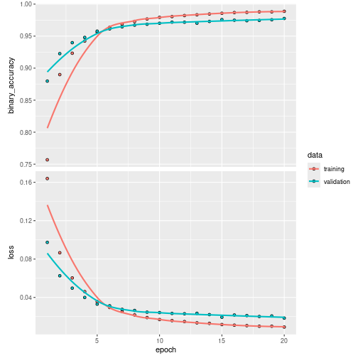
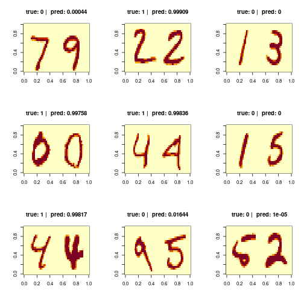

## Introduction

[Siamese Networks](https://en.wikipedia.org/wiki/Siamese_neural_network)
are neural networks which share weights between two or more sister networks,
each producing embedding vectors of its respective inputs.

In supervised similarity learning, the networks are then trained to maximize the
contrast (distance) between embeddings of inputs of different classes, while minimizing the distance between
embeddings of similar classes, resulting in embedding spaces that reflect
the class segmentation of the training inputs.

This implementation loosely follows Hadsell-et-al.'06 [1] (see paper for mode
details) but the euclidean distance is replaced by a subtraction
layer and one fully-connect (FC) layer.

[1] "Dimensionality Reduction by Learning an Invariant Mapping"
     https://yann.lecun.com/exdb/publis/pdf/hadsell-chopra-lecun-06.pdf

Gets to 98.11% test accuracy after 20 epochs. 3 seconds per epoch
on a AMD Ryzen 7 PRO 4750U (CPU)


``` r
library(keras3)
```


``` r
contrastive_loss <- function(y_true, y_pred) {
    # Contrastive loss from Hadsell-et-al.'06
    # https://yann.lecun.com/exdb/publis/pdf/hadsell-chopra-lecun-06.pdf
    margin = 1
    margin_square = op_square(op_maximum(margin - (y_pred), 0))
    op_mean((1 - y_true) * op_square(y_pred) + (y_true) * margin_square)
}
```

## Create pairs of images

We will train the model to differentiate between digits of different classes. For
example, digit `0` needs to be differentiated from the rest of the
digits (`1` through `9`), digit `1` - from `0` and `2` through `9`, and so on.
To carry this out, we will select N random images from class A (for example,
for digit `0`) and pair them with N random images from another class B
(for example, for digit `1`). Then, we can repeat this process for all classes
of digits (until digit `9`). Once we have paired digit `0` with other digits,
we can repeat this process for the remaining classes for the rest of the digits
(from `1` until `9`).

``` r
create_pairs <- function(x, y) {
    # Positive and negative pair creation.
    # Alternates between positive and negative pairs.
    digit_indices <- tapply(1:length(y), y, list)
    y1 <- y
    y2 <- sapply(y, function(a) sample(0:9,1,prob=0.1+0.8*(0:9==a)))
    idx1 <- 1:nrow(x)
    idx2 <- sapply(as.character(y2), function(a) sample(digit_indices[[a]],1))
    is_same  <- 1*(y1==y2)
    list(pair1 = x[idx1,], pair2 = x[idx2,], y = is_same)
}

compute_accuracy <- function(predictions, labels) {
    # Compute classification accuracy with a fixed threshold on distances.
    mean(labels[predictions > 0.5])
}
```


``` r
# the data, shuffled and split between train and test sets
mnist   <- dataset_mnist()
x_train <- mnist$train$x
y_train <- mnist$train$y
x_test  <- mnist$test$x
y_test  <- mnist$test$y
x_train <- array_reshape(x_train, c(nrow(x_train), 784))
x_test  <- array_reshape(x_test, c(nrow(x_test), 784))
x_train <- x_train / 255
x_test  <- x_test / 255

# create training+test positive and negative pairs
tr <- create_pairs(x_train, y_train)
te <- create_pairs(x_test,  y_test)

names(tr)
```

```
## [1] "pair1" "pair2" "y"
```

## Network definition


``` r
# input layers
input_dim = 784
input_1 <- layer_input(shape = c(input_dim))
input_2 <- layer_input(shape = c(input_dim))

# definition of the base network that will be shared
base_network <- keras_model_sequential() %>%
    layer_dense(units = 128, activation = 'relu') %>%
    layer_dropout(rate = 0.1) %>%
    layer_dense(units = 128, activation = 'relu') %>%
    layer_dropout(rate = 0.1) %>%
    layer_dense(units = 128, activation = 'relu')

# because we re-use the same instance `base_network`, the weights of
# the network will be shared across the two branches
branch_1 <- base_network(input_1)
branch_2 <- base_network(input_2)

# merging layer
out <- layer_subtract(list(branch_1, branch_2)) %>%
    layer_dropout(rate = 0.1) %>%
    layer_dense(units = 16, activation = 'relu') %>%
    layer_dense(1, activation = "sigmoid")

# create and compile model
model <- keras_model(list(input_1, input_2), out)
```

## Train


``` r
model %>% compile(
    optimizer = "rmsprop",
    #loss = "binary_crossentropy",
    loss = contrastive_loss,
    metrics = metric_binary_accuracy
)

history <- model %>% fit(
    list(tr$pair1, tr$pair2), tr$y,
    batch_size = 128,
    epochs = 20,
    validation_data = list(
        list(te$pair1, te$pair2),
        te$y
    )
)
```

```
## Epoch 1/20
## 469/469 - 5s - 11ms/step - binary_accuracy: 0.7572 - loss: 0.1639 - val_binary_accuracy: 0.8790 - val_loss: 0.0980
## Epoch 2/20
## 469/469 - 1s - 1ms/step - binary_accuracy: 0.8907 - loss: 0.0858 - val_binary_accuracy: 0.9241 - val_loss: 0.0607
## Epoch 3/20
## 469/469 - 1s - 1ms/step - binary_accuracy: 0.9244 - loss: 0.0592 - val_binary_accuracy: 0.9369 - val_loss: 0.0496
## Epoch 4/20
## 469/469 - 1s - 1ms/step - binary_accuracy: 0.9436 - loss: 0.0447 - val_binary_accuracy: 0.9506 - val_loss: 0.0396
## Epoch 5/20
## 469/469 - 1s - 1ms/step - binary_accuracy: 0.9558 - loss: 0.0355 - val_binary_accuracy: 0.9601 - val_loss: 0.0322
## Epoch 6/20
## 469/469 - 1s - 1ms/step - binary_accuracy: 0.9643 - loss: 0.0291 - val_binary_accuracy: 0.9642 - val_loss: 0.0284
## Epoch 7/20
## 469/469 - 1s - 1ms/step - binary_accuracy: 0.9692 - loss: 0.0245 - val_binary_accuracy: 0.9652 - val_loss: 0.0268
## Epoch 8/20
## 469/469 - 1s - 1ms/step - binary_accuracy: 0.9736 - loss: 0.0212 - val_binary_accuracy: 0.9686 - val_loss: 0.0250
## Epoch 9/20
## 469/469 - 1s - 1ms/step - binary_accuracy: 0.9769 - loss: 0.0188 - val_binary_accuracy: 0.9675 - val_loss: 0.0268
## Epoch 10/20
## 469/469 - 1s - 1ms/step - binary_accuracy: 0.9786 - loss: 0.0172 - val_binary_accuracy: 0.9701 - val_loss: 0.0241
## Epoch 11/20
## 469/469 - 1s - 1ms/step - binary_accuracy: 0.9803 - loss: 0.0160 - val_binary_accuracy: 0.9699 - val_loss: 0.0234
## Epoch 12/20
## 469/469 - 1s - 1ms/step - binary_accuracy: 0.9827 - loss: 0.0141 - val_binary_accuracy: 0.9713 - val_loss: 0.0229
## Epoch 13/20
## 469/469 - 0s - 1ms/step - binary_accuracy: 0.9849 - loss: 0.0126 - val_binary_accuracy: 0.9697 - val_loss: 0.0233
## Epoch 14/20
## 469/469 - 1s - 1ms/step - binary_accuracy: 0.9844 - loss: 0.0127 - val_binary_accuracy: 0.9717 - val_loss: 0.0224
## Epoch 15/20
## 469/469 - 1s - 1ms/step - binary_accuracy: 0.9854 - loss: 0.0116 - val_binary_accuracy: 0.9771 - val_loss: 0.0194
## Epoch 16/20
## 469/469 - 1s - 1ms/step - binary_accuracy: 0.9864 - loss: 0.0110 - val_binary_accuracy: 0.9751 - val_loss: 0.0207
## Epoch 17/20
## 469/469 - 1s - 1ms/step - binary_accuracy: 0.9880 - loss: 0.0102 - val_binary_accuracy: 0.9764 - val_loss: 0.0198
## Epoch 18/20
## 469/469 - 1s - 1ms/step - binary_accuracy: 0.9879 - loss: 0.0100 - val_binary_accuracy: 0.9714 - val_loss: 0.0234
## Epoch 19/20
## 469/469 - 0s - 1ms/step - binary_accuracy: 0.9880 - loss: 0.0098 - val_binary_accuracy: 0.9754 - val_loss: 0.0196
## Epoch 20/20
## 469/469 - 1s - 1ms/step - binary_accuracy: 0.9888 - loss: 0.0090 - val_binary_accuracy: 0.9771 - val_loss: 0.0190
```

``` r
plot(history)
```



## Evaluate


``` r
# compute final accuracy on training and test sets

tr_pred <- predict(model, list(tr$pair1, tr$pair2))[,1]
```

```
## 1875/1875 - 1s - 772us/step
```

``` r
tr_acc  <- compute_accuracy(tr_pred, tr$y)
te_pred <- predict(model, list(te$pair1, te$pair2))[,1]
```

```
## 313/313 - 0s - 1ms/step
```

``` r
te_acc  <- compute_accuracy(te_pred, te$y)

sprintf('* Accuracy on training set: %0.2f%%', (100 * tr_acc))
```

```
## [1] "* Accuracy on training set: 99.62%"
```

``` r
sprintf('* Accuracy on test set: %0.2f%%', (100 * te_acc))
```

```
## [1] "* Accuracy on test set: 98.42%"
```

## Plots


``` r
par(mfrow=c(1,1))
vioplot::vioplot( te_pred ~ te$y )
```


``` r
i=3
visualizePair <- function(i) {
    image(rbind(matrix( te$pair1[i,],28,28)[,28:1], matrix( te$pair2[i,],28,28)[,28:1]))
    title(paste("true:", te$y[i],"|  pred:", round(te_pred[i],5)))
}
par(mfrow=c(3,3))
lapply(1:9, visualizePair)
```



```
## [[1]]
## NULL
##
## [[2]]
## NULL
##
## [[3]]
## NULL
##
## [[4]]
## NULL
##
## [[5]]
## NULL
##
## [[6]]
## NULL
##
## [[7]]
## NULL
##
## [[8]]
## NULL
##
## [[9]]
## NULL
```
