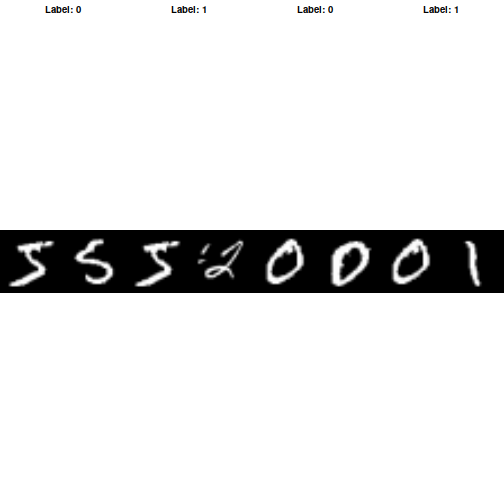
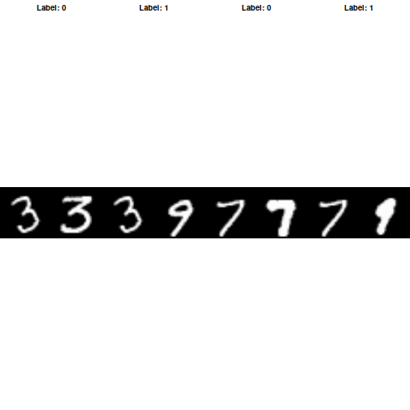
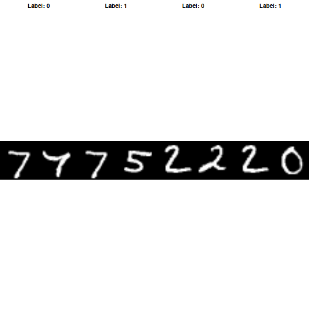
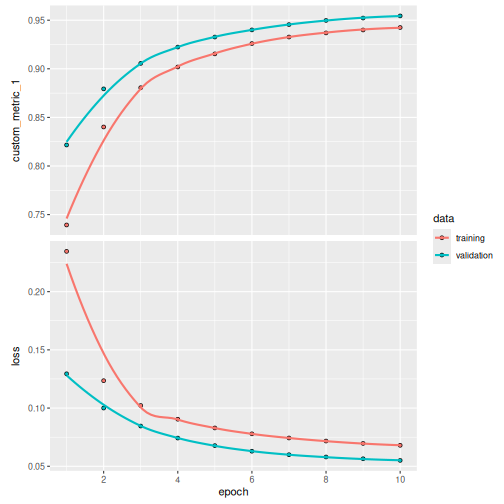
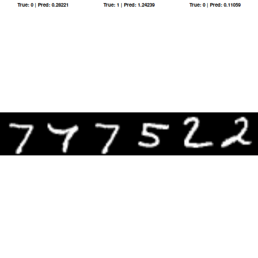

## Introduction

[Siamese Networks](https://en.wikipedia.org/wiki/Siamese_neural_network)
are neural networks which share weights between two or more sister networks,
each producing embedding vectors of its respective inputs.

In supervised similarity learning, the networks are then trained to maximize the
contrast (distance) between embeddings of inputs of different classes, while
minimizing the distance between embeddings of similar classes, resulting in
embedding spaces that reflect the class segmentation of the training inputs.

## Setup


``` r
library(keras3)
```

## Hyperparameters


``` r
epochs <- 10
batch_size <- 16
margin <- 1  # Margin for contrastive loss.
```

## Load the MNIST dataset


``` r
c(c(x_train_val, y_train_val), c(x_test, y_test)) %<-% dataset_mnist()
```

## Define training and validation sets


``` r
# Keep 50% of the training data in the validation set.
train_indices <- seq_len(30000L)
validation_indices <- seq.int(30001L, nrow(x_train_val))

x_train <- x_train_val[train_indices, , , drop = FALSE]
x_val <- x_train_val[validation_indices, , , drop = FALSE]
y_train <- y_train_val[train_indices]
y_val <- y_train_val[validation_indices]
rm(x_train_val, y_train_val)

# Change the data type to a floating point format and make the channel
# dimension explicit.
as_image_tensor <- function(x) {
  x |>
    op_convert_to_tensor(dtype = "float32") |>
    op_expand_dims(axis = -1)
}

x_train <- as_image_tensor(x_train)
x_val <- as_image_tensor(x_val)
x_test <- as_image_tensor(x_test)
```

## Create pairs of images

We will train the model to differentiate between digits of different classes.
For example, digit `0` needs to be differentiated from the rest of the digits
(`1` through `9`), digit `1` from `0` and `2` through `9`, and so on.
To carry this out, we select N random images from class A (for example, digit
`0`) and pair them with N random images from another class B (for example,
digit `1`). We repeat this process for all classes of digits.


``` r
make_pairs <- function(x, y) {
  num_classes <- max(y) + 1L
  digit_indices <- lapply(
    seq_len(num_classes) - 1L,
    \(label) which(y == label)
  )

  matching_indices <- vapply(
    seq_along(y),
    \(i) sample(digit_indices[[y[[i]] + 1L]], size = 1L),
    integer(1)
  )

  nonmatching_labels <- vapply(
    y,
    \(label) {
      candidates <- setdiff(seq_len(num_classes) - 1L, label)
      as.integer(sample(candidates, size = 1L))
    },
    integer(1)
  )
  nonmatching_indices <- vapply(
    seq_along(y),
    \(i) {
      sample(digit_indices[[nonmatching_labels[[i]] + 1L]], size = 1L)
    },
    integer(1)
  )

  first_indices <- rep(seq_along(y), each = 2L)
  second_indices <- as.vector(rbind(matching_indices, nonmatching_indices))

  list(
    pair1 = op_take(x, first_indices, axis = 1),
    pair2 = op_take(x, second_indices, axis = 1),
    labels = as.numeric(rep(c(0, 1), times = length(y)))
  )
}

pairs_train <- make_pairs(x_train, y_train)
pairs_val <- make_pairs(x_val, y_val)
pairs_test <- make_pairs(x_test, y_test)

rm(x_train, x_val, x_test, y_train, y_val, y_test)
```

We get 60,000 training pairs. Each pair contains two images, and each image has
shape `(28, 28, 1)`.


``` r
dim(pairs_train$pair1)
```

```
## [1] 60000    28    28     1
```

Split the training pairs:


``` r
x_train_1 <- pairs_train$pair1
x_train_2 <- pairs_train$pair2
labels_train <- pairs_train$labels
```

Split the validation pairs:


``` r
x_val_1 <- pairs_val$pair1
x_val_2 <- pairs_val$pair2
labels_val <- pairs_val$labels
```

Split the test pairs:


``` r
x_test_1 <- pairs_test$pair1
x_test_2 <- pairs_test$pair2
labels_test <- pairs_test$labels
```

## Visualize pairs and their labels


``` r
visualize <- function(pairs, labels, to_show = 6L, num_col = 3L,
                      predictions = NULL, test = FALSE) {
  num_row <- max(to_show %/% num_col, 1L)
  to_show <- num_row * num_col
  indices <- seq_len(to_show)

  pair1 <- op_take(pairs$pair1, indices, axis = 1) |> as.array()
  pair2 <- op_take(pairs$pair2, indices, axis = 1) |> as.array()
  prediction_values <- if (is.null(predictions)) {
    NULL
  } else {
    drop(as.array(predictions))[indices]
  }

  old_par <- par(no.readonly = TRUE)
  on.exit(par(old_par), add = TRUE)
  par(mfrow = c(num_row, num_col), mar = c(0, 0, 2, 0))

  for (i in indices) {
    image <- cbind(pair1[i, , , 1L], pair2[i, , , 1L])
    plot(as.raster(image / 255))

    label <- if (test) {
      sprintf(
        "True: %d | Pred: %.5f",
        as.integer(labels[[i]]),
        prediction_values[[i]]
      )
    } else {
      sprintf("Label: %d", as.integer(labels[[i]]))
    }
    title(main = label)
  }

  invisible(NULL)
}
```

Inspect training pairs:


``` r
visualize(pairs_train, labels_train, to_show = 4L, num_col = 4L)
```



Inspect validation pairs:


``` r
visualize(pairs_val, labels_val, to_show = 4L, num_col = 4L)
```



Inspect test pairs:


``` r
visualize(pairs_test, labels_test, to_show = 4L, num_col = 4L)
```



## Define the model

There are two input layers, each leading to its own network, which produces
embeddings. A `Lambda` layer then merges them using
[Euclidean distance](https://en.wikipedia.org/wiki/Euclidean_distance).


``` r
euclidean_distance <- function(vectors) {
  c(x, y) %<-% vectors
  sum_square <- op_sum(op_square(x - y), axis = 2, keepdims = TRUE)
  op_sqrt(op_maximum(sum_square, config_epsilon()))
}

create_embedding_network <- function() {
  inputs <- keras_input(shape = c(28, 28, 1))
  outputs <- inputs |>
    layer_batch_normalization() |>
    layer_conv_2d(
      filters = 4, kernel_size = c(5, 5), activation = "tanh"
    ) |>
    layer_average_pooling_2d(pool_size = c(2, 2)) |>
    layer_conv_2d(
      filters = 16, kernel_size = c(5, 5), activation = "tanh"
    ) |>
    layer_average_pooling_2d(pool_size = c(2, 2)) |>
    layer_flatten() |>
    layer_batch_normalization() |>
    layer_dense(units = 10, activation = "tanh")

  keras_model(inputs, outputs, name = "embedding")
}

embedding_network <- create_embedding_network()

input_1 <- keras_input(shape = c(28, 28, 1))
input_2 <- keras_input(shape = c(28, 28, 1))

# Reusing the same embedding network shares its weights between the towers.
tower_1 <- embedding_network(input_1)
tower_2 <- embedding_network(input_2)

# Distance is the output; there is no final dense sigmoid layer.
distance <- list(tower_1, tower_2) |>
  layer_lambda(euclidean_distance)
siamese <- keras_model(
  inputs = list(input_1, input_2),
  outputs = distance
)
```

## Define the contrastive loss


``` r
contrastive_loss <- function(margin = 1) {
  function(y_true, y_pred) {
    square_pred <- op_square(y_pred)
    margin_square <- op_square(op_maximum(margin - y_pred, 0))
    op_mean(
      (1 - y_true) * square_pred +
        y_true * margin_square
    )
  }
}
```

## Define the accuracy metric


``` r
accuracy <- function(y_true, y_pred) {
  y_true <- op_cast(y_true, "float32")
  y_true <- op_reshape(y_true, c(-1))
  y_pred <- op_reshape(y_pred, c(-1))

  # 0 for similar (< 0.5), 1 for dissimilar (> 0.5).
  predictions <- op_cast(y_pred > 0.5, "float32")
  op_mean(op_equal(y_true, predictions))
}
```

## Compile the model with the contrastive loss


``` r
siamese |> compile(
  loss = contrastive_loss(margin),
  optimizer = "rmsprop",
  metrics = list(accuracy)
)
summary(siamese)
```

```
## Model: "functional"
## ┏━━━━━━━━━━━━━━━━━━━┳━━━━━━━━━━━━━━━━━┳━━━━━━━━━━━┳━━━━━━━━━━━━━━━━┳━━━━━━━┓
## ┃ Layer (type)      ┃ Output Shape    ┃   Param # ┃ Connected to   ┃ Trai… ┃
## ┡━━━━━━━━━━━━━━━━━━━╇━━━━━━━━━━━━━━━━━╇━━━━━━━━━━━╇━━━━━━━━━━━━━━━━╇━━━━━━━┩
## │ input_layer_1     │ (None, 28, 28,  │         0 │ -              │   -   │
## │ (InputLayer)      │ 1)              │           │                │       │
## ├───────────────────┼─────────────────┼───────────┼────────────────┼───────┤
## │ input_layer_2     │ (None, 28, 28,  │         0 │ -              │   -   │
## │ (InputLayer)      │ 1)              │           │                │       │
## ├───────────────────┼─────────────────┼───────────┼────────────────┼───────┤
## │ embedding         │ (None, 10)      │     5,318 │ input_layer_1… │   Y   │
## │ (Functional)      │                 │           │ input_layer_2… │       │
## ├───────────────────┼─────────────────┼───────────┼────────────────┼───────┤
## │ lambda (Lambda)   │ (None, 1)       │         0 │ embedding[0][… │   -   │
## │                   │                 │           │ embedding[1][… │       │
## └───────────────────┴─────────────────┴───────────┴────────────────┴───────┘
##  Total params: 5,318 (20.77 KB)
##  Trainable params: 4,804 (18.77 KB)
##  Non-trainable params: 514 (2.01 KB)
```

## Train the model


``` r
history <- siamese |> fit(
  x = list(x_train_1, x_train_2),
  y = labels_train,
  validation_data = list(
    list(x_val_1, x_val_2),
    labels_val
  ),
  batch_size = batch_size,
  epochs = epochs
)
```

```
## Epoch 1/10
## 3750/3750 - 14s - 4ms/step - custom_metric_1: 0.7390 - loss: 0.2347 - val_custom_metric_1: 0.8233 - val_loss: 0.1280
## Epoch 2/10
## 3750/3750 - 10s - 3ms/step - custom_metric_1: 0.8402 - loss: 0.1236 - val_custom_metric_1: 0.8798 - val_loss: 0.0998
## Epoch 3/10
## 3750/3750 - 10s - 3ms/step - custom_metric_1: 0.8807 - loss: 0.1023 - val_custom_metric_1: 0.9042 - val_loss: 0.0848
## Epoch 4/10
## 3750/3750 - 10s - 3ms/step - custom_metric_1: 0.9021 - loss: 0.0904 - val_custom_metric_1: 0.9207 - val_loss: 0.0748
## Epoch 5/10
## 3750/3750 - 10s - 3ms/step - custom_metric_1: 0.9168 - loss: 0.0829 - val_custom_metric_1: 0.9319 - val_loss: 0.0682
## Epoch 6/10
## 3750/3750 - 10s - 3ms/step - custom_metric_1: 0.9262 - loss: 0.0779 - val_custom_metric_1: 0.9387 - val_loss: 0.0636
## Epoch 7/10
## 3750/3750 - 10s - 3ms/step - custom_metric_1: 0.9327 - loss: 0.0743 - val_custom_metric_1: 0.9447 - val_loss: 0.0604
## Epoch 8/10
## 3750/3750 - 11s - 3ms/step - custom_metric_1: 0.9367 - loss: 0.0716 - val_custom_metric_1: 0.9496 - val_loss: 0.0581
## Epoch 9/10
## 3750/3750 - 12s - 3ms/step - custom_metric_1: 0.9398 - loss: 0.0696 - val_custom_metric_1: 0.9525 - val_loss: 0.0564
## Epoch 10/10
## 3750/3750 - 12s - 3ms/step - custom_metric_1: 0.9418 - loss: 0.0680 - val_custom_metric_1: 0.9548 - val_loss: 0.0548
```

## Visualize results


``` r
plot(history)
```



## Evaluate the model


``` r
results <- siamese |> evaluate(
  list(x_test_1, x_test_2),
  labels_test
)
```

```
## 625/625 - 2s - 3ms/step - custom_metric_1: 0.9573 - loss: 0.0519
```

``` r
results
```

```
## $custom_metric_1
## [1] 0.9573
##
## $loss
## [1] 0.05186361
```

## Visualize the predictions


``` r
predictions <- siamese |> predict(list(x_test_1, x_test_2))
```

```
## 625/625 - 1s - 2ms/step
```

``` r
visualize(
  pairs_test,
  labels_test,
  to_show = 3L,
  predictions = predictions,
  test = TRUE
)
```


