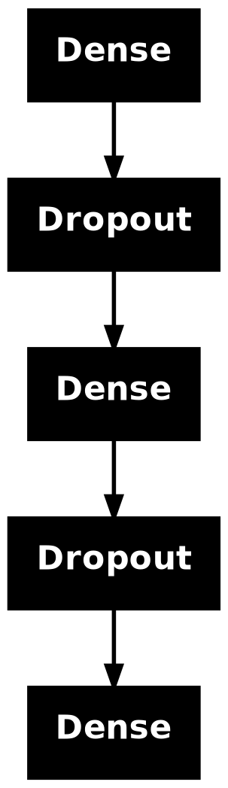
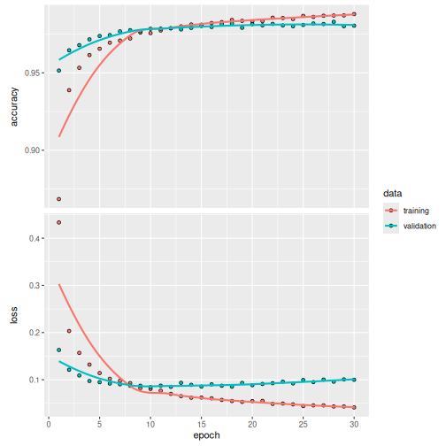

## Overview

[Keras](https://keras.posit.co/) is a high-level neural networks API developed with a focus on enabling fast experimentation. *Being able to go from idea to result with the least possible delay is key to doing good research.* Keras has the following key features:

- Allows the same code to run on CPU or on GPU, seamlessly.

- User-friendly API which makes it easy to quickly prototype deep learning models.

- Built-in support for convolutional networks (for computer vision), recurrent networks (for sequence processing), and any combination of both.

- Supports arbitrary network architectures: multi-input or multi-output models, layer sharing, model sharing, etc. This means that Keras is appropriate for building essentially any deep learning model, from a memory network to a neural Turing machine.

This website provides documentation for the R interface to Keras. See the main Keras website at <https://keras.io> for additional information on the project.

## Installation

First, install the keras R package:


``` r
install.packages("keras3")
```

or install the development version with:


``` r
remotes::install_github("rstudio/keras")
```

The Keras R interface requires that a backend engine be installed. This is [TensorFlow](https://www.tensorflow.org/) by default.


``` r
keras3::install_keras(backend = "tensorflow")
```

This will provide you with default installation of Keras and TensorFlow that is GPU capable, if a GPU is available. If you want a more customized installation, e.g. see the documentation for `install_keras()` and the [installation](https://tensorflow.rstudio.com/installation/) section.

## MNIST Example

We can learn the basics of Keras by walking through a simple example: recognizing handwritten digits from the [MNIST](https://en.wikipedia.org/wiki/MNIST_database) dataset. MNIST consists of 28 x 28 grayscale images of handwritten digits like these:


The dataset also includes labels for each image, telling us which digit it is. For example, the labels for the above images are 5, 0, 4, and 1.

### Preparing the Data

The MNIST dataset is included with Keras and can be accessed using the `dataset_mnist()` function. Here we load the dataset then create variables for our test and training data:


``` r
library(keras3)
mnist <- dataset_mnist()
x_train <- mnist$train$x
y_train <- mnist$train$y
x_test <- mnist$test$x
y_test <- mnist$test$y
```

The `x` data is a 3-d array `(images, width, height)` of grayscale values. To prepare the data for training we convert the 3-d arrays into matrices by reshaping width and height into a single dimension (28x28 images are flattened into length 784 vectors). Then, we convert the grayscale values from integers ranging between 0 to 255 into floating point values ranging between 0 and 1:


``` r
# reshape
x_train <- array_reshape(x_train, c(nrow(x_train), 784))
x_test <- array_reshape(x_test, c(nrow(x_test), 784))
# rescale
x_train <- x_train / 255
x_test <- x_test / 255
```

Note that we use the `array_reshape()` function rather than the `dim<-()` function to reshape the array. This is so that the data is re-interpreted using row-major semantics (as opposed to R's default column-major semantics), which is in turn compatible with the way that the numerical libraries called by Keras interpret array dimensions.

The `y` data is an integer vector with values ranging from 0 to 9. To prepare this data for training we one-hot encode the vectors into binary class matrices using the Keras `to_categorical()` function:


``` r
y_train <- to_categorical(y_train, 10)
y_test <- to_categorical(y_test, 10)
```

### Defining the Model

The core data structure of Keras is a model, a way to organize layers. The simplest type of model is the [Sequential model](https://tensorflow.rstudio.com/articles/sequential_model.html), a linear stack of layers.

We begin by creating a sequential model and then adding layers using the pipe (`|>`) operator:


``` r
model <- keras_model_sequential(input_shape = c(784))
model |>
  layer_dense(units = 256, activation = 'relu') |>
  layer_dropout(rate = 0.4) |>
  layer_dense(units = 128, activation = 'relu') |>
  layer_dropout(rate = 0.3) |>
  layer_dense(units = 10, activation = 'softmax')
```

The `input_shape` argument to the first layer specifies the shape of the input data (a length 784 numeric vector representing a grayscale image). The final layer outputs a length 10 numeric vector (probabilities for each digit) using a [softmax activation function](https://en.wikipedia.org/wiki/Softmax_function).

Use the `summary()` function to print the details of the model:


``` r
summary(model)
```

```
## Model: "sequential"
## ┏━━━━━━━━━━━━━━━━━━━━━━━━━━━━━━━━━┳━━━━━━━━━━━━━━━━━━━━━━━━┳━━━━━━━━━━━━━━━┓
## ┃ Layer (type)                    ┃ Output Shape           ┃       Param # ┃
## ┡━━━━━━━━━━━━━━━━━━━━━━━━━━━━━━━━━╇━━━━━━━━━━━━━━━━━━━━━━━━╇━━━━━━━━━━━━━━━┩
## │ dense (Dense)                   │ (None, 256)            │       200,960 │
## ├─────────────────────────────────┼────────────────────────┼───────────────┤
## │ dropout (Dropout)               │ (None, 256)            │             0 │
## ├─────────────────────────────────┼────────────────────────┼───────────────┤
## │ dense_1 (Dense)                 │ (None, 128)            │        32,896 │
## ├─────────────────────────────────┼────────────────────────┼───────────────┤
## │ dropout_1 (Dropout)             │ (None, 128)            │             0 │
## ├─────────────────────────────────┼────────────────────────┼───────────────┤
## │ dense_2 (Dense)                 │ (None, 10)             │         1,290 │
## └─────────────────────────────────┴────────────────────────┴───────────────┘
##  Total params: 235,146 (918.54 KB)
##  Trainable params: 235,146 (918.54 KB)
##  Non-trainable params: 0 (0.00 B)
```


``` r
plot(model)
```


Next, compile the model with appropriate loss function, optimizer, and metrics:


``` r
model |> compile(
  loss = 'categorical_crossentropy',
  optimizer = optimizer_rmsprop(),
  metrics = c('accuracy')
)
```

### Training and Evaluation

Use the `fit()` function to train the model for 30 epochs using batches of 128 images:


``` r
history <- model |> fit(
  x_train, y_train,
  epochs = 30, batch_size = 128,
  validation_split = 0.2
)
```

The `history` object returned by `fit()` includes loss and accuracy metrics which we can plot:


``` r
plot(history)
```



Evaluate the model's performance on the test data:


``` r
model |> evaluate(x_test, y_test)
```

```
## 313/313 - 1s - 3ms/step - accuracy: 0.9806 - loss: 0.0880
```

```
## $accuracy
## [1] 0.9806
##
## $loss
## [1] 0.08797418
```

Generate predictions on new data:


``` r
probs <- model |> predict(x_test)
```

```
## 313/313 - 0s - 1ms/step
```

``` r
max.col(probs) - 1L
```

```
##   [1] 7 2 1 0 4 1 4 9 6 9 0 6 9 0 1 5 9 7 3 4 9 6 6 5 4 0 7 4 0 1 3 1 3 4 7
##  [36] 2 7 1 2 1 1 7 4 2 3 5 1 2 4 4 6 3 5 5 6 0 4 1 9 5 7 8 9 3 7 4 6 4 3 0
##  [71] 7 0 2 9 1 7 3 2 9 7 7 6 2 7 8 4 7 3 6 1 3 6 9 3 1 4 1 7 6 9
##  [ reached getOption("max.print") -- omitted 9900 entries ]
```

Keras provides a vocabulary for building deep learning models that is simple, elegant, and intuitive. Building a question answering system, an image classification model, a neural Turing machine, or any other model is just as straightforward.

### Deep Learning with R Book

If you want a more comprehensive introduction to both Keras and the concepts and practice of deep learning, we recommend the [Deep Learning with R, 2nd Edition](https://www.manning.com/books/deep-learning-with-r-second-edition) book from Manning. This book is a collaboration between François Chollet, the creator of (Python) Keras, J.J. Allaire, who wrote the original R interface to Keras, and Tomasz Kalinowski, the maintainer of the R interface to Keras.

The book presumes no significant knowledge of machine learning and deep learning, and goes all the way from basic theory to advanced practical applications, all using the R interface to Keras.

<div style="clear: both;"></div>

## Why this name, Keras?

Keras (κέρας) means horn in Greek. It is a reference to a literary image from ancient Greek and Latin literature, first found in the Odyssey, where dream spirits (Oneiroi, singular Oneiros) are divided between those who deceive men with false visions, who arrive to Earth through a gate of ivory, and those who announce a future that will come to pass, who arrive through a gate of horn. It's a play on the words κέρας (horn) / κραίνω (fulfill), and ἐλέφας (ivory) / ἐλεφαίρομαι (deceive).

Keras was initially developed as part of the research effort of project ONEIROS (Open-ended Neuro-Electronic Intelligent Robot Operating System).

> "Oneiroi are beyond our unravelling --who can be sure what tale they tell? Not all that men look for comes to pass. Two gates there are that give passage to fleeting Oneiroi; one is made of horn, one of ivory. The Oneiroi that pass through sawn ivory are deceitful, bearing a message that will not be fulfilled; those that come out through polished horn have truth behind them, to be accomplished for men who see them." Homer, Odyssey 19. 562 ff (Shewring translation).
