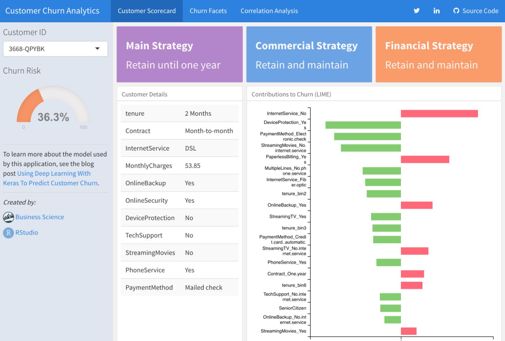

```{r setup, include=FALSE}
library(keras)
knitr::opts_chunk$set(eval = FALSE)
```


Resources for learning how to use Keras as well as the underlying principles of deep learning.

<style type="text/css">
.page-header {
  border-bottom: none;
  margin: 0;
  padding-bottom: 0;
}
</style>
<br/>


<div class="link-table">

|  |  |
|-----------------|---------------------------------------------------------------|
| <a href="tutorial_basic_classification.html"></a>                 |  [**Keras Tutorials**](tutorial_basic_classification.html) <br/>  A sequence of step-by-step tutorials that walk you through the main components of the Keras library and demonstrate the core workflows used for training and improving the performance of neural networks. There are 5 tutorials covering [Basic Classification](tutorial_basic_classfication.html), [Text Classification](tutorial_basic_text_classification.html), [Basic Regression](tutorial_basic_regression.html), [Overfitting and Underfitting](tutorial_overfit_underfit.html), and how to [Save and Restore Models](tutorial_save_and_restore.html). |
| <a href="https://www.amazon.com/Deep-Learning-R-Francois-Chollet/dp/161729554X"></a>  | [**Deep Learning with R**](https://www.amazon.com/Deep-Learning-R-Francois-Chollet/dp/161729554X) <br/>Deep Learning with R is meant for statisticians, analysts, engineers, and students with a reasonable amount of R experience but no significant knowledge of machine learning and deep learning. The goal of the book is to provide a learning resource for the R community that goes all the way from basic theory to advanced practical applications. You’ll learn from more than 30 code examples that include detailed commentary and practical recommendations. You don’t need previous experience with machine learning or deep learning: this book covers from scratch all the necessary basics. You don’t need an advanced mathematics background, either---high-school-level mathematics should suffice in order to follow along. |
| <a href="https://www.amazon.com/Deep-Learning-Adaptive-Computation-Machine/dp/0262035618"></a>  | [**Deep Learning**](https://www.amazon.com/Deep-Learning-Adaptive-Computation-Machine/dp/0262035618) <br/>An introduction to a broad range of topics in deep learning. The text offers mathematical and conceptual background, covering relevant concepts in linear algebra, probability theory and information theory, numerical computation, and machine learning. It describes deep learning techniques used by practitioners in industry, including deep feedforward networks, regularization, optimization algorithms, convolutional networks, sequence modeling, and practical methodology. This is the definitive textbook on deep learning. Written by major contributors to the field, it is clear, comprehensive, and authoritative. If you want to know where deep learning came from, what it is good for, and where it is going, read this book.|
| <a href="https://github.com/rstudio/cheatsheets/raw/master/keras.pdf"></a>  | [**Deep Learning with Keras Cheatsheet**](https://github.com/rstudio/cheatsheets/raw/master/keras.pdf) <br/>A quick reference guide to the concepts and available functions in the R interface to Keras. Covers the various types of Keras layers, data preprocessing, training workflow, and pre-trained models.  |
| <a href="https://tensorflow.rstudio.com/learn/gallery.html"></a>  | [**Gallery**](https://tensorflow.rstudio.com/learn/gallery.html) <br/>In-depth examples of using Keras with R, including detailed explanatory narrative as well as coverage of ancillary tasks like data preprocessing and visualization. A great resource for taking the next step after you've learned the basics. |
| <a href="examples/index.html"></a>  | [**Examples**](examples/index.html) <br/> Introductory examples of using Keras with R. These examples cover the basics of training models with the keras, tfestimators, and tensorflow packages.  |

</div>

