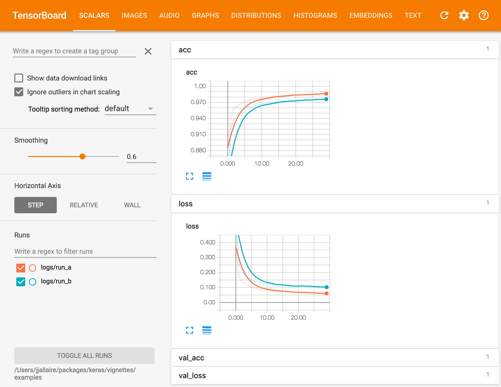

```{r setup, include = FALSE}
library(keras)
knitr::opts_chunk$set(comment = NA, eval = FALSE)
```

## Overview

There are a number of tools available for visualizing the training of Keras models, including:

1) A [plot method](https://keras.rstudio.com/reference/plot.keras_training_history.html) for the Keras training history returned from `fit()`.

2) Real time visualization of training metrics within the RStudio IDE.

3) Integration with the [TensorBoard](https://www.tensorflow.org/tensorboard/get_started) visualization tool included with TensorFlow. Beyond just training metrics, TensorBoard has a wide variety of other visualizations available including the underlying TensorFlow graph, gradient histograms, model weights, and more. TensorBoard also enables you to compare metrics across multiple training runs.

Each of these tools is described in more detail below.

## Plotting History

The Keras `fit()` method returns an R object containing the training history, including the value of metrics at the end of each epoch . You can plot the training metrics by epoch using the `plot()` method. 

For example, here we compile and fit a model with the "accuracy" metric:

```{r}
model %>% compile(
  loss = 'categorical_crossentropy',
  optimizer = optimizer_rmsprop(),
  metrics = c('accuracy')
)

history <- model %>% fit(
  x_train, y_train, 
  epochs = 30, batch_size = 128, 
  validation_split = 0.2
)
```

We can then plot the training history as follows:

```{r}
plot(history)
```

{width=757 height=489 .r-plot}

The history will be plotted using [ggplot2](https://ggplot2.tidyverse.org/) if available (if not then base graphics will be used), include all specified metrics as well as the loss, and draw a smoothing line if there are 10 or more epochs. You can customize all of this behavior via various options of the [plot method](https://keras.rstudio.com/reference/plot.keras_training_history.html).

If you want to create a custom visualization you can call the `as.data.frame()` method on the history to obtain a data frame with factors for each metric as well as training vs. validation:

```{r}
history_df <- as.data.frame(history)
str(history_df)
```

```
'data.frame':	120 obs. of  4 variables:
 $ epoch : int  1 2 3 4 5 6 7 8 9 10 ...
 $ value : num  0.87 0.941 0.954 0.962 0.965 ...
 $ metric: Factor w/ 2 levels "acc","loss": 1 1 1 1 1 1 1 1 1 1 ...
 $ data  : Factor w/ 2 levels "training","validation": 1 1 1 1 1 1 1 1 1 1 ...
```

## RStudio IDE 

If you are training your model within the RStudio IDE then real time metrics are available within the Viewer pane:

```{css, echo=FALSE}
#rstudiohistory {
  margin-top: 15px;
  margin-bottom: 15px;
}
```

<a id="rstudiohistory" href="https://rstudioblog.files.wordpress.com/2017/08/rstudio-training-metrics-full.gif"></a>
<script type="application/javascript">
function isMobilePhone() {
  try { return ! window.matchMedia("only screen and (min-width: 768px)").matches; }
  catch(e) { return false; }
}
var a = document.getElementById("rstudiohistory");
var img = document.createElement("IMG");
img.className = "r-plot";
img.width = 640;
img.height = 502;
if (!isMobilePhone()) {
  img.src = "https://i1.wp.com/rstudioblog.files.wordpress.com/2017/08/rstudio-training-metrics.gif";
} else {
  a.href = '';
  img.src = "https://i0.wp.com/rstudioblog.files.wordpress.com/2017/08/rstudio-training-metrics-mobile.png";
}
a.appendChild(img);
</script>

The `view_metrics` argument of the `fit()` method controls whether real time metrics are displayed. By default metrics are automatically displayed if one or more metrics are specified in the call to `compile()` and there is more than one training epoch. 

You can explicitly control whether metrics are displayed by specifying the `view_metrics` argument. You can also set a global session default using the `keras.view_metrics` option:

```{r}
# don't show metrics during this run
history <- model %>% fit(
  x_train, y_train, 
  epochs = 30, batch_size = 128, 
  view_metrics = FALSE,
  validation_split = 0.2
)

# set global default to never show metrics
options(keras.view_metrics = FALSE)
```

Note that when `view_metrics` is `TRUE` metrics will be displayed even when not running within RStudio (in that case metrics will be displayed in an external web browser).

## TensorBoard

TensorBoard is a visualization tool included with TensorFlow that enables you to visualize dynamic graphs of your Keras training and test metrics, as well as activation histograms for the different layers in your model. 

For example, here's a TensorBoard display for Keras accuracy and loss metrics:

{width=700 height=545 .screenshot}

### Recording Data

To record data that can be visualized with TensorBoard, you add a TensorBoard callback to the `fit()` function. For example:

```{r}
history <- model %>% fit(
  x_train, y_train,
  batch_size = batch_size,
  epochs = epochs,
  verbose = 1,
  callbacks = callback_tensorboard("logs/run_a"),
  validation_split = 0.2
)
```

See the documentation on the `callback_tensorboard()` function for the various available options. The most important option is the `log_dir`, which determines which directory logs are written to for a given training run. 

You should either use a distinct log directory for each training run or remove the log directory between runs.

### Viewing Data

To view TensorBoard data for a given set of runs you use the `tensorboard()` function, pointing it to the previously specified `log_dir`:

```{r}
tensorboard("logs/run_a")
```

It's often useful to run TensorBoard while you are training a model. To do this, simply launch tensorboard within the training directory right before you begin training:

```{r}
# launch TensorBoard (data won't show up until after the first epoch)
tensorboard("logs/run_a")

# fit the model with the TensorBoard callback
history <- model %>% fit(
  x_train, y_train,
  batch_size = batch_size,
  epochs = epochs,
  verbose = 1,
  callbacks = callback_tensorboard("logs/run_a"),
  validation_split = 0.2
)
```    

Keras writes TensorBoard data at the end of each epoch so you won't see any data in TensorBoard until 10-20 seconds after the end of the first epoch (TensorBoard automatically refreshes it's display every 30 seconds during training). 

### Comparing Runs

TensorBoard will automatically include all runs logged within the sub-directories of the specified `log_dir`, for example, if you logged another run using:

```{r}
callback_tensorboard(log_dir = "logs/run_b")
```

Then called tensorboard as follows:

```{r}
tensorboard("logs")
```

The TensorBoard visualization would look like this:

{width=700 height=540 .screenshot}

You can also pass multiple log directories. For example:

```{r}
tensorboard(c("logs/run_a", "logs/run_b"))
```

### Customization

#### Metrics

In the above examples TensorBoard metrics are logged for loss and accuracy. The TensorBoard callback will log data for any metrics which are specified in the `metrics` parameter of the `compile()` function. For example, in the following code:

```r
model %>% compile(
  loss = 'mean_squared_error',
  optimizer = 'sgd',
  metrics= c('mae', 'acc')
)
```

TensorBoard data series will be created for the loss (mean squared error) as well as for the mean absolute error and accuracy metrics.

#### Options

The `callback_tensorboard()` function includes a number of other options that control logging during training:

```r
callback_tensorboard(log_dir = "logs", histogram_freq = 0,
  write_graph = TRUE, write_images = FALSE, embeddings_freq = 0,
  embeddings_layer_names = NULL, embeddings_metadata = NULL)
```

| Name  | Description |
|-----------------|-------------------------------------------------------------------|
| `log_dir`  | Path of the directory to save the log files to be parsed by Tensorboard. |
| `histogram_freq`  | Frequency (in epochs) at which to compute activation histograms for the layers of the model. If set to 0 (the default), histograms won't be computed.  |
| `write_graph` | Whether to visualize the graph in Tensorboard. The log file can become quite large when write_graph is set to `TRUE`  |
| `write_images`  | Whether to write model weights to visualize as image in Tensorboard.  |
| `embeddings_freq` | Frequency (in epochs) at which selected embedding layers will be saved.  |
| `embeddings_layer_names` | A list of names of layers to keep eye on. If `NULL` or empty list all the embedding layers will be watched.  |
| `embeddings_metadata`  | A named list which maps layer name to a file name in which metadata for this embedding layer is saved. See the [details](https://www.tensorflow.org/tensorboard/tensorboard_projector_plugin) about the metadata file format. In case if the same metadata file is used for all embedding layers, string can be passed.  |


