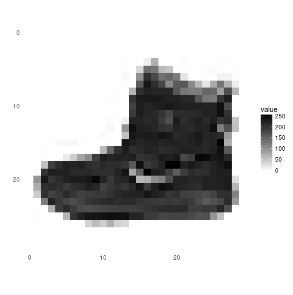

```{r setup, include=FALSE}
knitr::opts_chunk$set(echo = TRUE, eval = FALSE)
```


In this guide, we will train a neural network model to classify images of clothing, like sneakers and shirts. It's fine if you don't understand all the details, this is a fast-paced overview of a complete Keras program with the details explained as we go.

```{r}
library(keras)
```

## Import the Fashion MNIST dataset


This guide uses the [Fashion MNIST](https://github.com/zalandoresearch/fashion-mnist) dataset which contains 70,000 grayscale images in 10 categories. The images show individual articles of clothing at low resolution (28 by 28 pixels), as seen here:


Fashion MNIST is intended as a drop-in replacement for the classic [MNIST](http://yann.lecun.com/exdb/mnist/) dataset—often used as the "Hello, World" of machine learning programs for computer vision. The MNIST dataset contains images of handwritten digits (0, 1, 2, etc) in an identical format to the articles of clothing we'll use here.

This guide uses Fashion MNIST for variety, and because it's a slightly more challenging problem than regular MNIST. Both datasets are relatively small and are used to verify that an algorithm works as expected. They're good starting points to test and debug code.

We will use 60,000 images to train the network and 10,000 images to evaluate how accurately the network learned to classify images. You can access the Fashion MNIST directly from Keras.

```{r}
fashion_mnist <- dataset_fashion_mnist()

c(train_images, train_labels) %<-% fashion_mnist$train
c(test_images, test_labels) %<-% fashion_mnist$test
```

At this point we have four arrays: The train_images and train_labels arrays are the training set — the data the model uses to learn. The model is tested against the test set: the test_images, and test_labels arrays.

The images each are 28 x 28 arrays, with pixel values ranging between 0 and 255. The labels are arrays of integers, ranging from 0 to 9. These correspond to the class of clothing the image represents:

Digit  | Class
-------| -------------
0 | T-shirt/top
1 | Trouser
2 | Pullover
3 | Dress
4 | Coat
5 | Sandal
6 | Shirt
7 | Sneaker
8 | Bag
9 | Ankle boot

Each image is mapped to a single label. Since the class names are not included with the dataset, we'll store them in a vector to use later when plotting the images.

```{r}
class_names = c('T-shirt/top',
                'Trouser',
                'Pullover',
                'Dress',
                'Coat', 
                'Sandal',
                'Shirt',
                'Sneaker',
                'Bag',
                'Ankle boot')
```


## Explore the data

Let's explore the format of the dataset before training the model. The following shows there are 60,000 images in the training set, with each image represented as 28 x 28 pixels:

```{r}
dim(train_images)
```

```
[1] 60000    28    28
```


Likewise, there are 60,000 labels in the training set:

```{r}
dim(train_labels)
```

```
[1] 60000
```


Each label is an integer between 0 and 9:

```{r}
train_labels[1:20]
```

```
[1] 9 0 0 3 0 2 7 2 5 5 0 9 5 5 7 9 1 0 6 4
```


There are 10,000 images in the test set. Again, each image is represented as 28 x 28 pixels:

```{r}
dim(test_images)
```

```
[1] 10000    28    28
```


And the test set contains 10,000 images labels:

```{r}
dim(test_labels)
```

```
[1] 10000
```

## Preprocess the data

The data must be preprocessed before training the network. If you inspect the first image in the training set, you will see that the pixel values fall in the range of 0 to 255:

```{r}
library(tidyr)
library(ggplot2)

image_1 <- as.data.frame(train_images[1, , ])
colnames(image_1) <- seq_len(ncol(image_1))
image_1$y <- seq_len(nrow(image_1))
image_1 <- gather(image_1, "x", "value", -y)
image_1$x <- as.integer(image_1$x)

ggplot(image_1, aes(x = x, y = y, fill = value)) +
  geom_tile() +
  scale_fill_gradient(low = "white", high = "black", na.value = NA) +
  scale_y_reverse() +
  theme_minimal() +
  theme(panel.grid = element_blank())   +
  theme(aspect.ratio = 1) +
  xlab("") +
  ylab("")
```




We scale these values to a range of 0 to 1 before feeding to the neural network model. For this, we simply divide by 255. 

It's important that the training set and the testing set are preprocessed in the same way:

```{r}
train_images <- train_images / 255
test_images <- test_images / 255
```


Display the first 25 images from the training set and display the class name below each image. 
Verify that the data is in the correct format and we're ready to build and train the network.


```{r}
par(mfcol=c(5,5))
par(mar=c(0, 0, 1.5, 0), xaxs='i', yaxs='i')
for (i in 1:25) { 
  img <- train_images[i, , ]
  img <- t(apply(img, 2, rev)) 
  image(1:28, 1:28, img, col = gray((0:255)/255), xaxt = 'n', yaxt = 'n',
        main = paste(class_names[train_labels[i] + 1]))
}
```


## Build the model

Building the neural network requires configuring the layers of the model, then compiling the model.


### Setup the layers

The basic building block of a neural network is the layer. Layers extract representations from the data fed into them. And, hopefully, these representations are more meaningful for the problem at hand.

Most of deep learning consists of chaining together simple layers. Most layers, like `layer_dense`, have parameters that are learned during training.

```{r}
model <- keras_model_sequential()
model %>%
  layer_flatten(input_shape = c(28, 28)) %>%
  layer_dense(units = 128, activation = 'relu') %>%
  layer_dense(units = 10, activation = 'softmax')
```

The first layer in this network, `layer_flatten`, transforms the format of the images from a 2d-array (of 28 by 28 pixels), to a 1d-array of 28 * 28 = 784 pixels. Think of this layer as unstacking rows of pixels in the image and lining them up. This layer has no parameters to learn; it only reformats the data.

After the pixels are flattened, the network consists of a sequence of two `dense` layers. These are densely-connected, or fully-connected, neural layers. The first dense layer has 128 nodes (or neurons). The second (and last) layer is a 10-node softmax layer —this returns an array of 10 probability scores that sum to 1. Each node contains a score that indicates the probability that the current image belongs to one of the 10 digit classes.

### Compile the model

Before the model is ready for training, it needs a few more settings. These are added during the model's compile step:

 - Loss function — This measures how accurate the model is during training. We want to minimize this function to "steer" the model in the right direction.
 - Optimizer — This is how the model is updated based on the data it sees and its loss function.
  - Metrics —Used to monitor the training and testing steps. The following example uses accuracy, the fraction of the images that are correctly classified.


```{r}
model %>% compile(
  optimizer = 'adam', 
  loss = 'sparse_categorical_crossentropy',
  metrics = c('accuracy')
)
```


### Train the model

Training the neural network model requires the following steps:

 - Feed the training data to the model — in this example, the `train_images` and `train_labels` arrays.
 - The model learns to associate images and labels.
 - We ask the model to make predictions about a test set — in this example, the test_images array. We verify that the predictions match the labels from the test_labels array.

To start training, call the `fit` method — the model is "fit" to the training data:

```{r}
model %>% fit(train_images, train_labels, epochs = 5)
```

```
Epoch 1/5
60000/60000 [==============================] - 7s 118us/step - loss: 0.4980 - acc: 0.8238
Epoch 2/5
60000/60000 [==============================] - 6s 101us/step - loss: 0.3783 - acc: 0.8634
Epoch 3/5
60000/60000 [==============================] - 9s 156us/step - loss: 0.3378 - acc: 0.8767
Epoch 4/5
60000/60000 [==============================] - 7s 123us/step - loss: 0.3124 - acc: 0.8848
Epoch 5/5
60000/60000 [==============================] - 7s 111us/step - loss: 0.2959 - acc: 0.8911
```


As the model trains, the loss and accuracy metrics are displayed. This model reaches an accuracy of about 0.88 (or 88%) on the training data.

### Evaluate accuracy

Next, compare how the model performs on the test dataset:

```{r}
score <- model %>% evaluate(test_images, test_labels)

cat('Test loss:', score$loss, "\n")
cat('Test accuracy:', score$acc, "\n")
```

```
10000/10000 [==============================] - 0s 19us/step
Test loss: 0.3755946 
Test accuracy: 0.8644 
```


It turns out, the accuracy on the test dataset is a little less than the accuracy on the training dataset. This gap between training accuracy and test accuracy is an example of overfitting. Overfitting is when a machine learning model performs worse on new data than on their training data.


### Make predictions

With the model trained, we can use it to make predictions about some images.

```{r}
predictions <- model %>% predict(test_images)
```

Here, the model has predicted the label for each image in the testing set. Let's take a look at the first prediction:

```{r}
predictions[1, ]
```

```
[1] 1.247006e-06 8.371295e-08 1.987903e-07 1.078801e-06 2.053094e-07 1.419330e-02 9.533844e-06
[8] 5.745503e-02 2.694531e-05 9.283124e-01
```


A prediction is an array of 10 numbers. These describe the "confidence" of the model that the image corresponds to each of the 10 different articles of clothing. We can see which label has the highest confidence value:

```{r}
which.max(predictions[1, ])
```

```
[1] 10
```

Alternatively, we can also directly get the class prediction:

```{r}
class_pred <- model %>% predict_classes(test_images)
class_pred[1:20]
```

```
[1] 9 2 1 1 6 1 4 6 5 7 4 5 5 3 4 1 2 2 8 0
```


As the labels are 0-based, this actually means a predicted label of 9 (to be found in class_names[9]). So the model is most confident that this image is an ankle boot.
And we can check the test label to see this is correct:

```{r}
test_labels[1]
```

```
[1] 9
```


Let's plot several images with their predictions. Correct prediction labels are green and incorrect prediction labels are red.

```{r}
par(mfcol=c(5,5))
par(mar=c(0, 0, 1.5, 0), xaxs='i', yaxs='i')
for (i in 1:25) { 
  img <- test_images[i, , ]
  img <- t(apply(img, 2, rev)) 
  # subtract 1 as labels go from 0 to 9
  predicted_label <- which.max(predictions[i, ]) - 1
  true_label <- test_labels[i]
  if (predicted_label == true_label) {
    color <- '#008800' 
  } else {
    color <- '#bb0000'
  }
  image(1:28, 1:28, img, col = gray((0:255)/255), xaxt = 'n', yaxt = 'n',
        main = paste0(class_names[predicted_label + 1], " (",
                      class_names[true_label + 1], ")"),
        col.main = color)
}
```


Finally, use the trained model to make a prediction about a single image.

```{r}
# Grab an image from the test dataset
# take care to keep the batch dimension, as this is expected by the model
img <- test_images[1, , , drop = FALSE]
dim(img)
```

```
[1]  1 28 28
```


Now predict the image:

```{r}
predictions <- model %>% predict(img)
predictions
```

```
             [,1]         [,2]         [,3]       [,4]         [,5]       [,6]         [,7]
[1,] 1.247006e-06 8.371312e-08 1.987903e-07 1.0788e-06 2.053096e-07 0.01419331 9.533853e-06
           [,8]         [,9]     [,10]
[1,] 0.05745504 2.694531e-05 0.9283124
```


`predict` returns a list of lists, one for each image in the batch of data. Grab the predictions for our (only) image in the batch:

```{r}
# subtract 1 as labels are 0-based
prediction <- predictions[1, ] - 1
which.max(prediction)
```

```
[1] 10
```

Or, directly getting the class prediction again:

```{r}
class_pred <- model %>% predict_classes(img)
class_pred
```

```
[1] 9
```


And, as before, the model predicts a label of 9.

## More Tutorials

Check out these additional tutorials to learn more:

- [Text Classification](tutorial_basic_text_classification.html) --- This tutorial classifies movie reviews as positive or negative using the text of the review. 

- [Basic Regression](tutorial_basic_regression.html) --- This tutorial builds a model to predict the median price of homes in a Boston suburb during the mid-1970s. 

- [Overfitting and Underfitting](tutorial_overfit_underfit.html) --- In this tutorial, we explore two common regularization techniques (weight regularization and dropout) and use them to improve our movie review classification results.

- [Save and Restore Models](tutorial_save_and_restore.html) --- This tutorial demonstrates various ways to save and share models (after as well as during training).

