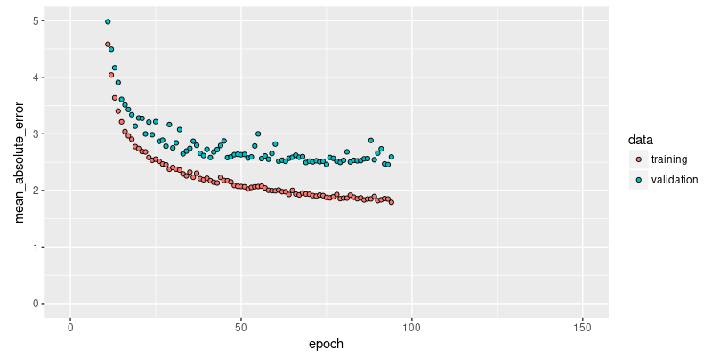

```{r setup, include=FALSE}
knitr::opts_chunk$set(echo = TRUE, eval = FALSE)
```


In a regression problem, we aim to predict the output of a continuous value, like a price or a probability. Contrast this with a classification problem, where we aim to predict a discrete label (for example, where a picture contains an apple or an orange).

This notebook builds a model to predict the median price of homes in a Boston suburb during the mid-1970s. To do this, we'll provide the model with some data points about the suburb, such as the crime rate and the local property tax rate.


```{r}
library(keras)
```


## The Boston Housing Prices dataset

The [Boston Housing Prices dataset](https://www.cs.toronto.edu/~delve/data/boston/bostonDetail.html) is accessible directly from keras.

```{r}
boston_housing <- dataset_boston_housing()

c(train_data, train_labels) %<-% boston_housing$train
c(test_data, test_labels) %<-% boston_housing$test
```


### Examples and features

This dataset is much smaller than the others we've worked with so far: it has 506 total examples that are split between 404 training examples and 102 test examples:


```{r}
paste0("Training entries: ", length(train_data), ", labels: ", length(train_labels))
```


```
[1] "Training entries: 5252, labels: 404"
```

The dataset contains 13 different features:

 - Per capita crime rate.
 - The proportion of residential land zoned for lots over 25,000 square feet.
 - The proportion of non-retail business acres per town.
 - Charles River dummy variable (= 1 if tract bounds river; 0 otherwise).
 - Nitric oxides concentration (parts per 10 million).
 - The average number of rooms per dwelling.
 - The proportion of owner-occupied units built before 1940.
 - Weighted distances to five Boston employment centers.
 - Index of accessibility to radial highways.
 - Full-value property-tax rate per $10,000.
 - Pupil-teacher ratio by town.
 - 1000 * (Bk - 0.63) ** 2 where Bk is the proportion of Black people by town.
 - Percentage lower status of the population.

Each one of these input data features is stored using a different scale. Some features are represented by a proportion between 0 and 1, other features are ranges between 1 and 12, some are ranges between 0 and 100, and so on. 

```{r}
train_data[1, ] # Display sample features, notice the different scales
```

```
[1]   1.23247   0.00000   8.14000   0.00000   0.53800   6.14200  91.70000   3.97690
[9]   4.00000 307.00000  21.00000 396.90000  18.72000
```

Let's add column names for better data inspection.


```{r}
library(tibble)

column_names <- c('CRIM', 'ZN', 'INDUS', 'CHAS', 'NOX', 'RM', 'AGE', 
                  'DIS', 'RAD', 'TAX', 'PTRATIO', 'B', 'LSTAT')
train_df <- as_tibble(train_data)
colnames(train_df) <- column_names

train_df
```

```
# A tibble: 404 x 13
     CRIM    ZN INDUS  CHAS   NOX    RM   AGE   DIS   RAD   TAX PTRATIO     B LSTAT
    <dbl> <dbl> <dbl> <dbl> <dbl> <dbl> <dbl> <dbl> <dbl> <dbl>   <dbl> <dbl> <dbl>
 1 1.23     0    8.14     0 0.538  6.14  91.7  3.98     4   307    21    397. 18.7 
 2 0.0218  82.5  2.03     0 0.415  7.61  15.7  6.27     2   348    14.7  395.  3.11
 3 4.90     0   18.1      0 0.631  4.97 100    1.33    24   666    20.2  376.  3.26
 4 0.0396   0    5.19     0 0.515  6.04  34.5  5.99     5   224    20.2  397.  8.01
 5 3.69     0   18.1      0 0.713  6.38  88.4  2.57    24   666    20.2  391. 14.6 
 6 0.284    0    7.38     0 0.493  5.71  74.3  4.72     5   287    19.6  391. 11.7 
 7 9.19     0   18.1      0 0.7    5.54 100    1.58    24   666    20.2  397. 23.6 
 8 4.10     0   19.6      0 0.871  5.47 100    1.41     5   403    14.7  397. 26.4 
 9 2.16     0   19.6      0 0.871  5.63 100    1.52     5   403    14.7  169. 16.6 
10 1.63     0   21.9      0 0.624  5.02 100    1.44     4   437    21.2  397. 34.4 
# ... with 394 more rows
```


### Labels

The labels are the house prices in thousands of dollars. (You may notice the mid-1970s prices.)

```{r}
train_labels[1:10] # Display first 10 entries

```

```
[1] 15.2 42.3 50.0 21.1 17.7 18.5 11.3 15.6 15.6 14.4
```


## Normalize features

It's recommended to normalize features that use different scales and ranges. Although the model might converge without feature normalization, it makes training more difficult, and it makes the resulting model more dependant on the choice of units used in the input.

```{r}
# Test data is *not* used when calculating the mean and std.

# Normalize training data
train_data <- scale(train_data) 

# Use means and standard deviations from training set to normalize test set
col_means_train <- attr(train_data, "scaled:center") 
col_stddevs_train <- attr(train_data, "scaled:scale")
test_data <- scale(test_data, center = col_means_train, scale = col_stddevs_train)

train_data[1, ] # First training sample, normalized
```

```
[1] -0.2719092 -0.4830166 -0.4352220 -0.2565147 -0.1650220 -0.1762241  0.8120550  0.1165538 -0.6254735
[10] -0.5944330  1.1470781  0.4475222  0.8241983
```


## Create the model

Let's build our model. Here, we'll use a `sequential` model with two densely connected hidden layers, and an output layer that returns a single, continuous value. The model building steps are wrapped in a function, `build_model`, since we'll create a second model, later on.

```{r}
build_model <- function() {
  
  model <- keras_model_sequential() %>%
    layer_dense(units = 64, activation = "relu",
                input_shape = dim(train_data)[2]) %>%
    layer_dense(units = 64, activation = "relu") %>%
    layer_dense(units = 1)
  
  model %>% compile(
    loss = "mse",
    optimizer = optimizer_rmsprop(),
    metrics = list("mean_absolute_error")
  )
  
  model
}

model <- build_model()
model %>% summary()
```

```
_____________________________________________________________________________________
Layer (type)                          Output Shape                      Param #      
=====================================================================================
dense_5 (Dense)                       (None, 64)                        896          
_____________________________________________________________________________________
dense_6 (Dense)                       (None, 64)                        4160         
_____________________________________________________________________________________
dense_7 (Dense)                       (None, 1)                         65           
=====================================================================================
Total params: 5,121
Trainable params: 5,121
Non-trainable params: 0
_____________________________________________________________________________________
```


## Train the model

The model is trained for 500 epochs, recording training and validation accuracy in a `keras_training_history` object.
We also show how to use a custom callback, replacing the default training output by a single dot per epoch.

```{r}
# Display training progress by printing a single dot for each completed epoch.
print_dot_callback <- callback_lambda(
  on_epoch_end = function(epoch, logs) {
    if (epoch %% 80 == 0) cat("\n")
    cat(".")
  }
)    

epochs <- 500

# Fit the model and store training stats
history <- model %>% fit(
  train_data,
  train_labels,
  epochs = epochs,
  validation_split = 0.2,
  verbose = 0,
  callbacks = list(print_dot_callback)
)


```

Now, we visualize the model's training progress using the metrics stored in the `history` variable. We want to use this data to determine how long to train before the model stops making progress.

```{r}
library(ggplot2)

plot(history, metrics = "mean_absolute_error", smooth = FALSE) +
  coord_cartesian(ylim = c(0, 5))
```


This graph shows little improvement in the model after about 200 epochs. Let's update the `fit` method to automatically stop training when the validation score doesn't improve. We'll use a [callback](https://keras.rstudio.com/reference/callback_early_stopping.html) that tests a training condition for every epoch. If a set amount of epochs elapses without showing improvement, it automatically stops the training.

```{r}
# The patience parameter is the amount of epochs to check for improvement.
early_stop <- callback_early_stopping(monitor = "val_loss", patience = 20)

model <- build_model()
history <- model %>% fit(
  train_data,
  train_labels,
  epochs = epochs,
  validation_split = 0.2,
  verbose = 0,
  callbacks = list(early_stop, print_dot_callback)
)

plot(history, metrics = "mean_absolute_error", smooth = FALSE) +
  coord_cartesian(xlim = c(0, 150), ylim = c(0, 5))
```




The graph shows the average error is about $2,500 dollars. Is this good? Well, $2,500 is not an insignificant amount when some of the labels are only $15,000.

Let's see how did the model performs on the test set:

```{r}
c(loss, mae) %<-% (model %>% evaluate(test_data, test_labels, verbose = 0))

paste0("Mean absolute error on test set: $", sprintf("%.2f", mae * 1000))
```

```
[1] "Mean absolute error on test set: $3297.68"
```

## Predict

Finally, predict some housing prices using data in the testing set:

```{r}
test_predictions <- model %>% predict(test_data)
test_predictions[ , 1]
```

```
 [1]  9.159314 17.955666 20.573296 31.487156 25.231384 18.803967 27.139153
 [8] 21.052799 18.904579 22.056618 19.140137 17.342262 15.233129 42.001091
[15] 19.280727 19.559774 27.276485 20.737257 19.391312 38.450863 12.431134
[22] 16.025173 19.910103 14.362184 20.846870 24.595688 31.234753 30.109112
[29] 11.271907 21.081585 18.724422 14.542423 33.109241 25.842684 18.071476
[36]  9.046785 14.701134 17.113651 21.169674 27.008324 29.676132 28.280304
[43] 15.355518 41.252007 29.731274 24.258526 25.582203 16.032135 24.014944
[50] 22.071520 35.658638 19.342590 13.662583 15.854269 34.375328 28.051319
[57] 13.002036 47.801872 33.513954 23.775620 25.214602 17.864346 14.284246
[64] 17.458893 22.757492 22.424841 13.578171 22.530212 15.667303  7.438343
[71] 38.318726 29.219141 25.282124 15.476329 24.670732 17.125381 20.079552
[78] 23.601147 34.540359 12.151771 19.177418 37.980789 15.576267 14.904464
[85] 17.581717 17.851192 20.480953 19.700697 21.921551 31.415789 19.116734
[92] 21.192280 24.934101 41.778465 35.113403 19.307007 35.754066 53.983509
[99] 26.797831 44.472233 32.520882 19.591730
```

## Conclusion

This notebook introduced a few techniques to handle a regression problem.

 - Mean Squared Error (MSE) is a common loss function used for regression problems (different than classification problems).
 - Similarly, evaluation metrics used for regression differ from classification. A common regression metric is Mean Absolute Error (MAE).
- When input data features have values with different ranges, each feature should be scaled independently.
- If there is not much training data, prefer a small network with few hidden layers to avoid overfitting.
- Early stopping is a useful technique to prevent overfitting.

## More Tutorials

Check out these additional tutorials to learn more:

- [Basic Classification](tutorial_basic_classification.html) --- In this tutorial, we train a neural network model to classify images of clothing, like sneakers and shirts. 

- [Text Classification](tutorial_basic_text_classification.html) --- This tutorial classifies movie reviews as positive or negative using the text of the review. 

- [Overfitting and Underfitting](tutorial_overfit_underfit.html) --- In this tutorial, we explore two common regularization techniques (weight regularization and dropout) and use them to improve our movie review classification results.

- [Save and Restore Models](tutorial_save_and_restore.html) --- This tutorial demonstrates various ways to save and share models (after as well as during training).


